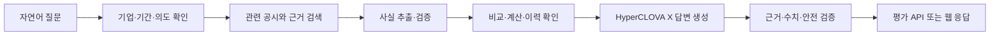

# FolioLens

> 대회 제공 공시에서 자연어 질문에 필요한 사실을 검색·추출·비교·계산하고, 원문 근거와 정보 한계를 함께 제시하는 공시 Agent

FolioLens는 제10회 2026 미래에셋증권 AI Festival의 공시 Agent 부문 출품 프로젝트다. 단순 공시 요약보다 **질문 해결**, **재현 가능한 계산**, **주장별 원문 근거**에 초점을 둔다. 평가용 공시 질의응답 코어를 먼저 완성하고, 이후 같은 코어를 질문 중심 웹과 포트폴리오 개인화에 재사용한다.

## 해결하려는 문제

기업 공시는 공식 정보지만 문서와 표가 복잡하고, 하나의 질문에도 여러 기업·기간·공시가 필요할 수 있다. 정정·변경·해지 공시를 놓치거나 서로 다른 단위와 기간을 그대로 비교하면 잘못된 결론에 도달하기도 쉽다.

FolioLens는 다음 과정을 하나의 검증 가능한 흐름으로 연결한다.



공시에서 확인할 수 없는 내용은 외부 지식으로 채우지 않는다. 정상 실행 뒤 일부만 확인되면 답변 결과를 `PARTIAL`, 답할 근거가 없으면 `UNANSWERABLE`로 구분한다. 시스템 처리 실패는 답변 결과와 섞지 않고 별도 실행 `FAILED`로 기록한다. 답변 결과 타입 이름과 판정 기준은 아직 확정하지 않았다.

## 제품 범위

| 단계 | 목표 | 주요 기능 |
|---|---|---|
| P0 — 평가 코어 | 대회 평가 질문에 정확히 답하기 | 데이터 적재, 원문 파싱, 검색, 결정적 계산, 정정·후속 이력, HyperCLOVA X 답변, 근거·안전 검증, 평가 API |
| P1 — 질문 중심 웹 | P0 코어를 사용자가 직접 확인하기 | 질문 입력, 처리 상태, 직접 답변, 비교·계산 상세, 원문 근거, 정보 한계 |
| P2 — 포트폴리오 개인화 | 보유 종목과 투자 이유를 분석에 연결하기 | 보유 비중, 투자 가정 관련성, 개인화 중요도, 다음 확인 지표 |

현재 우선순위는 P0다. 포트폴리오 개인화는 핵심 공시 QA 흐름이 검증된 뒤 확장한다.

## 핵심 원칙

- 평가 답변은 대회 제공 공시 데이터만 근거로 사용한다.
- 서비스 경로의 언어모델은 대회가 허용한 HyperCLOVA X 계열로 제한한다.
- 금액, 날짜, 증감률, 비중 같은 계산은 Spring 백엔드의 결정적 로직이 수행한다.
- 핵심 주장과 수치는 실제 파일의 장·절·표·행 등 원문 위치까지 추적할 수 있어야 한다.
- 사실, 백엔드 계산, Agent 해석, 정보 한계를 구분한다.
- 매수·매도 추천, 목표주가, 주가 방향·확률, 수익 보장 표현을 제공하지 않는다.

## 데이터 범위

현재 기준 데이터셋은 70개 상장기업과 공시 메타데이터 4,204건으로 구성된다.

| 공시 그룹 | 건수 |
|---|---:|
| 정기공시 `periodic` | 1,054 |
| 주요사항보고서 `major` | 598 |
| 거래소공시 `exchange` | 1,469 |
| 지분공시 `holding` | 1,083 |

데이터의 실제 구조, 파일 수와 예외는 [`docs/DATA_CATALOG.md`](docs/DATA_CATALOG.md)를 기준으로 한다. 평가 경로에서는 OpenDART 실시간 API, 뉴스, 검색엔진 등 외부 데이터로 답변을 보완하지 않는다.

## 역할 분리

| 영역 | HyperCLOVA X | Spring 백엔드 |
|---|---|---|
| 질문 이해 | 의도·기업 표현·기간·작업 후보 생성 | 기업 식별자·기간·단계 검증 |
| 검색 | 검색어·섹션 힌트 후보 생성 | 실제 조회·순위·한도·재검색 통제 |
| 사실 추출 | 비정형 후보 생성 | 원문 존재·자료형·단위 검증 |
| 계산·이력 | 결과 의미 설명 | 공식·단위·반올림·정정 관계 확정 |
| 답변 | 자연어 종합 | 근거 제한·수치·스키마·안전 검증 |

## 기술 스택

- Backend: Java 21, Spring Boot 4.1, Gradle, Spring Web MVC, Spring Data JPA, Bean Validation, Flyway, Actuator
- Database: PostgreSQL 17
- Frontend: React 19, TypeScript, Vite, 기본 CSS와 fetch API
- Model: HyperCLOVA X
- Deployment: Docker, Docker Compose

## 저장소 구조

```text
foliolens-server/
├─ backend/          Spring Boot API, 도메인, 데이터 적재, Flyway
├─ frontend/         React 기반 P1 웹
├─ docs/             요구사항, 기능, IA, API, 데이터·도구 계약
├─ compose.yaml      PostgreSQL과 백엔드 실행 환경
└─ .env.example      로컬 실행 환경변수 예시
```

## 현재 구현 상태

역할 A 상태는 2026-08-25 작업 트리 기준으로 갱신했다. 데이터 적재·파서·검색·fact·계산 등 역할 B 상태는 이번 작업에서 재판정하지 않았으므로 아래 표의 기존 스냅샷을 현재 완료 근거로 사용하면 안 된다.

| 상태 | 영역 |
|---|---|
| 코드·구성 존재 | Docker 기반 Spring·PostgreSQL 실행 구성, 기업 CSV 적재, 공시 manifest 적재, `companies`·`disclosures`·`disclosure_documents` Flyway 스키마 |
| 역할 A 초기 뼈대 | `GET /answer`, 내부 명령, 5개 키 평가 응답 DTO·전용 예외 경계, 질문 계획 DTO, `QuestionRun` 저장과 placeholder 오케스트레이션 서비스 |
| 미구현 | 실제 원문 파일 등록, 원문 파싱·청킹, 사실·근거·계산 저장, 검색 구현체, 정정 이력, HyperCLOVA X 연동, 답변 검증 |
| P1 이전 단계 | 프론트엔드는 Vite 기본 예제 수준이며 질문·근거 화면은 아직 구현되지 않음 |

현재 `GET /answer` 진입점은 존재하지만 `retrieved_context`는 항상 빈 배열이며 서비스는 `QuestionRun`을 `PENDING`으로 만든 뒤 임시 문구를 반환한다. 계획 검증·검색·계산·HyperCLOVA X·최종 검증과 run 종료 전이는 연결되지 않았다.

> 검증 상태: 2026-08-25 현재 `backend\gradlew.bat compileJava --no-daemon --console=plain`은 성공했다. 이번 문서 동기화에서는 전체 테스트와 Docker 통합을 재검증하지 않았으므로 컴파일 성공을 기능 완료로 간주하지 않는다.

## 로컬 실행

### Docker Compose

요구 사항: Docker Desktop과 대회 데이터셋 경로

```powershell
Copy-Item .env.example .env
```

`.env`에서 비밀번호와 `FOLIOLENS_DATASET_PATH`를 로컬 환경에 맞게 바꾼다. 최초 기업·공시 메타데이터 적재가 필요하면 다음 값도 `true`로 설정한다.

```dotenv
FOLIOLENS_IMPORT_COMPANIES_ON_STARTUP=true
FOLIOLENS_IMPORT_DISCLOSURES_ON_STARTUP=true
```

```powershell
docker compose up --build
Invoke-RestMethod http://localhost:8080/actuator/health
```

데이터셋 적재는 재실행할 수 있도록 설계되어 있지만, 두 적재 플래그를 계속 켜 두면 애플리케이션 시작 때마다 검증 작업이 실행된다.

### 제출 smoke

앱과 PostgreSQL의 liveness/readiness만 먼저 확인할 수 있다.

```powershell
.\scripts\submission-smoke.ps1 -InfrastructureOnly
```

A8 실제 데이터 연결이 완료된 뒤에는 대표 질문, 평가 응답의 정확한 5개 키, 질문 보존, 공시 `20240424800596` 근거와 placeholder 미반환까지 확인한다. 기본 `question_id`는 골든 케이스 ID가 아니라 상관관계용 ID를 사용한다.

```powershell
.\scripts\submission-smoke.ps1
```

### 제출 프로필

제출 환경은 개발용 Compose 위에 배치 실행을 모두 끄고 HCX와 버전을 필수화하는 오버레이를 적용한다. 심사 환경은 매번 빈 PostgreSQL에서 시작하므로, `app`을 올리기 전에 최신 덤프를 복원해 Flyway V12(`disclosure_facts`/`disclosure_evidences`)까지 채운 상태로 만들어야 한다. 덤프 파일(`backup/foliolens-db.dump`)은 저장소에 커밋하지 않으므로 팀에서 별도로 전달받거나, 데이터가 채워진 개발용 `db`에서 아래 명령으로 직접 만든다.

```powershell
# (선택) 데이터가 채워진 개발용 db 컨테이너에서 덤프 새로 만들기
docker compose exec db pg_dump -U foliolens -Fc -d foliolens_snapshot_20260904 > backup\foliolens-db.dump
```

```powershell
Copy-Item .env.submission.example .env.submission
# .env.submission의 비밀번호와 HCX_API_KEY를 실제 값으로 변경
docker compose --env-file .env.submission -f compose.yaml -f compose.submission.yaml config --quiet

# 빈 db를 먼저 띄우고 덤프를 복원한 뒤에 app을 올린다 (신규 볼륨일 때 1회)
docker compose --env-file .env.submission -f compose.yaml -f compose.submission.yaml up -d db
docker compose --env-file .env.submission -f compose.yaml -f compose.submission.yaml cp backup\foliolens-db.dump db:/tmp/foliolens-db.dump
docker compose --env-file .env.submission -f compose.yaml -f compose.submission.yaml exec db pg_restore -U foliolens -d foliolens --no-owner --no-privileges /tmp/foliolens-db.dump

docker compose --env-file .env.submission -f compose.yaml -f compose.submission.yaml up -d --build
.\scripts\submission-smoke.ps1 -InfrastructureOnly
```

`-U`/`-d` 값은 `.env.submission`의 `POSTGRES_USER`/`POSTGRES_DB`와 맞춘다(기본값 `foliolens`/`foliolens`).

제출 프로필은 승인된 골든 케이스만 실행한다. 시설투자 골든 케이스 3건(SK하이닉스 `20240424800596`, 셀트리온 `20260324800030`, LG이노텍 `20251127800903`)은 모두 `APPROVED`로 반영되어 있으므로, 덤프에 해당 fact·evidence가 포함되어 있으면 전체 smoke가 placeholder 없이 통과해야 한다.

### Frontend

현재 프론트엔드는 기능 화면이 아닌 개발 초기 템플릿이다.

```powershell
Set-Location frontend
npm ci
npm run dev
```

## 주요 문서

- [프로젝트 컨텍스트](docs/PROJECT_CONTEXT.md): 목적, 제품 전략, 제약
- [요구사항 정의서](docs/요구사항_정의서.md): 우선순위와 완료 조건
- [기능·기술 명세서](docs/기능명세서.md): 백엔드 흐름과 구현 계약
- [IA](docs/IA.md): P1 화면과 사용자 흐름
- [API 명세서](docs/API_명세서.md): 평가·웹 API 공통 계약
- [데이터 카탈로그](docs/DATA_CATALOG.md): 실제 대회 데이터 구조
- [도구 계약](docs/TOOL_CONTRACTS.md): QueryPlan 도구와 공시 라우팅
- [역할 A 기능 명세](docs/role-a/ROLE_A_SPEC.md): 역할 A의 현재 코드 기준 P0 잔여 계약과 역할 경계
- [기술 결정](docs/DECISIONS.md): 승인된 기술 선택

## 첫 번째 완료 목표

기업 한 곳의 공시 1~2건을 사용해 대표 질문 하나에 정확한 수치와 원문 근거를 포함한 답변을 반환하는 수직 흐름을 완성한다. 기준 질문은 SK하이닉스의 2024년 신규시설투자 공시에서 투자금액·목적·자기자본 대비 비율을 찾고, 비율을 백엔드에서 재계산하는 사례다.
