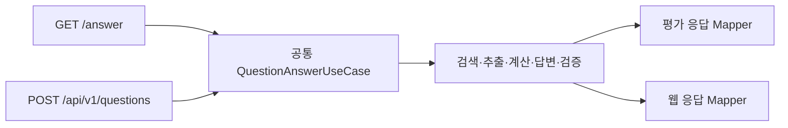

# FolioLens API 명세서

| 항목 | 내용 |
|---|---|
| 문서 버전 | v1.0 |
| 문서 상태 | 공식 과제 반영 개정안 |
| 작성일 | 2026-07-28 |
| 기준 문서 | `요구사항_정의서.md`, `기능명세서.md`, `IA.md` |
| 상세 계약 | `API_상세_명세서.md` |
| 구현 기준 | Java 21, Spring Boot, PostgreSQL |

> 2026-08-25 역할 A 동기화: 평가 API 진입점·mapper·예외 경계와 실행 상태 축의 현재 사실만 갱신했다. 오류 body, intent schema와 역할 B·C 영역은 확정하지 않았다.
> 2026-09-05 주최측 평가 API 공지 반영: 인증 헤더 미사용, `retrieved_context`·`think_trace` 문자열 타입, 순차 단건 호출·300초 타임아웃·5xx/타임아웃 2회 재시도가 확정됐다. 16절·22절 참고.

## 1. 목적과 범위

본 문서는 FolioLens가 제공하는 평가 API, 웹 API, 내부 데이터 관리 API와 운영 API의 전체 구조와 공통 계약을 정의한다.

이번 개정의 핵심은 다음과 같다.

1. 평가용 `GET /answer`를 최우선 계약으로 정의한다.
2. 웹 API를 질문 실행, 답변, 공시 근거와 계산 중심으로 재구성한다.
3. 평가 API와 웹 API가 같은 공통 답변 엔진을 사용하도록 한다.
4. 공통 웹 API 응답은 현재 백엔드의 `ApiResponse<T>` 형식을 유지한다.
5. 포트폴리오 API는 P2로 이동하고 P0/P1 개발을 막지 않게 한다.
6. OpenDART 동기화 API를 평가 경로에서 제거하고 개발용 코드로 격리한다.

## 2. API 영역

| 영역 | Prefix | 용도 | 우선순위 |
|---|---|---|---|
| 평가 API | `/answer` | 운영진의 비공개 평가 질문 | P0 Must |
| 웹 API | `/api/v1` | 질문 UI, 근거, 공시 탐색 | P1 Should |
| 내부 API | `/internal/v1` | 제공 데이터 적재·인덱싱 | P0 Must |
| 운영 API | `/actuator` | 상태·준비·생존 확인 | P0 Must |
| 포트폴리오 API | `/api/v1/portfolios` 등 | 사용자 개인화 | P2 Could |

평가 API는 `/api/v1` 공통 응답 래퍼를 사용하지 않는다.

## 3. 설계 원칙

### 3.1 공통 코어와 어댑터 분리



`QuestionAnswerUseCase`는 목표 개념명이다. 현재 역할 A 코어 경계는 `OrchestrationAnswerService -> AnswerResult`이고 평가 어댑터가 이를 `EvaluationAnswerResponse`로 변환한다.

- 평가 API와 웹 API는 같은 검색·계산·검증 결과를 사용한다.
- URL과 DTO 차이는 어댑터에서 변환한다.
- 평가 API 변경이 도메인 로직에 전파되지 않아야 한다.

### 3.2 사실·계산·해석 분리

웹 답변의 주장은 다음 유형으로 구분한다.

| 유형 | 의미 |
|---|---|
| FACT | 제공 공시에서 직접 확인한 사실 |
| CALCULATION | 백엔드가 검증된 사실로 계산한 결과 |
| INTERPRETATION | 사실과 계산에 대한 조건부 설명 |
| LIMITATION | 확인할 수 없는 정보와 비교 한계 |

### 3.3 근거 우선

- FACT는 하나 이상의 `evidenceId`를 가져야 한다.
- CALCULATION은 `calculationId`와 모든 입력 근거를 가져야 한다.
- INTERPRETATION은 근거 사실을 가져야 한다.
- 근거 없는 핵심 주장은 최종 응답에 포함하지 않는다.

### 3.4 답변 불가와 오류 분리

```text
UNANSWERABLE = 시스템은 정상 처리했지만 제공 공시로 답할 수 없음
FAILED       = 시스템 또는 외부 모델 오류로 처리를 완료하지 못함
```

`UNANSWERABLE`과 `PARTIAL`은 성공 응답 안의 비즈니스 상태다.

### 3.5 결정적 계산

- 증감액, 증감률, 비중, 기간과 단위 변환은 백엔드가 수행한다.
- 계산 입력, 공식, 결과, 반올림 규칙과 근거를 반환한다.
- HyperCLOVA X가 계산 결과를 임의로 변경하지 않는다.

### 3.6 데이터 범위

- 평가와 웹 답변의 사실 근거는 대회 제공 데이터로 제한한다.
- 평가 프로필에서 OpenDART, 뉴스, 검색엔진과 외부 코퍼스를 호출하지 않는다.
- `sourceProvider`는 평가 경로에서 `CONTEST`만 허용한다.

## 4. Base URL과 환경

### 4.1 로컬

```text
http://localhost:8080
```

### 4.2 운영

```text
https://{assigned-host}
```

운영 호스트, TLS, 포트와 허용 IP는 운영진 규격에 맞춰 확정한다.

### 4.3 API 버전

- 웹·내부 API는 URL의 `/v1`로 버전 관리한다.
- 평가 API 경로는 운영진 규격을 그대로 사용하므로 자체 버전을 붙이지 않는다.

## 5. 인증과 접근 제어

### 5.1 접근 방식

| API | 인증 |
|---|---|
| `GET /answer` | 운영진 최종 규격에 따름 |
| 기업·공시·분석 기준 조회 | 공개 |
| 웹 질문 실행·조회 | 자동 생성되는 데모 세션 |
| 포트폴리오 API | JWT |
| `/internal/v1/**` | 관리자 인증 또는 외부 비공개 |
| `/actuator/health/**` | 상태 정보만 공개 |

### 5.2 웹 데모 세션

첫 방문 시 프론트엔드는 다음 API를 자동 호출한다.

```http
POST /api/v1/demo-sessions
```

발급받은 토큰을 질문 API 요청 헤더에 전달한다.

```http
X-Demo-Session: {sessionToken}
```

사용자가 별도의 회원가입을 하지 않아도 질문할 수 있게 하기 위한 세션이다.

### 5.3 JWT

P2 포트폴리오 기능에서 사용한다.

```http
Authorization: Bearer {accessToken}
```

데모 세션과 JWT 중 하나의 접근 문맥만 사용하며 서로의 리소스에 접근할 수 없다.

### 5.4 현재 코드와의 차이

현재 소스에서 아래 경로별 보안 체인은 확인되지 않았다. 특히 평가 API의 인증 방식은 운영진 규격 대기이므로 추측하지 않고, 규격 확정 뒤 다음 경계를 구현해야 한다.

- 평가 API
- 공개 조회 API
- 데모 세션 질문 API
- JWT 포트폴리오 API
- 내부 관리 API

## 6. 공통 HTTP 규약

### 6.1 요청 헤더

```http
Content-Type: application/json
Accept: application/json
X-Request-Id: optional-client-request-id
X-Demo-Session: web-demo-session-token
Authorization: Bearer jwt-token
```

- `X-Request-Id`가 없을 때 서버가 생성하는 동작은 목표 계약이며 현재 미구현이다(`REMAINING`).
- 응답 헤더에 최종 request ID를 반환하는 동작도 현재 미구현이다(`REMAINING`).
- GET 요청에는 `Content-Type`을 생략할 수 있다.

### 6.2 필드 이름

- JSON 필드는 `camelCase`를 사용한다.
- 평가 API는 운영진 규격에 따라 `snake_case`를 사용한다.
- ID는 문자열로 표현한다.
- 내부 PK는 UUID 문자열을 사용한다.
- 접수번호는 숫자가 아니라 문자열이다.

### 6.3 날짜와 시각

| 자료형 | 형식 | 예 |
|---|---|---|
| 날짜 | ISO 8601 `YYYY-MM-DD` | `2025-03-20` |
| 시각 | ISO 8601 + offset | `2025-03-20T10:30:00+09:00` |
| 기간 표시 | 문자열 | `2023.01~2026.03` |

### 6.4 금액과 비율

- 계산 가능한 값은 JSON number로 반환한다.
- 큰 금액의 정밀도가 중요한 경우 정수 단위 KRW를 사용한다.
- `rawValue`로 공시 원문 표시값을 함께 반환한다.
- 비율은 `%` 문자열이 아니라 숫자로 반환한다.
- `20.0`은 `20.0%`를 의미한다.
- 표시용 문자열은 `displayValue`에 둔다.

### 6.5 null과 빈 배열

- 값이 없으면 `null`을 사용한다.
- 목록이 비어 있으면 `[]`를 사용한다.
- 확인되지 않은 값을 `0`, 빈 문자열 또는 임의 기본값으로 바꾸지 않는다.

## 7. 웹 API 공통 응답

현재 구현된 `ApiResponse<T>` 형식을 따른다.

### 7.1 성공

```json
{
  "success": true,
  "code": null,
  "message": "질문 요청이 접수되었습니다.",
  "data": {}
}
```

현재 `code`는 성공 시 설정하지 않으므로 `null`이다.

### 7.2 실패

```json
{
  "success": false,
  "code": "QUESTION_404_1",
  "message": "질문 실행을 찾을 수 없습니다.",
  "data": null
}
```

### 7.3 유효성 검사 실패의 현재 동작

현재 `GlobalExceptionHandler`는 `ApiResponse.fail(String)`을 사용하므로 `code`가 `null`일 수 있다.

```json
{
  "success": false,
  "code": null,
  "message": "질문은 필수입니다.",
  "data": null
}
```

목표 구현에서는 유효성 검사도 `COMMON_400_1` 또는 도메인 오류 코드를 반환하도록 개선한다.

## 8. 페이지네이션

### 8.1 요청

```text
page=0
size=20
sort=submittedAt,desc
```

- `page`는 0부터 시작한다.
- 기본 `size`는 20이다.
- 최대 `size`는 100이다.

### 8.2 응답

현재 `PageInfoResponse` 형식을 사용한다.

```json
{
  "items": [],
  "page": {
    "number": 0,
    "size": 20,
    "totalElements": 0,
    "totalPages": 0,
    "hasNext": false
  }
}
```

## 9. 공통 열거형

### 9.1 질문 실행 상태와 답변 결과

현재 코드의 `QuestionRunStatus`는 실행 생명주기만 나타낸다.

| 값 | 의미 | 종료 상태 |
|---|---|---|
| `PENDING` | 실행 레코드 생성 후 처리 시작 전 | 아니요 |
| `PROCESSING` | 계획·검색·계산·생성·검증 처리 중 | 아니요 |
| `COMPLETED` | 정상 실행 종료 | 예 |
| `FAILED` | 시스템·DB·모델·제한시간 등 실행 실패 | 예 |

`PARTIAL`과 `UNANSWERABLE`은 실행 상태가 아니라 정상 실행 뒤 답변 충족도의 별도 축이다. 이 축의 최종 타입 이름과 판정 기준은 아직 확정하지 않았다. `PLANNING`, `RETRIEVAL`, `CALCULATION`, `VALIDATION` 같은 세부 단계는 당분간 구조화 로그와 안전한 실행 요약에만 사용한다.

### 9.2 요청 채널

- `EVALUATION`: 현재 enum과 평가 command에서 확인됨(`CODE_CONFIRMED`)
- `WEB`, `PORTFOLIO`: P1/P2 제안이며 현재 enum에는 없음

현재 `AnswerQuestionCommand.channel`은 존재하지만 `QuestionRun` 생성자가 `EVALUATION`을 고정하므로 저장까지 전달되지 않는다(`REMAINING`).

### 9.3 질문 유형

아래 목록은 별도 intent 필드를 전제로 한 legacy proposal이다. 현재 작업 트리에서는 `IntentType`이 제거됐지만 필드 제거 결정은 아직 `DECISION_REQUIRED`이므로 확정 공통 enum으로 사용하지 않는다.

- `FACT_LOOKUP`
- `COMPARISON`
- `CALCULATION`
- `HISTORY`
- `SYNTHESIS`
- `UNANSWERABLE_CHECK`

### 9.4 주장 유형

- `FACT`
- `CALCULATION`
- `INTERPRETATION`
- `LIMITATION`

### 9.5 근거 유형

- `TEXT`
- `TABLE`
- `STRUCTURED_DATA`

### 9.6 검증 상태

- `VERIFIED`
- `REJECTED`
- `UNKNOWN`

### 9.7 공시 범주

- `PERIODIC`
- `MATERIAL`
- `EXCHANGE`
- `OWNERSHIP`

세부 공시 유형은 데이터 수령 후 `disclosureType` 코드 사전으로 관리한다.

### 9.8 공시 관계

- `CORRECTS`
- `SUPERSEDES`
- `FOLLOWS_UP`
- `RELATED`

### 9.9 데이터 제공자

- `CONTEST`

`OPENDART`는 개발용 데이터 소스 코드로 존재할 수 있지만 평가·웹 답변에 반환하지 않는다.

## 10. API 요약

### 10.1 평가 API

| Method | URL | 설명 |
|---|---|---|
| GET | `/answer` | 평가 질문에 동기 답변 |

### 10.2 데모 세션

| Method | URL | 설명 |
|---|---|---|
| POST | `/api/v1/demo-sessions` | 익명 웹 질문용 세션 생성 |

### 10.3 기업

| Method | URL | 설명 | 상태 |
|---|---|---|---|
| GET | `/api/v1/companies` | 기업명·종목코드 검색 | 일부 구현 |

### 10.4 질문

| Method | URL | 설명 |
|---|---|---|
| POST | `/api/v1/questions` | 질문 실행 생성 |
| GET | `/api/v1/questions/{runId}` | 실행 상태와 답변 조회 |
| POST | `/api/v1/questions/{runId}/clarifications` | 모호성 확인 후 실행 재개 |
| GET | `/api/v1/questions/{runId}/evidences/{evidenceId}` | 공시 근거 상세 |
| GET | `/api/v1/questions/{runId}/calculations/{calculationId}` | 계산 상세 |

### 10.5 대화

| Method | URL | 설명 |
|---|---|---|
| GET | `/api/v1/conversations/{conversationId}` | 질문·답변 기록 조회 |

후속 질문은 새 질문 생성 API에 `conversationId`와 `parentRunId`를 전달한다.

### 10.6 공시

| Method | URL | 설명 |
|---|---|---|
| GET | `/api/v1/disclosures` | 제공 공시 목록 |
| GET | `/api/v1/disclosures/comparison` | 공시 2~4건 비교 |
| GET | `/api/v1/disclosures/{disclosureId}` | 공시 메타데이터·구조화 사실 |
| GET | `/api/v1/disclosures/{disclosureId}/sections` | 원문 목차·섹션 목록 |
| GET | `/api/v1/disclosures/{disclosureId}/sections/{sectionId}` | 원문 섹션 상세 |

### 10.7 데이터·분석 기준

| Method | URL | 설명 |
|---|---|---|
| GET | `/api/v1/meta/analysis-policy` | 데이터 범위·계산·안전 정책 |

### 10.8 내부 데이터 적재

| Method | URL | 설명 |
|---|---|---|
| POST | `/internal/v1/datasets/ingestion-jobs` | 제공 데이터 적재 작업 생성 |
| GET | `/internal/v1/datasets/ingestion-jobs/{jobId}` | 적재 상태·품질 결과 조회 |

### 10.9 운영

| Method | URL | 설명 |
|---|---|---|
| GET | `/actuator/health` | 종합 상태 |
| GET | `/actuator/health/readiness` | 요청 처리 준비 상태 |
| GET | `/actuator/health/liveness` | 프로세스 생존 상태 |

### 10.10 포트폴리오(P2)

| Method | URL | 설명 |
|---|---|---|
| POST/GET/PATCH | `/api/v1/portfolios` | 포트폴리오 관리 |
| POST/PATCH/DELETE | `/api/v1/portfolios/{portfolioId}/holdings` | 보유 종목 관리 |
| POST/PATCH/DELETE | `/api/v1/holdings/{holdingId}/theses` | 투자 이유 관리 |
| GET | `/api/v1/portfolios/{portfolioId}/dashboard` | 개인화 대시보드 |

P2 상세 계약은 P0/P1 안정화 후 별도 버전에서 확정한다.

## 11. 핵심 웹 질문 계약

> 이 장의 `RECEIVED`, `RETRIEVING`, `CLARIFICATION_REQUIRED` 등은 기존 P1 제안 예시이며 현재 `QuestionRunStatus` 구현 계약이 아니다. P1 진행 API를 구현하기 전 상태 모델을 별도로 결정해야 한다.

### 11.1 질문 실행 생성

```http
POST /api/v1/questions
X-Demo-Session: {sessionToken}
Content-Type: application/json
```

```json
{
  "question": "A사의 2024년과 2025년 시설투자 금액을 비교해줘.",
  "conversationId": null,
  "parentRunId": null,
  "selectedDisclosureIds": [],
  "portfolioId": null
}
```

정상 응답은 `202 Accepted`다.

```json
{
  "success": true,
  "code": null,
  "message": "질문 요청이 접수되었습니다.",
  "data": {
    "runId": "49a1fcd8-3e45-47b0-91d5-10cce36a67de",
    "conversationId": "2a1f644f-214f-42db-ac1b-c867d35ba29a",
    "status": "RECEIVED",
    "statusMessage": "질문을 확인하고 있습니다.",
    "pollUrl": "/api/v1/questions/49a1fcd8-3e45-47b0-91d5-10cce36a67de",
    "createdAt": "2026-07-28T14:00:00+09:00"
  }
}
```

### 11.2 실행 조회

처리 중에는 진행 상태를 반환한다.

```json
{
  "success": true,
  "code": null,
  "message": "질문 처리 상태를 조회했습니다.",
  "data": {
    "runId": "49a1fcd8-3e45-47b0-91d5-10cce36a67de",
    "status": "RETRIEVING",
    "statusMessage": "관련 공시를 찾고 있습니다.",
    "progress": {
      "currentStage": "RETRIEVING",
      "completedStages": ["PLANNING"]
    },
    "answer": null,
    "createdAt": "2026-07-28T14:00:00+09:00",
    "completedAt": null
  }
}
```

완료 후에는 구조화된 답변을 반환한다.

```json
{
  "success": true,
  "code": null,
  "message": "질문 답변 조회에 성공했습니다.",
  "data": {
    "runId": "49a1fcd8-3e45-47b0-91d5-10cce36a67de",
    "conversationId": "2a1f644f-214f-42db-ac1b-c867d35ba29a",
    "status": "COMPLETED",
    "question": "A사의 2024년과 2025년 시설투자 금액을 비교해줘.",
    "answer": {
      "directAnswer": "시설투자 금액은 2,000억원에서 2,400억원으로 400억원, 20.0% 증가했습니다.",
      "claims": [],
      "comparisons": [],
      "calculations": [],
      "disclosureTimeline": [],
      "usedEvidences": [],
      "limitations": [],
      "suggestedQuestions": []
    },
    "dataBasis": {
      "sourceProvider": "CONTEST",
      "period": "2023.01~2026.03",
      "datasetVersion": "contest-data-v1"
    },
    "createdAt": "2026-07-28T14:00:00+09:00",
    "completedAt": "2026-07-28T14:00:09+09:00"
  }
}
```

## 12. 모호성 확인 계약

질문 분석 중 기업을 하나로 확정할 수 없으면 실행 조회 결과가 다음 상태가 된다.

```json
{
  "success": true,
  "code": null,
  "message": "질문을 계속하려면 기업 선택이 필요합니다.",
  "data": {
    "runId": "run-uuid",
    "status": "CLARIFICATION_REQUIRED",
    "clarification": {
      "type": "COMPANY",
      "message": "어느 기업을 의미하는지 선택해 주세요.",
      "candidates": [
        {
          "companyId": "company-uuid-1",
          "corpName": "삼성전자",
          "stockCode": "005930",
          "market": "KOSPI"
        }
      ]
    }
  }
}
```

사용자는 다음 API로 선택을 제출한다.

```http
POST /api/v1/questions/{runId}/clarifications
```

```json
{
  "type": "COMPANY",
  "selectedCompanyId": "company-uuid-1"
}
```

## 13. 답변 구성요소

### 13.1 Claim

```json
{
  "claimId": "claim-1",
  "type": "FACT",
  "text": "2025년 시설투자 금액은 2,400억원입니다.",
  "evidenceIds": ["evidence-2"],
  "calculationId": null
}
```

### 13.2 Comparison

```json
{
  "comparisonId": "comparison-1",
  "label": "시설투자 금액",
  "basis": "같은 기업의 연도별 시설투자 공시",
  "items": [
    {
      "label": "2024년",
      "rawValue": "2,000억원",
      "normalizedValue": 200000000000,
      "unit": "KRW",
      "evidenceId": "evidence-1"
    },
    {
      "label": "2025년",
      "rawValue": "2,400억원",
      "normalizedValue": 240000000000,
      "unit": "KRW",
      "evidenceId": "evidence-2"
    }
  ],
  "calculationIds": ["calculation-1"],
  "warnings": []
}
```

### 13.3 Evidence 요약

```json
{
  "evidenceId": "evidence-2",
  "receiptNo": "20250101000001",
  "companyName": "A사",
  "reportName": "신규시설투자등",
  "submittedAt": "2025-01-01",
  "sectionPath": "2. 투자내역 > 투자금액",
  "preview": "투자금액 2,400억원...",
  "evidenceType": "TABLE",
  "correction": false
}
```

### 13.4 Limitation

```json
{
  "code": "ACCOUNTING_BASIS_MISMATCH",
  "message": "두 값의 연결·별도 기준이 달라 직접 비교하지 않았습니다.",
  "affectedFields": ["operatingProfit"]
}
```

## 14. 근거 상세 계약

```json
{
  "evidenceId": "evidence-2",
  "supportedClaimIds": ["claim-1", "claim-2"],
  "disclosure": {
    "disclosureId": "disclosure-uuid",
    "receiptNo": "20250101000001",
    "companyName": "A사",
    "stockCode": "000000",
    "reportName": "신규시설투자등",
    "submittedAt": "2025-01-01",
    "correction": false
  },
  "location": {
    "sectionId": "section-uuid",
    "sectionPath": "2. 투자내역 > 투자금액",
    "page": null,
    "tableNumber": "표 1",
    "rowLabel": "투자금액",
    "startOffset": 120,
    "endOffset": 152
  },
  "content": "투자금액 2,400억원",
  "contextBefore": "투자 내역은 다음과 같습니다.",
  "contextAfter": "투자 종료 예정일은 2027년 11월입니다.",
  "table": {
    "headers": ["구분", "내용"],
    "row": ["투자금액", "2,400억원"]
  },
  "sourceProvider": "CONTEST"
}
```

## 15. 계산 상세 계약

```json
{
  "calculationId": "calculation-1",
  "operation": "CHANGE_RATE",
  "label": "전년 대비 시설투자 금액 증감률",
  "inputs": [
    {
      "role": "BASE",
      "label": "2024년",
      "rawValue": "2,000억원",
      "normalizedValue": 200000000000,
      "unit": "KRW",
      "factId": "fact-1",
      "evidenceIds": ["evidence-1"]
    },
    {
      "role": "COMPARISON",
      "label": "2025년",
      "rawValue": "2,400억원",
      "normalizedValue": 240000000000,
      "unit": "KRW",
      "factId": "fact-2",
      "evidenceIds": ["evidence-2"]
    }
  ],
  "formula": "(comparison - base) / base * 100",
  "rawResult": 20.0,
  "displayValue": "20.0%",
  "roundingRule": "HALF_UP_1",
  "status": "COMPLETED",
  "failureReason": null
}
```

## 16. 평가 API 계약

### 16.1 요청

```http
GET /answer?question_id=q-001&question=A사의%202025년%20매출액은?
```

| 파라미터 | 타입 | 필수 | 설명 |
|---|---|---|---|
| question_id | String | 예 | 평가 시스템의 질문 ID |
| question | String | 예 | URL 인코딩된 자연어 질문 |

`question_id`는 내부 `AnswerResult.externalQuestionId`로 보존하는 평가 correlation 값이다. `AnswerResult.runId`는 `QuestionRun.id`와 같은 내부 실행 UUID이며 현재 평가 5개 응답 키에는 노출하지 않는다. request ID는 이 둘과 별개인 HTTP 로그 상관값이다.

### 16.2 응답

주최측 평가 API 공지(2026-09-05)로 wire 타입이 확정됐다: 5개 최상위 키의 값은 모두 문자열이다. 여러 근거·실행 단계는 문자열 안에서 구분 태그로 자유롭게 연결하며, 태그 형식 자체는 평가 대상이 아니다.

```json
{
  "question_id": "q-001",
  "question": "A사의 2025년 매출액은?",
  "retrieved_context": "[1] receipt_no=20250320000001 | report_name=사업보고서 | submitted_at=2025-03-20 | section=III. 재무에 관한 사항\n답변에 실제 사용한 문맥",
  "think_trace": "[RETRIEVAL] A사의 2025년 사업보고서에서 매출액 항목을 검색했습니다.\n[VALIDATION] 답변 수치와 공시 근거가 일치하는지 확인했습니다.",
  "answer": "A사의 2025년 매출액은 ...입니다. 근거: 2025년 사업보고서 ..."
}
```

### 16.3 규칙

- 평가는 동기 응답이다.
- `question_id`, `question`, `retrieved_context`, `think_trace`, `answer` 모든 필드는 문자열(string) 타입이다.
- `retrieved_context`에는 실제 사용한 근거만 포함하며, 여러 문서는 문자열 안에서 번호·구분 태그로 연결한다.
- 모든 답변은 근거 공시를 명시한다.
- `think_trace`는 안전한 실행 요약이며 모델의 내부 사고과정이 아니다.
- 답변 불가 시에도 같은 스키마로 반환하고 `answer`에 정보 한계를 명시한다.
- 요청에는 인증 헤더를 사용하지 않는다. 경로는 `/answer`로 고정한다.

## 17. 오류 코드

### 17.1 현재 구현 코드

| HTTP | 코드 | 메시지 |
|---:|---|---|
| 400 | COMMON_400_1 | 입력값이 올바르지 않습니다. |
| 401 | COMMON_401_1 | 인증이 필요합니다. |
| 403 | COMMON_403_1 | 접근 권한이 없습니다. |
| 404 | COMMON_404_1 | 요청한 리소스를 찾을 수 없습니다. |
| 500 | COMMON_500_1 | 서버 내부 오류가 발생했습니다. |

### 17.2 추가할 도메인 코드

| HTTP | 코드 | 상황 |
|---:|---|---|
| 400 | QUESTION_400_1 | 질문이 비어 있거나 형식이 잘못됨 |
| 400 | QUESTION_400_2 | 질문 길이 초과 |
| 400 | QUESTION_400_3 | 명확화 선택값 오류 |
| 403 | QUESTION_403_1 | 다른 세션·사용자의 질문 실행 접근 |
| 404 | QUESTION_404_1 | 질문 실행 없음 |
| 409 | QUESTION_409_1 | 현재 상태에서 허용되지 않는 상태 전이 |
| 404 | COMPANY_404_1 | 제공 기업 마스터에서 기업 없음 |
| 404 | DISCLOSURE_404_1 | 공시 없음 |
| 404 | EVIDENCE_404_1 | 질문 실행에 속한 근거 없음 |
| 404 | CALCULATION_404_1 | 질문 실행에 속한 계산 없음 |
| 409 | DATASET_409_1 | 같은 데이터셋의 적재 작업이 이미 진행 중 |
| 503 | DATASET_503_1 | 데이터셋·인덱스 준비 안 됨 |
| 429 | AGENT_429_1 | 모델 호출 제한 |
| 504 | AGENT_504_1 | 질문 처리 제한시간 초과 |
| 502 | AGENT_502_1 | 모델 출력 스키마 오류 |
| 500 | AGENT_500_1 | 답변 검증을 완료하지 못함 |

`DISCLOSURE_NOT_FOUND`, `INSUFFICIENT_EVIDENCE`, `CALCULATION_NOT_APPLICABLE`는 질문 처리 중에는 가능하면 HTTP 오류가 아니라 `UNANSWERABLE`, `PARTIAL`, `limitations`로 표현한다.

## 18. 캐시와 멱등성

### 18.1 질문

- 동일 요청의 재전송 방지를 위해 `Idempotency-Key`를 받을 수 있다.
- 키 범위는 데모 세션 또는 사용자다.
- 동일 키와 동일 본문이면 기존 `runId`를 반환한다.
- 동일 키와 다른 본문이면 `409 Conflict`를 반환한다.

### 18.2 데이터 적재

```text
datasetVersion + sourceDocumentId + contentHash
```

동일 키는 중복 문서를 생성하지 않는다.

### 18.3 답변 캐시

캐시 키는 다음 버전을 포함한다.

- 정규화 질문
- 데이터셋
- 검색 설정
- 사실 추출기
- 계산 규칙
- 모델
- 프롬프트

버전 중 하나가 바뀌면 이전 답변 캐시를 사용하지 않는다.

## 19. 보안과 로그

### 19.1 로그 필드

- request ID
- external question ID
- run ID
- channel
- `QuestionRunStatus` 실행 상태
- 정상 실행 뒤 답변 충족도(타입명 미확정)
- 사용 공시 ID
- 데이터셋·검색·모델·프롬프트·계산 규칙 버전
- 단계별 처리시간
- 오류 코드

### 19.2 로그 금지

- JWT와 세션 토큰 원문
- API 키
- 시스템 프롬프트 전문
- 모델의 비공개 내부 사고과정
- 불필요한 개인정보

### 19.3 프롬프트 인젝션

- 질문과 공시 원문의 명령문을 신뢰하지 않는다.
- 모델이 만든 URL을 서버가 호출하지 않는다.
- 평가 프로필에는 외부 검색 도구를 등록하지 않는다.

## 20. 구현 상태

| API | 상태 |
|---|---|
| 기업 검색 | 구현됨 |
| 공통 성공·오류 응답 | 구현됨 |
| JWT 보안 기반 | 부분 구현 |
| 데모 세션 | DB 초안만 존재 |
| 질문 API | 미구현 |
| 공시 목록·상세 | 미구현 |
| 근거·계산 API | 미구현 |
| 평가 API | 부분 구현 — `GET /answer`, 내부 명령, 5개 응답 키와 평가 전용 예외 경계는 존재하나 실제 근거 매핑·HCX·검증·계약 테스트는 미완료 |
| 데이터 적재 API | 미구현 |
| Actuator | 의존성·기본 구성 존재 |
| 포트폴리오 | ERD·문서 초안, 서비스 미구현 |

## 21. 계약 테스트 필수 항목

### 평가

- 한글과 특수문자 URL 인코딩
- `question_id` 보존
- `question_id`, `question` 누락·빈 값·공백 400
- 정확한 5개 최상위 키와 웹 `ApiResponse` 미사용
- 답변 불가 시 동일 스키마
- `think_trace`의 비밀정보 미포함
- 응답 제한시간

### 웹 질문

- 세션별 실행 격리
- 202 생성 응답과 polling
- 모든 실행 상태
- 모호한 기업 확인과 재개
- PARTIAL·UNANSWERABLE·FAILED
- 주장·근거·계산 참조 무결성

### 데이터 범위

- 모든 반환 근거의 `sourceProvider=CONTEST`
- 평가 프로필 OpenDART 호출 0건
- 뉴스·검색엔진 호출 0건

### 계산

- 증감률·비중·기간
- 분모 0
- 단위 불일치
- 연결·별도 및 누적·당기 불일치
- 반올림

## 22. 확정이 필요한 사항

> 2026-09-05 주최측 공지로 평가 API 인증 방식(미사용), `retrieved_context`·`think_trace` 자료형(문자열), 평가 질문 제한시간(300초)과 동시 요청 수(순차 단건)는 확정됐다. 아래는 남은 항목이다.

1. 웹 질문의 polling 주기와 전체 보존기간
2. 데모 세션 토큰 전달 방식을 헤더 또는 쿠키 중 무엇으로 할지
3. 답변 URL 공유 허용 여부
4. 공시 원문 섹션의 cursor 또는 page 방식
5. 내부 데이터 적재를 HTTP API와 CLI 중 무엇으로 운영할지
6. P2 포트폴리오 API의 재개 시점

이 항목이 확정되면 `DECISIONS.md`, 본 문서와 상세 명세를 함께 갱신한다.
