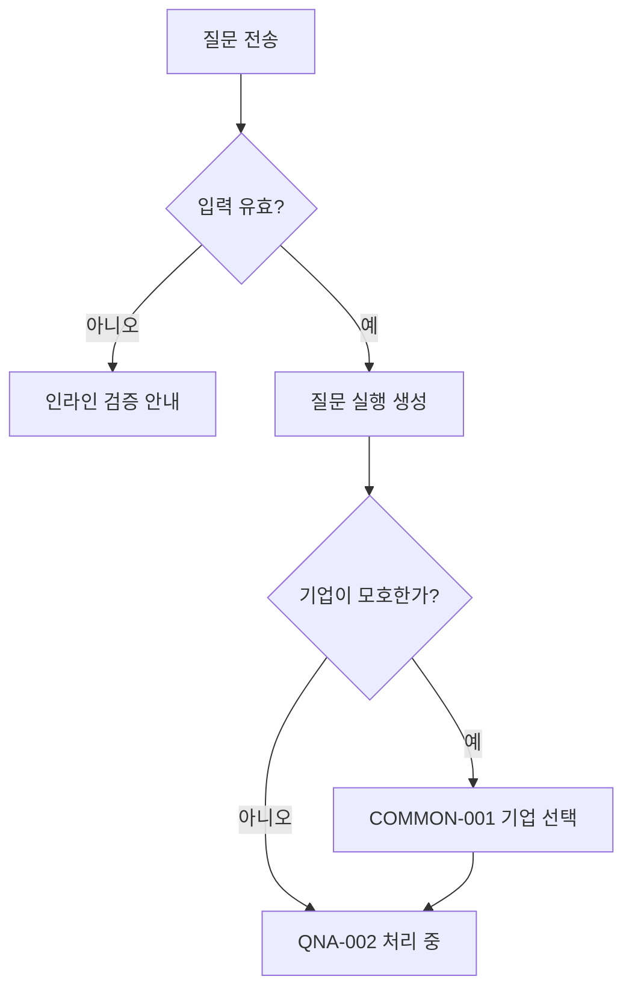
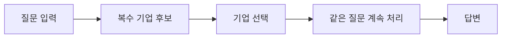
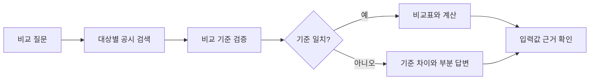
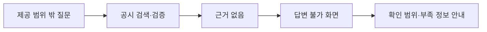
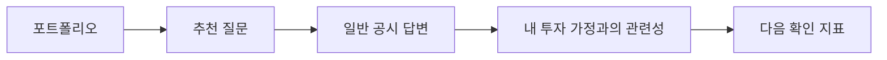

# FolioLens 공시 Agent IA

| 항목 | 내용 |
|---|---|
| 프로젝트명 | FolioLens |
| 문서 유형 | Information Architecture |
| 문서 버전 | v1.0 |
| 문서 상태 | 공식 과제 반영 개정안 |
| 작성일 | 2026-07-28 |
| 기준 문서 | `요구사항_정의서.md` v1.0, `기능명세서.md` v1.0 |
| 후속 정합화 대상 | API 명세서, ERD, 화면 와이어프레임 |

## 1. IA 목적

본 문서는 FolioLens 웹 서비스의 화면, 정보 계층, 메뉴 구조, URL, 이동 경로 및 화면 상태를 정의한다.

개정된 IA의 핵심 목표는 다음과 같다.

1. 사용자가 로그인이나 포트폴리오 등록 없이 바로 공시 질문을 시작할 수 있게 한다.
2. 질문의 직접 답변, 공시 사실, 백엔드 계산, Agent 설명과 정보 한계를 구분한다.
3. 모든 핵심 주장과 수치에서 실제 사용한 공시 근거로 이동할 수 있게 한다.
4. 단일 문서뿐 아니라 기간별·기업별 비교와 정정·후속공시 이력을 이해하기 쉽게 보여 준다.
5. 평가용 API와 웹 서비스가 같은 답변 엔진을 사용하되, 평가 API 자체를 사용자 화면으로 만들지 않는다.
6. 포트폴리오 개인화 기능은 P2 확장 영역으로 분리한다.

## 2. IA 적용 범위와 우선순위

### 2.1 P0 — 평가 API

P0의 핵심은 `GET /answer` 평가 API이며 사용자 화면이 필수는 아니다.

IA에서는 P0 엔진의 결과를 사람이 확인할 수 있도록 P1 웹 화면에 표현 기준을 정의한다. 평가 API의 필드와 규격은 `API_명세서.md`에서 관리한다.

### 2.2 P1 — 질문 중심 웹

이번 IA의 핵심 범위다.

- 질문 홈
- 질문 처리 상태
- 답변 상세
- 주장별 공시 근거
- 계산 상세
- 정정·후속공시 이력
- 공시 탐색
- 데이터·분석 기준 안내
- 후속 질문

### 2.3 P2 — 포트폴리오 개인화

기존 IA의 다음 기능은 삭제하지 않고 P2로 이동한다.

- 포트폴리오 생성과 보유 종목 관리
- 보유 비중과 투자 이유
- 개인화 중요도
- 투자 가정 영향
- 포트폴리오 대시보드
- 알림과 리포트

P2 화면은 P1 질문 경험을 확장해야 하며 별도의 답변 엔진을 만들지 않는다.

## 3. 정보구조 원칙

### 3.1 질문 우선

- 첫 화면의 가장 중요한 요소는 자연어 질문 입력창이다.
- 질문 전에 포트폴리오, 로그인 또는 복잡한 조건 입력을 강제하지 않는다.
- 기업명, 기간, 비교 기준은 가능한 한 자연어 질문에서 해석한다.
- 필요한 경우에만 기업 후보나 기준을 간단히 확인한다.

### 3.2 결론 우선, 근거까지 추적

답변 정보는 다음 순서로 보여 준다.

1. 직접 답변
2. 핵심 사실과 비교 결과
3. 계산식과 입력값
4. 정정·후속공시 상태
5. 주장별 공시 근거
6. 정보 한계와 비교 주의사항
7. 후속 질문

### 3.3 사실·계산·해석 분리

모든 답변 요소는 다음 라벨 중 하나를 사용한다.

| 라벨 | 의미 |
|---|---|
| 공시 사실 | 공시 원문 또는 제공 구조화 데이터에서 직접 확인 |
| 백엔드 계산 | 검증된 사실을 결정적 공식으로 계산 |
| Agent 설명 | 사실과 계산을 이해하기 쉽게 설명 |
| 확인 불가 | 제공 공시에서 근거를 확인할 수 없음 |

`호재`, `악재`, `매수`, `매도`처럼 단정적인 투자 판단 라벨은 사용하지 않는다.

### 3.4 근거는 답변의 부속물이 아닌 핵심 정보

- 답변 하단에 출처 링크만 모아 두지 않는다.
- 핵심 주장마다 근거 번호 또는 근거 버튼을 연결한다.
- 근거를 열면 공시명, 기업, 접수일, 접수번호, 원문 위치와 문맥을 확인할 수 있어야 한다.
- 계산 결과는 모든 입력값의 근거를 함께 보여 준다.

### 3.5 정보 한계를 정상 상태로 표현

- 답변 불가는 오류 화면이 아니다.
- 일부만 확인된 경우 검증된 내용은 그대로 보여 준다.
- 확인할 수 없는 항목과 그 이유를 명시한다.
- 외부 뉴스나 OpenDART로 이동해 답을 보완한다고 안내하지 않는다.

### 3.6 점진적 상세화

```text
질문 홈
→ 직접 답변
→ 주장·계산
→ 공시 근거
→ 원문 문맥
```

처음부터 모든 원문과 시스템 정보를 펼치지 않고 사용자가 필요할 때 상세 내용을 확인하게 한다.

### 3.7 안전한 처리 과정 표시

- `think_trace`에 해당하는 내용을 웹에서 그대로 노출하지 않는다.
- 웹에서는 `공시 검색`, `사실 확인`, `계산`, `근거 검증` 같은 실행 단계만 보여 준다.
- 모델의 비공개 내부 사고과정, 시스템 프롬프트와 보안정보는 표시하지 않는다.

## 4. 핵심 사용자와 작업

### 4.1 일반 사용자

| 목적 | 원하는 작업 |
|---|---|
| 특정 사실 확인 | 기업과 기간을 자연어로 질문 |
| 변화 확인 | 전년·전분기·정정 전후 값 비교 |
| 기업 비교 | 같은 지표를 여러 기업에서 비교 |
| 계산 확인 | 증감률·비중·기간과 계산 기준 확인 |
| 현재 상태 확인 | 최초·정정·해지 등 후속 이력 확인 |
| 신뢰성 확인 | 답변의 공시 근거와 원문 문맥 확인 |
| 한계 확인 | 제공 공시로 답할 수 있는 범위 확인 |

### 4.2 대회 평가자

평가자는 주로 평가 API를 사용한다. 웹 화면은 다음 보조 목적에 사용될 수 있다.

- 대표 질문 데모
- 답변과 근거의 시각적 검증
- 기술 발표와 라이브 시연
- 답변 실패 원인의 설명

### 4.3 포트폴리오 사용자(P2)

- 보유 종목과 투자 이유 등록
- 보유 종목 관련 질문 추천
- 공시가 투자 가정과 관련되는 이유 확인
- 개인화된 공시 확인 순서 관리

## 5. 전체 사이트맵

```text
FolioLens
├─ 1. 질문
│  ├─ 1.1 질문 홈
│  ├─ 1.2 질문 처리 중
│  ├─ 1.3 답변 상세
│  │  ├─ 직접 답변
│  │  ├─ 핵심 주장
│  │  ├─ 비교·계산
│  │  ├─ 정정·후속 이력
│  │  ├─ 정보 한계
│  │  └─ 후속 질문
│  ├─ 1.4 공시 근거 상세
│  └─ 1.5 대화 기록(P1 후반)
│
├─ 2. 공시 탐색(P1)
│  ├─ 2.1 공시 목록
│  │  ├─ 기업 필터
│  │  ├─ 기간 필터
│  │  ├─ 공시 범주·유형 필터
│  │  └─ 정정 여부
│  ├─ 2.2 공시 문서 상세
│  │  ├─ 공시 메타데이터
│  │  ├─ 문서 목차
│  │  ├─ 구조화 사실
│  │  ├─ 관련·정정·후속공시
│  │  └─ 원문 보기
│  └─ 2.3 공시 비교
│
├─ 3. 서비스 안내
│  ├─ 3.1 데이터·분석 기준
│  ├─ 3.2 지원 질문 예시
│  ├─ 3.3 답변 상태와 한계
│  └─ 3.4 서비스 정보
│
├─ 4. 내 포트폴리오(P2)
│  ├─ 4.1 포트폴리오 대시보드
│  ├─ 4.2 보유 종목
│  ├─ 4.3 투자 이유
│  ├─ 4.4 개인화 질문
│  └─ 4.5 알림·리포트
│
└─ 5. 공통
   ├─ 5.1 기업 선택
   ├─ 5.2 처리 상태
   ├─ 5.3 부분 답변
   ├─ 5.4 답변 불가
   ├─ 5.5 오류
   └─ 5.6 접근성·모바일 패널
```

## 6. 전역 내비게이션

### 6.1 데스크톱

P1 기본 내비게이션:

```text
[FolioLens]   질문하기   공시 탐색   분석 기준                         [새 질문]
```

P2 활성화 후:

```text
[FolioLens]   질문하기   공시 탐색   내 포트폴리오   분석 기준   [사용자 메뉴]
```

규칙:

- 로고는 질문 홈으로 이동한다.
- `새 질문`은 어느 화면에서든 질문 홈으로 이동하거나 질문 입력창을 연다.
- 현재 메뉴를 시각적으로 표시한다.
- 질문 처리 중 다른 메뉴로 이동할 때 실행을 취소하지 않는다.
- 답변으로 돌아갈 수 있도록 최근 실행 상태를 유지한다.

### 6.2 모바일

P1 하단 내비게이션:

```text
질문 | 공시 | 안내
```

P2 활성화 후:

```text
질문 | 공시 | 포트폴리오 | 더보기
```

근거 상세는 별도 전체 페이지보다 하단 시트로 먼저 열고, 필요하면 전체 화면으로 확장한다.

### 6.3 전역 유틸리티

- 데이터 기준: `대회 제공 공시 · 2023.01~2026.03`
- 새 질문
- 현재 답변으로 돌아가기
- 사용자 메뉴(P2)
- 접근성 옵션은 브라우저 표준을 우선하고 별도 테마는 후순위로 둔다.

### 6.4 전역 이동 규칙

- 기업명은 해당 기업으로 필터링된 공시 목록으로 연결한다.
- 공시명은 공시 문서 상세로 연결한다.
- 근거 번호는 같은 화면의 근거 패널을 연다.
- 근거 패널의 `원문에서 보기`는 해당 원문 위치로 이동한다.
- 브라우저 뒤로가기는 질문·필터·스크롤 위치를 복원한다.
- 공유 가능한 답변 URL은 내부 실행 ID를 사용하고 민감한 사용자 정보를 포함하지 않는다.

## 7. URL 구조

| 화면 | URL | 우선순위 | 인증 |
|---|---|---|---|
| 질문 홈 | `/` | Should | 없음 또는 익명 세션 |
| 질문 홈 별칭 | `/questions` | Should | 없음 또는 익명 세션 |
| 답변 상세 | `/questions/{runId}` | Should | 실행 접근 정책 |
| 근거 상세 | `/questions/{runId}/evidences/{evidenceId}` | Should | 실행 접근 정책 |
| 대화 | `/conversations/{conversationId}` | Should | 익명 세션 또는 사용자 |
| 공시 목록 | `/disclosures` | Should | 없음 |
| 공시 상세 | `/disclosures/{disclosureId}` | Should | 없음 |
| 공시 비교 | `/disclosures/compare?ids={id1},{id2}` | Should | 없음 |
| 분석 기준 | `/methodology` | Should | 없음 |
| 서비스 상태 | `/status` | Could | 없음 |
| 포트폴리오 | `/portfolio` | Could | JWT |
| 보유 종목 상세 | `/portfolio/holdings/{holdingId}` | Could | JWT |
| 포트폴리오 설정 | `/portfolio/settings` | Could | JWT |

평가용 `GET /answer`는 화면 URL이 아니며 전역 내비게이션에 노출하지 않는다.

## 8. 화면 목록

| 화면 ID | 화면명 | 역할 | 우선순위 |
|---|---|---|---|
| QNA-001 | 질문 홈 | 자연어 질문 시작 | Should |
| QNA-002 | 질문 처리 중 | 단계별 처리 상태 | Should |
| QNA-003 | 답변 상세 | 직접 답변·주장·계산·한계 | Should |
| QNA-004 | 답변 불가 | 정상적인 정보 부족 결과 | Should |
| EVD-001 | 공시 근거 상세 | 주장별 공시 문맥 검증 | Should |
| EVD-002 | 계산 상세 | 입력값·공식·단위·근거 검증 | Should |
| CONV-001 | 대화·후속 질문 | 문맥을 유지한 질문 | Should |
| DISC-001 | 공시 목록 | 제공 공시 탐색 | Should |
| DISC-002 | 공시 문서 상세 | 원문·사실·관련공시 확인 | Should |
| DISC-003 | 공시 비교 | 기간·정정 전후 대조 | Should |
| INFO-001 | 데이터·분석 기준 | 데이터 범위와 방법 안내 | Should |
| COMMON-001 | 기업 선택 | 모호한 기업 확인 | Should |
| COMMON-002 | 오류 | 요청·시스템 오류 처리 | Should |
| PORT-001 | 포트폴리오 대시보드 | 개인화 진입 | Could |
| PORT-002 | 보유 종목 관리 | 보유 정보 CRUD | Could |
| PORT-003 | 투자 이유 관리 | 투자 가정 CRUD | Could |
| PORT-004 | 개인화 답변 | 투자 가정 관련성 표시 | Could |

## 9. 화면별 상세 명세

### 9.1 QNA-001 질문 홈

#### 목적

사용자가 서비스의 사용법을 따로 학습하지 않아도 첫 질문을 입력하고 답변 흐름을 시작하게 한다.

#### 정보 우선순위

1. 서비스 한 줄 설명
2. 질문 입력창
3. 질문 가능 범위와 데이터 기간
4. 대표 질문 예시
5. 답변 근거 제공 방식
6. 서비스 한계와 투자 권유 아님 안내

#### 기본 화면

```text
┌──────────────────────────────────────────────────────────────┐
│ FolioLens                                                    │
│ 공시에서 답을 찾고, 비교하고, 근거까지 보여 드립니다.       │
│                                                              │
│ ┌──────────────────────────────────────────────────────────┐ │
│ │ 예: A사의 2024년과 2025년 연구개발비를 비교해줘          │ │
│ └──────────────────────────────────────────────────────────┘ │
│                                                     [질문]   │
│                                                              │
│ 대회 제공 공시 · 2023.01~2026.03                            │
│                                                              │
│ [단일 사실] [기간 비교] [기업 비교] [정정·후속공시]         │
└──────────────────────────────────────────────────────────────┘
```

#### 질문 입력

- 여러 줄 입력
- 글자 수 표시
- Enter는 줄바꿈, `Ctrl/Cmd + Enter`는 전송
- 모바일은 명시적인 전송 버튼 사용
- 공백만 있는 질문 전송 금지
- 허용 길이 초과 시 즉시 안내

#### 대표 질문 예시

| 유형 | 예시 |
|---|---|
| 사실 조회 | “A사의 2025년 시설투자 금액과 목적은?” |
| 기간 비교 | “A사의 2024년과 2025년 영업이익을 비교해줘.” |
| 기업 비교 | “A사와 B사의 2025년 부채비율을 비교해줘.” |
| 계산 | “이번 계약금액은 최근 매출액의 몇 퍼센트야?” |
| 이력 | “이 공급계약은 정정이나 해지 없이 유지되고 있어?” |
| 정보 한계 | “현재 주가가 얼마야?” |

실제 서비스에서는 제공 데이터에 포함된 기업명으로 예시를 구성한다.

#### 전송 후 분기



### 9.2 COMMON-001 기업 선택

#### 표시 조건

- 동일하거나 유사한 기업명이 여러 개 검색됨
- 약칭만으로 기업을 확정할 수 없음
- 질문 속 기업명이 제공 기업 마스터에 없음

#### 후보 카드

- 정식 기업명
- 종목코드
- 시장
- 업종
- 질문에서 입력한 표현과의 일치 방식

#### 행동

- 기업 선택 후 같은 질문 계속 처리
- 질문 수정
- 선택하지 않고 취소

#### 원칙

- 첫 번째 후보를 자동 선택하지 않는다.
- 사용자가 선택하기 전 모델이 임의 기업을 답변에 사용하지 않는다.
- 기업을 찾지 못하면 제공 대상 기업 범위를 안내한다.

### 9.3 QNA-002 질문 처리 중

#### 목적

대기 시간 동안 시스템이 멈추지 않았음을 알리고, 사용자가 안전한 수준의 처리 단계만 이해하게 한다.

#### 단계 표시

| 내부 상태 | 사용자 표시 |
|---|---|
| RECEIVED | 질문을 확인하고 있습니다 |
| PLANNING | 질문의 기업·기간·비교 조건을 파악하고 있습니다 |
| RETRIEVING | 관련 공시를 찾고 있습니다 |
| EXTRACTING | 공시에서 필요한 사실을 확인하고 있습니다 |
| CALCULATING | 수치와 변화율을 계산하고 있습니다 |
| GENERATING | 확인된 내용으로 답변을 작성하고 있습니다 |
| VALIDATING | 답변과 공시 근거를 검증하고 있습니다 |

#### 표시하지 않는 내용

- 모델의 내부 사고과정
- 시스템 프롬프트
- API 키와 내부 URL
- 데이터베이스 쿼리 전문
- 검증되지 않은 임시 답안

#### 행동

- 질문 원문 보기
- 처리 취소(P1 후반)
- 다른 메뉴 이동
- 완료되면 QNA-003, QNA-004 또는 COMMON-002로 자동 이동

#### 장시간 처리

- 예상시간을 근거 없이 표시하지 않는다.
- 제한시간이 가까우면 `검증 가능한 범위에서 답변을 정리하고 있습니다`라고 표시한다.
- 사용자에게 무한 로딩을 보여 주지 않는다.

### 9.4 QNA-003 답변 상세

#### 목적

질문에 대한 직접 답변을 가장 먼저 제공하고, 사용자가 수치·계산·공시 근거를 단계적으로 검증하게 한다.

#### 데스크톱 레이아웃

```text
┌──────────────────────────────────────────────────────────────────────┐
│ 질문: A사의 2024년과 2025년 시설투자 금액을 비교해줘               │
│ 답변 완료 · 기준 데이터 2026.03                                     │
├──────────────────────────────────────────┬───────────────────────────┤
│ 직접 답변                                │ 사용한 공시 2건           │
│                                          │ [1] 2024년 시설투자 공시  │
│ 핵심 주장                                │ [2] 2025년 시설투자 공시  │
│ [공시 사실] 2024년 ... [근거 1]          │                           │
│ [공시 사실] 2025년 ... [근거 2]          │ 선택한 근거 문맥           │
│ [백엔드 계산] 20.0% 증가 [계산 보기]     │                           │
│                                          │ [원문에서 보기]            │
│ 비교표 / 정정·후속 이력                  │                           │
│ 정보 한계                                │                           │
│ 후속 질문                                │                           │
└──────────────────────────────────────────┴───────────────────────────┘
```

오른쪽 근거 패널은 데스크톱 넓이가 부족하면 접을 수 있다.

#### A. 질문 헤더

- 사용자 질문 원문
- 답변 상태
- 데이터 기준 버전 또는 기준 시점
- 새 질문
- 링크 복사(P1 후반)

모델명, 프롬프트 버전과 내부 실행 ID는 기본 화면에서 숨기고 상세 정보에서 확인하게 한다.

#### B. 직접 답변

- 질문에 대한 핵심 결론을 첫 문단에 표시
- 중요한 수치와 비교 결과 강조
- 근거 없는 요약 문구 사용 금지
- 직접 답변 안의 수치에도 근거 번호 연결

#### C. 핵심 주장

각 주장 카드는 다음 구조를 가진다.

```text
[공시 사실]
2025년 시설투자 금액은 2,400억원입니다. [근거 2]
```

```text
[백엔드 계산]
전년보다 400억원, 20.0% 증가했습니다. [계산 보기]
```

```text
[Agent 설명]
투자 규모가 커졌지만 완료 일정과 집행 여부는 별도로 확인해야 합니다.
[근거 1] [근거 2]
```

#### D. 비교 결과

비교 질문에서만 표시한다.

| 항목 | 기준 대상 | 비교 대상 | 변화 |
|---|---|---|---|
| 시설투자 금액 | 2024년 2,000억원 | 2025년 2,400억원 | +400억원, +20.0% |

규칙:

- 기업, 기간, 연결·별도, 누적·당기 기준을 표 머리글 또는 주석에 표시한다.
- 비교 기준이 다르면 같은 표에서 단순 우열로 표현하지 않는다.
- 모바일에서는 카드형 행 또는 가로 스크롤을 사용한다.

#### E. 계산

계산 결과 옆의 `계산 보기`로 EVD-002를 연다.

간단한 계산은 인라인으로 보여 줄 수 있다.

```text
(2,400억원 - 2,000억원) ÷ 2,000억원 × 100 = 20.0%
```

반올림·단위 변환이 있으면 별도 주석을 표시한다.

#### F. 정정·후속공시 이력

관련 이력이 있을 때만 표시한다.

```text
2024.03.10 최초 계약
    ↓
2024.06.15 계약금액 정정
    ↓
2025.01.20 계약 해지 · 현재 상태
```

- 현재 상태를 가장 명확하게 표시한다.
- 질문의 기준 시점이 과거라면 해당 시점 이후 사건을 현재 답처럼 섞지 않는다.
- 각 사건에서 해당 공시 상세로 이동할 수 있다.

#### G. 정보 한계

다음 경우 반드시 표시한다.

- 일부 항목의 공시 근거 없음
- 비교 기준 불일치
- 제공 기간 밖 질문
- 정정 원공시 누락
- 계산 분모 0 또는 누락
- 공시만으로 해석할 수 없는 미래 전망

#### H. 사용한 공시

답변에 실제 사용한 공시만 기본 목록에 표시한다.

- 근거 번호
- 기업명
- 공시명
- 접수일
- 접수번호
- 정정 여부
- 사용한 섹션

검색했지만 답변에 사용하지 않은 문서는 일반 사용자에게 기본 노출하지 않는다.

#### I. 후속 질문

추천 질문은 현재 답변으로 확인 가능한 범위에서 생성한다.

예:

- “두 공시의 완료 예정일도 비교해줘.”
- “정정된 항목만 정리해줘.”
- “계산에 사용한 원문 값을 보여줘.”

공시에 없는 주가·뉴스 질문을 추천하지 않는다.

### 9.5 EVD-001 공시 근거 상세

#### 표시 방식

- 데스크톱: 오른쪽 사이드 패널
- 모바일: 하단 시트 → 전체 화면 확장 가능
- 공유 또는 직접 접근: 별도 URL

#### 정보 구조

1. 근거가 지지하는 주장
2. 기업명과 공시명
3. 접수일과 접수번호
4. 공시 유형과 정정 여부
5. 장·절·표·행 등 원문 위치
6. 근거 문맥
7. 표 머리글과 행·열 관계
8. 원문에서 보기

#### 근거 문맥 표시

- 실제 근거 문장을 강조한다.
- 전후 문맥을 필요한 만큼 함께 보여 준다.
- 표 값이면 머리글, 행 레이블과 단위를 함께 보여 준다.
- 잘린 문맥으로 의미가 바뀌지 않게 한다.
- 모델이 재작성한 문장을 원문 인용처럼 표시하지 않는다.

#### 원문 보기

우선순위:

1. 서비스 내부 원문 뷰어에서 해당 위치 열기
2. 제공 데이터에 허용된 원문 URL이 있을 때 해당 링크 열기
3. 위치 이동이 불가능하면 문서 첫 화면과 위치 설명 제공

OpenDART 실시간 조회를 원문 보기 기능으로 사용하지 않는다.

### 9.6 EVD-002 계산 상세

#### 목적

사용자가 계산 결과가 모델의 임의 숫자가 아니라 검증된 입력과 공식에서 나온 것을 확인하게 한다.

#### 표시 정보

- 계산명
- 기준값과 비교값
- 각 입력의 기업·기간·단위
- 각 입력값의 공시 근거
- 적용 공식
- 원계산 결과
- 표시 결과
- 반올림 규칙
- 계산 가능 또는 불가 이유

#### 예시

```text
전년 대비 증감률

기준값: 2,000억원 · 2024년 · [근거 1]
비교값: 2,400억원 · 2025년 · [근거 2]

(2,400 - 2,000) ÷ 2,000 × 100
= 20.0%
```

분모가 0인 경우:

```text
기준값이 0이어서 일반 증감률을 계산할 수 없습니다.
기준값과 비교값은 각각 표시합니다.
```

### 9.7 QNA-004 답변 불가

#### 목적

제공 공시에서 답을 확인할 수 없다는 결과를 신뢰 가능한 정상 화면으로 전달한다.

#### 화면 구조

```text
[확인 불가]
제공된 공시에서 현재 주가를 확인할 수 없습니다.

확인한 범위
- 대상 기업: A사
- 데이터 기간: 2023.01~2026.03
- 데이터 종류: 대회 제공 공시

부족한 정보
- 실시간 시장 가격 데이터

[질문 수정] [새 질문]
```

#### 규칙

- 일반 500 오류 화면을 사용하지 않는다.
- 모델의 사전학습 지식으로 빈칸을 채우지 않는다.
- 뉴스·외부 검색으로 답할 수 있다고 유도하지 않는다.
- 질문을 공시 범위로 바꿀 수 있는 경우에만 수정 예시를 제공한다.

### 9.8 CONV-001 대화·후속 질문

#### 목적

이전 질문의 기업, 기간과 사용 공시를 문맥으로 후속 질문을 이어 간다.

#### 레이아웃

- 질문·답변 메시지
- 답변 상태와 근거 수
- 각 답변의 `자세히 보기`
- 하단 고정 질문 입력
- 현재 적용 중인 문맥 칩

문맥 칩 예:

```text
[A사] [2024~2025] [시설투자] [문맥 지우기]
```

#### 규칙

- 새 질문에 기업과 기간을 명시하면 이전 문맥보다 우선한다.
- 이전 답변이 틀렸다는 사용자 지시만으로 검증된 사실을 변경하지 않는다.
- 각 답변은 당시 데이터·프롬프트·계산 버전과 연결한다.
- 오래된 답변을 새 데이터 기준 답변처럼 표시하지 않는다.

### 9.9 DISC-001 공시 목록

#### 목적

질문을 만들기 전후에 사용자가 제공 공시 자체를 탐색하게 한다.

#### 필터

- 기업명·종목코드
- 접수 기간
- 정기공시·수시/거래소공시·지분공시
- 세부 공시 유형
- 정정 여부
- 보고서명 검색

#### 정렬

- 접수일 최신순(기본)
- 접수일 오래된순
- 기업명순

개인화 중요도순은 P2에서만 제공한다.

#### 목록 정보

- 기업명·종목코드
- 공시명
- 공시 범주·유형
- 접수일
- 접수번호
- 정정 배지
- 파싱·검색 가능 상태

#### 행동

- 공시 상세
- 이 공시에 대해 질문
- 비교 대상에 추가
- 필터 초기화

#### 빈 상태

```text
선택한 기업·기간·공시 유형에 해당하는 제공 공시가 없습니다.
[필터 초기화]
```

### 9.10 DISC-002 공시 문서 상세

#### 헤더

- 기업명·종목코드
- 공시명
- 접수일·접수번호
- 제출인
- 공시 범주·유형
- 정정 여부
- 데이터셋 버전

#### 본문 탭

| 탭 | 내용 |
|---|---|
| 원문 | 목차와 파싱된 공시 원문 |
| 구조화 사실 | 추출·검증된 사실과 근거 |
| 관련 공시 | 정정·후속·관련 공시 타임라인 |

#### 주요 행동

- 이 공시에 대해 질문
- 비교 대상에 추가
- 원문 내 검색
- 근거 위치 링크 복사(P1 후반)

#### 파싱 부분 실패

- 정상 구간은 표시한다.
- 누락된 장·표와 실패 이유를 안내한다.
- 전체 문서를 정상 파싱한 것처럼 표시하지 않는다.

### 9.11 DISC-003 공시 비교

#### 지원 비교

- 같은 기업의 기간별 공시
- 원공시와 정정공시
- 같은 사건의 최초·변경·종료 공시
- 서로 다른 기업의 같은 지표

#### 비교 선택

- 최소 2개, 초기 최대 4개
- 기업·기간·공시 유형 정보를 선택 칩에 표시
- 비교할 수 없는 조합은 이유를 안내

#### 화면 구조

1. 비교 기준
2. 핵심 차이 요약
3. 항목별 비교표
4. 계산 결과
5. 공시 이력
6. 각 값의 근거
7. 비교 한계

#### 정정 비교 예

| 항목 | 원공시 | 정정공시 | 변화 |
|---|---|---|---|
| 투자금액 | 2,000억원 | 2,400억원 | +400억원, +20.0% |
| 완료 예정일 | 2027.03 | 2027.11 | 8개월 연기 |
| 투자 목적 | 생산능력 확대 | 생산능력 확대 | 변경 없음 |

### 9.12 INFO-001 데이터·분석 기준

#### 목적

사용자가 답변 가능 범위와 신뢰 원칙을 이해하게 한다.

#### 표시 정보

- 데이터 출처: 대회 제공 데이터
- 데이터 기간: 2023년 1월~2026년 3월
- 포함 데이터 범주
  - 사업·반기·분기보고서
  - 주요사항보고서
  - 거래소 공시
  - 5% 보고
  - 기업 마스터와 공시 메타데이터
- 사용 모델: 대회에서 허용한 HyperCLOVA X 계열
- 백엔드가 계산하는 항목
- 공시 사실과 Agent 설명의 차이
- 정정·후속공시 처리 방식
- 답변 불가 기준
- 투자 권유가 아니라는 안내
- 외부 뉴스와 OpenDART를 평가 답변에 사용하지 않는다는 안내
- 현재 데이터셋·검색·규칙 버전(P1 후반)

## 10. P2 포트폴리오 IA

### 10.1 진입 원칙

- 포트폴리오가 없어도 일반 공시 질문을 이용할 수 있다.
- 포트폴리오는 전역 필수 컨텍스트가 아니다.
- 사용자가 개인화 기능을 선택할 때만 로그인과 등록을 요청한다.

### 10.2 P2 사이트맵

```text
내 포트폴리오
├─ 포트폴리오 대시보드
│  ├─ 보유 종목
│  ├─ 추천 공시 질문
│  └─ 확인 필요 항목
├─ 보유 종목 관리
├─ 투자 이유 관리
├─ 개인화 질문
│  ├─ 일반 공시 답변
│  └─ 내 투자 가정과의 관련성
└─ 알림·리포트
```

### 10.3 PORT-001 포트폴리오 대시보드

정보 우선순위:

1. 보유 종목 관련 추천 질문
2. 최근 공시와 핵심 변화
3. 사용자가 확인하지 않은 항목
4. 투자 이유와 관련된 공시
5. 보유 정보

기존처럼 대시보드 자체가 P0의 시작 화면이 되지 않는다.

### 10.4 PORT-002 보유 종목 관리

- 기업 검색
- 종목 추가·수정·삭제
- 보유 비중
- 선택적으로 수량·평균 매입가
- 중복 종목과 비중 합계 검증

### 10.5 PORT-003 투자 이유 관리

- 사용자 원문 보존
- 주제와 확인 지표
- 활성·비활성 상태
- 변경 이력
- Agent가 구조화한 결과 수정

### 10.6 PORT-004 개인화 답변

일반 답변 아래 별도 영역으로 표시한다.

```text
일반 공시 답변
└─ 내 포트폴리오와의 관련성
   ├─ 보유 비중
   ├─ 관련 투자 이유
   ├─ 관련되는 이유
   ├─ 조건과 불확실성
   └─ 다음 확인 지표
```

개인화 해석은 공시 사실처럼 표시하지 않으며 매수·매도 추천으로 바꾸지 않는다.

## 11. 핵심 사용자 흐름

### 11.1 첫 방문과 사실 질문


완료 조건:

- 로그인이나 포트폴리오 없이 질문을 시작할 수 있다.
- 답변에서 최소 하나의 사용 공시를 확인할 수 있다.
- 핵심 수치에서 근거 상세로 이동할 수 있다.

### 11.2 모호한 기업 질문



### 11.3 기간·기업 비교



### 11.4 정정·후속공시 확인


### 11.5 답변 불가



### 11.6 공시 탐색에서 질문


### 11.7 P2 포트폴리오 질문



## 12. 상태와 분기 규칙

### 12.1 답변 상태

| 내부 상태 | 화면 처리 |
|---|---|
| COMPLETED | 정상 답변 전체 표시 |
| PARTIAL | 확인된 답변 + 누락 항목 경고 |
| UNANSWERABLE | QNA-004 답변 불가 |
| FAILED | COMMON-002 오류 |

### 12.2 접근·데이터 분기

| 조건 | 처리 |
|---|---|
| 빈 질문 | 입력창 아래 검증 문구 |
| 기업 모호 | COMMON-001 후보 선택 |
| 기업 없음 | 제공 기업에서 찾지 못했음을 안내 |
| 관련 공시 없음 | 답변 불가, 검색 범위 표시 |
| 한 비교 대상만 근거 있음 | PARTIAL, 확인된 대상만 표시 |
| 비교 기준 불일치 | 계산하지 않고 기준 차이 표시 |
| 정정 원공시 없음 | 현재 확보된 공시와 연결 한계 표시 |
| 계산 분모 0 | 계산 불가 이유와 원값 표시 |
| 공시 파싱 일부 실패 | 정상 구간과 누락 구간 구분 |
| 모델 timeout | 제한 재시도 후 오류 또는 검증된 부분 답변 |
| 존재하지 않는 run | 404 오류 |
| 다른 사용자의 P2 run | 403 오류 |
| 데이터셋 준비 안 됨 | 503 및 상태 안내 |

### 12.3 COMMON-002 오류

표시 정보:

- 사용자가 이해할 수 있는 오류 제목
- 간단한 원인
- request ID
- 재시도 가능 여부
- 새 질문 또는 이전 화면 이동

내부 예외 전문과 스택 트레이스는 표시하지 않는다.

## 13. 공통 UI 구성요소

### 13.1 QuestionComposer

- 질문 입력
- 전송
- 현재 컨텍스트 칩
- 글자 수·검증
- 예시 질문 선택

### 13.2 AnswerStatus

- 처리 단계
- 완료·부분·답변 불가·오류 상태
- 데이터 기준 시점

### 13.3 ClaimCard

- 사실·계산·설명·확인 불가 라벨
- 주장 내용
- 근거 번호
- 계산 상세 버튼

### 13.4 EvidenceChip

```text
[근거 1 · 사업보고서 2025.03.20]
```

- 클릭 또는 키보드로 근거 패널 열기
- 색상만으로 근거 종류를 구분하지 않음

### 13.5 EvidencePanel

- 주장과 공시 문맥 연결
- 원문 위치
- 표 문맥
- 공시 상세 이동

### 13.6 CalculationBlock

- 입력값
- 공식
- 결과
- 단위와 반올림
- 입력별 근거

### 13.7 ComparisonTable

- 기업·기간별 열
- 기준 정보
- 변화량·변화율
- 모바일 대체 레이아웃

### 13.8 DisclosureTimeline

- 최초·정정·변경·종료
- 현재 상태
- 기준 시점
- 사건별 근거

### 13.9 LimitationNotice

- 확인하지 못한 정보
- 비교 불가 이유
- 제공 데이터 범위
- 질문 수정 행동

## 14. 반응형 설계

### 14.1 데스크톱

- 전체 콘텐츠 최대 폭은 약 1200~1280px을 기준으로 검토한다.
- 답변 본문과 근거 패널의 2열 구조를 우선한다.
- 답변 본문은 읽기 쉬운 폭을 유지한다.
- 긴 원문은 고정 높이 패널 안에서 독립 스크롤할 수 있다.

### 14.2 태블릿

- 답변 본문 1열
- 근거 패널은 오버레이 또는 오른쪽 슬라이드 패널
- 비교표는 가로 스크롤 허용

### 14.3 모바일

- 질문·답변 1열
- 근거는 하단 시트
- 직접 답변과 상태를 최상단에 유지
- 비교표는 항목별 카드 또는 가로 스크롤
- 후속 질문 입력은 화면 하단에 고정 가능
- 화면을 가리는 고정 요소는 최소화

## 15. 접근성 및 문구 원칙

### 15.1 접근성

- 모든 버튼과 근거 칩을 키보드로 조작할 수 있어야 한다.
- 포커스 이동 순서는 답변 → 주장 → 계산 → 근거 순서와 일치해야 한다.
- 로딩 상태는 `aria-live`로 변화 내용을 전달한다.
- 색상 외에 아이콘과 텍스트를 함께 사용한다.
- 표에는 머리글과 캡션을 제공한다.
- 모바일 하단 시트가 열리면 포커스를 패널 안에 유지한다.

### 15.2 권장 문구

| 상황 | 권장 표현 |
|---|---|
| 처리 중 | 관련 공시를 찾고 있습니다 |
| 사실 | 공시에서 확인된 내용입니다 |
| 계산 | 확인된 수치에 공식을 적용한 결과입니다 |
| 부분 답변 | 일부 항목은 공시에서 확인할 수 없습니다 |
| 답변 불가 | 제공된 공시에서 확인할 수 없습니다 |
| 비교 불가 | 두 값의 기준이 달라 직접 비교하지 않았습니다 |
| 투자 판단 요구 | 공시 사실과 확인할 조건을 중심으로 설명드리겠습니다 |

### 15.3 피해야 할 문구

- 확실한 호재입니다
- 반드시 상승합니다
- 지금 매수해야 합니다
- 하락 확률은 N%입니다
- AI가 판단한 정답입니다
- 검색 결과가 없으니 일반 지식으로 답합니다

## 16. 화면과 목표 API 연결

현재 `API_명세서.md`는 이전 포트폴리오 중심 계약이므로 다음 표는 개정 목표다.

| 화면 ID | 목표 API |
|---|---|
| QNA-001 | `POST /api/v1/questions` |
| QNA-002 | `GET /api/v1/questions/{runId}` |
| QNA-003 | `GET /api/v1/questions/{runId}` |
| QNA-004 | `GET /api/v1/questions/{runId}` |
| EVD-001 | `GET /api/v1/questions/{runId}/evidences/{evidenceId}` |
| EVD-002 | `GET /api/v1/questions/{runId}/calculations/{calculationId}` |
| CONV-001 | `GET /api/v1/conversations/{conversationId}` |
| DISC-001 | `GET /api/v1/disclosures` |
| DISC-002 | `GET /api/v1/disclosures/{disclosureId}` |
| DISC-003 | `GET /api/v1/disclosures/comparison` 또는 질문 API |
| INFO-001 | `GET /api/v1/meta/analysis-policy` |
| PORT-001~004 | 기존 포트폴리오 API를 P2에서 개정 |

평가 시스템은 별도로 다음 API를 사용한다.

```http
GET /answer?question_id={questionId}&question={question}
```

평가 API의 응답을 웹 화면에서 직접 소비하지 않고, 두 어댑터가 동일한 공통 답변 결과를 각자의 DTO로 변환한다.

## 17. 화면 데이터 계약

### 17.1 답변 화면 필수 데이터

```json
{
  "runId": "run-uuid",
  "status": "COMPLETED",
  "question": "질문 원문",
  "directAnswer": "직접 답변",
  "claims": [],
  "comparisons": [],
  "calculations": [],
  "disclosureTimeline": [],
  "usedEvidences": [],
  "limitations": [],
  "suggestedQuestions": [],
  "dataBasis": {
    "provider": "CONTEST",
    "period": "2023.01~2026.03",
    "datasetVersion": "contest-data-v1"
  }
}
```

### 17.2 주장 필수 데이터

```json
{
  "claimId": "claim-1",
  "type": "FACT",
  "text": "2025년 시설투자 금액은 2,400억원입니다.",
  "evidenceIds": ["evidence-2"],
  "calculationId": null
}
```

### 17.3 근거 필수 데이터

```json
{
  "evidenceId": "evidence-2",
  "receiptNo": "20250101000001",
  "companyName": "A사",
  "reportName": "신규시설투자등",
  "submittedAt": "2025-01-01",
  "sectionPath": "2. 투자내역 > 투자금액",
  "content": "원문 문맥",
  "sourceLocation": "표 1, 2행",
  "correction": false
}
```

프론트엔드는 답변 문자열에서 접수번호나 근거를 다시 파싱하지 않는다. 백엔드가 구조화된 주장·근거 관계를 제공해야 한다.

## 18. 요구사항 추적

| 화면·구성 | 연결 요구사항 |
|---|---|
| QNA-001 | UR-001, UR-002, FR-WEB-001, FR-WEB-007 |
| COMMON-001 | UR-007, FR-QUERY-002, FR-QUERY-006 |
| QNA-002 | FR-WEB-006, FR-OPS-003 |
| QNA-003 | UR-003~006, FR-WEB-002, FR-WEB-004 |
| EVD-001 | UR-005, FR-WEB-003, FR-FACT-004~005 |
| EVD-002 | UR-004, FR-CALC-001~005 |
| QNA-004 | UR-008, FR-ANS-006~007 |
| CONV-001 | UR-009, FR-WEB-005 |
| DISC-001~003 | FR-RET, FR-CALC-007~009 |
| INFO-001 | BR-004~009, CR-001~010 |
| PORT-001~004 | UR-010, FR-PORT |
| 공통 안전 문구 | FR-ANS-010~011, BRULE-030~034 |

## 19. P1 화면 구현 범위

### 19.1 1차 시연 필수

1. QNA-001 질문 홈
2. QNA-002 처리 중
3. QNA-003 답변 상세
4. QNA-004 답변 불가
5. EVD-001 공시 근거 상세
6. EVD-002 계산 상세
7. COMMON-001 기업 선택
8. COMMON-002 오류
9. INFO-001 데이터·분석 기준

### 19.2 2차 시연

1. CONV-001 후속 질문
2. DISC-001 공시 목록
3. DISC-002 공시 상세
4. DISC-003 공시 비교
5. 모바일 근거 하단 시트

### 19.3 P2 이후

- 포트폴리오 대시보드
- 보유 종목·투자 이유
- 개인화 중요도
- 알림·리포트
- 포트폴리오 공통 위험

## 20. 프론트엔드 구현 권장 순서

1. 답변 화면의 정적 fixture와 타입 정의
2. ClaimCard, EvidenceChip, EvidencePanel
3. CalculationBlock과 ComparisonTable
4. QNA-003 정상 답변
5. PARTIAL·UNANSWERABLE·FAILED 상태
6. QNA-001 질문 입력과 API 연결
7. QNA-002 처리 상태
8. 기업 모호성 선택
9. 후속 질문
10. 공시 목록·상세
11. 반응형·접근성 검수
12. P2 포트폴리오

답변 화면을 먼저 만드는 이유는 백엔드의 공통 답변 계약과 프론트엔드의 핵심 정보 구조를 가장 빨리 검증할 수 있기 때문이다.

## 21. IA 인수 체크리스트

### 질문 시작

- [ ] 첫 화면에서 포트폴리오 등록 없이 질문할 수 있는가?
- [ ] 지원 질문과 데이터 범위를 이해할 수 있는가?
- [ ] 모호한 기업을 임의 선택하지 않는가?

### 답변

- [ ] 직접 답변이 첫 화면 안에서 보이는가?
- [ ] 공시 사실, 계산, Agent 설명이 구분되는가?
- [ ] 모든 핵심 수치에서 근거 또는 계산 상세로 이동할 수 있는가?
- [ ] 비교 대상의 기업·기간·회계 기준을 확인할 수 있는가?
- [ ] 정정·후속공시의 현재 상태를 식별할 수 있는가?

### 근거

- [ ] 근거에 공시명, 접수일, 접수번호와 위치가 있는가?
- [ ] 표 값에서 머리글과 단위가 함께 보이는가?
- [ ] 모델 설명을 원문 인용처럼 표시하지 않는가?
- [ ] 서비스 내부 원문 위치로 이동할 수 있는가?

### 상태와 안전

- [ ] PARTIAL과 UNANSWERABLE이 오류와 구분되는가?
- [ ] 답변 불가 화면이 외부 데이터로 임의 보완하지 않는가?
- [ ] 처리 상태가 내부 사고과정을 노출하지 않는가?
- [ ] 매수·매도, 목표주가와 상승 확률 표현이 없는가?

### 반응형·접근성

- [ ] 모바일에서 근거와 계산을 확인할 수 있는가?
- [ ] 키보드로 주장과 근거를 순서대로 탐색할 수 있는가?
- [ ] 색상 없이도 상태와 라벨을 이해할 수 있는가?
- [ ] 로딩 상태가 보조기술에 전달되는가?

### 범위

- [ ] 평가 API가 웹 화면 구조와 결합되지 않았는가?
- [ ] P2 포트폴리오를 제거해도 P1 질문 흐름이 완결되는가?
- [ ] OpenDART·뉴스가 답변 근거 또는 원문 보기 경로에 포함되지 않는가?

## 22. 미확정 사항

1. 웹 일반 질문을 완전 익명으로 제공할지 임시 세션을 사용할지
2. 질문 처리를 동기 응답, 폴링 또는 스트리밍 중 어떤 방식으로 제공할지
3. 답변 URL의 공개 공유를 허용할지
4. `retrieved_context`와 웹 `usedEvidences`의 상세 필드
5. 원문 파일을 브라우저에서 어떤 형식으로 렌더링할지
6. 답변 화면에서 안전한 실행 요약을 어느 수준까지 보여 줄지
7. 공시 탐색을 1차 시연에 포함할지
8. 비교 대상으로 허용할 최대 문서 수
9. 대화 기록의 보존기간
10. P2 로그인과 포트폴리오 도입 시점

## 23. 후속 문서 변경 필요사항

1. `API_명세서.md`를 질문 실행·근거·계산 중심 계약으로 개정한다.
2. ERD에 질문 실행, 검색 근거, 계산과 검증 모델을 반영한다.
3. 화면 와이어프레임은 QNA-003 답변 상세부터 작성한다.
4. `PROJECT_CONTEXT.md`의 서비스 한 줄 정의를 질문 코어 우선으로 변경한다.
5. `DECISIONS.md`에 웹 질문 처리 방식과 원문 뷰어 방식을 기록한다.

후속 문서가 개정되기 전에는 본 IA의 화면 정보 계약을 목표로 사용하되, 실제 API URL은 확정 계약으로 간주하지 않는다.
