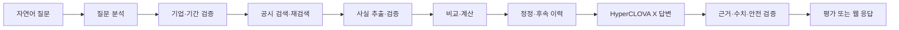
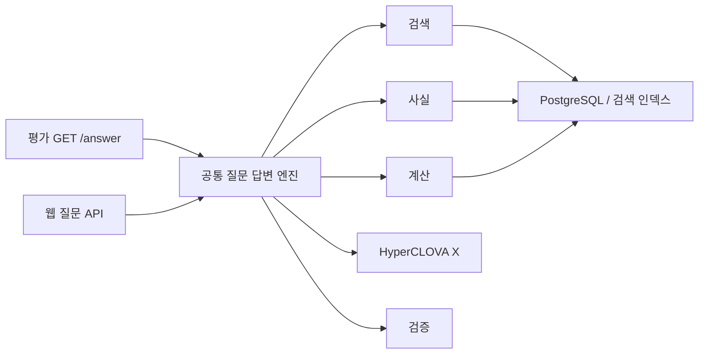

# FolioLens 프로젝트 컨텍스트

| 항목 | 내용 |
|---|---|
| 프로젝트명 | FolioLens |
| 문서 버전 | v1.0 |
| 문서 상태 | 공식 과제 반영 개정안 |
| 갱신일 | 2026-07-28 |
| 대회 | 제10회 2026 미래에셋증권 AI Festival |
| 참가 부문 | 공시 Agent |
| 예선 제출 기한 | 2026-09-06 |

> 2026-08-25 역할 A 동기화: 질문 계획·평가 어댑터·실행 저장 골격의 현재 사실과 역할 A 잔여 작업만 갱신했다. 데이터 적재·파서·검색·fact·계산 등 역할 B 구현 상태와 미확정 외부 계약은 2026-07-28 스냅샷에서 재판정하지 않았다.

## 1. 문서 역할

이 문서는 FolioLens의 목적, 범위, 핵심 제약, 기술 방향과 현재 상태를 빠르게 이해하기 위한 요약본이다.

구체적인 구현과 계약은 다음 문서를 사용한다.

- 요구사항과 우선순위: `요구사항_정의서.md`
- 기능·기술 구조: `기능명세서.md`
- 화면과 사용자 흐름: `IA.md`
- API 공통 계약: `API_명세서.md`
- URL별 상세 계약: `API_상세_명세서.md`
- 데이터베이스: `erd/README.md`, `erd/foliolens_schema.sql`
- 기술 결정과 근거: `DECISIONS.md`

## 2. 서비스 한 줄 정의

> 대회가 제공한 공시 데이터에서 자연어 질문에 필요한 사실을 검색·추출·비교·계산하고, 사용한 공시 근거와 정보 한계를 함께 설명하는 공시 Agent

평가 코어를 완성한 뒤에는 사용자의 보유 종목과 투자 이유를 연결해 개인화된 공시 분석으로 확장한다.

## 3. 공식 과제의 핵심

공식 과제는 단순히 공시를 요약하는 웹 서비스를 만드는 것이 아니다.

Agent는 자연어 질문을 받아 다음 작업을 수행해야 한다.

1. 관련 기업, 기간, 공시와 항목을 찾는다.
2. 공시에서 필요한 사실과 수치를 추출한다.
3. 여러 문서·기업·기간을 비교한다.
4. 증감액, 증감률과 비중 등을 계산한다.
5. 원공시·정정공시·후속공시를 연결한다.
6. 사용한 공시 근거와 함께 답변한다.
7. 공시에서 확인할 수 없는 내용은 추측하지 않는다.

예선에서는 운영진이 비공개 질문을 평가 API에 전달하고 답변의 정확성, 근거, 완전성, 논리성, 안전성과 정보 한계 대응을 평가한다.

## 4. 해결하려는 문제

기업 공시는 공식 정보지만 다음 이유로 일반 사용자가 활용하기 어렵다.

- 문서의 양이 많고 용어와 표 구조가 복잡하다.
- 정확한 보고서명과 공시 유형을 모르면 검색하기 어렵다.
- 하나의 질문에 여러 시점과 여러 종류의 공시가 필요할 수 있다.
- 정정·변경·해지 공시를 놓치면 과거 값을 현재 상태로 오해할 수 있다.
- 수치의 단위와 회계기간이 다르면 직접 비교하기 어렵다.
- 생성형 모델의 답변이 어느 공시를 근거로 하는지 검증하기 어렵다.

FolioLens는 사용자가 직접 문서를 찾아 대조하는 부담을 줄이되, 결과를 원문 근거로 다시 확인할 수 있게 한다.

## 5. 제품 전략

### 5.1 P0 — 평가 코어

가장 먼저 완성해야 하는 범위다.

- 대회 제공 데이터 적재·정규화
- 기업·기간·공시 유형·내용 기반 검색
- 자연어 질문 분석과 실행 계획
- 공시 사실 추출
- 결정적 비교·계산
- 정정·후속공시 이력 추적
- HyperCLOVA X 기반 답변 생성
- 주장·수치·근거·금지 표현 검증
- 평가용 `GET /answer`
- 골든셋과 회귀 평가
- Docker 제출 환경과 운영 상태

### 5.2 P1 — 질문 중심 웹

평가 코어를 사용자가 직접 경험할 수 있는 시연 서비스다.

- 자연어 질문 홈
- 질문 처리 상태
- 직접 답변과 핵심 주장
- 비교표와 계산 상세
- 공시 근거 패널과 원문 위치
- 답변 불가·부분 답변
- 공시 목록·상세·비교
- 후속 질문

### 5.3 P2 — 포트폴리오 개인화

FolioLens의 장기 차별화 방향이지만 P0보다 먼저 구현하지 않는다.

- 포트폴리오와 보유 종목
- 보유 비중과 투자 이유
- 보유 종목 기반 질문 추천
- 공시와 투자 가정의 관련성
- 개인화 중요도
- 알림과 리포트

## 6. 핵심 차별점

### 6.1 키워드 검색이 아니라 질문 해결

사용자가 정확한 공시명이나 항목명을 몰라도 기업, 기간, 비교 대상과 필요한 연산을 해석한다.

### 6.2 단일 요약이 아니라 다문서 종합

정기보고서, 수시·거래소공시와 지분공시를 함께 찾고 기간별·기업별 비교와 사건 이력을 제공한다.

### 6.3 모델의 임의 계산이 아닌 재현 가능한 계산

금액, 날짜, 단위, 증감률, 비중과 기간은 Spring 백엔드의 결정적 함수가 계산한다. 모델은 결과를 이해하기 쉽게 설명한다.

### 6.4 주장별 원문 근거

핵심 주장과 수치는 접수번호, 공시명, 접수일, 장·절·표·행 등 원문 위치와 연결한다.

### 6.5 정직한 실패

제공 공시로 답할 수 없으면 `UNANSWERABLE`, 일부만 확인되면 `PARTIAL`로 처리한다. 모델의 사전학습 지식이나 외부 데이터로 빈칸을 채우지 않는다.

### 6.6 개인화 확장

동일한 공시 QA 코어 위에 보유 종목과 투자 이유를 연결한다. 개인화를 위해 별도의 검색·답변 엔진을 만들지 않는다.

## 7. 대회 데이터 범위

| 구분 | 범위 |
|---|---|
| 기업 | 운영진이 선정한 대표 상장기업 |
| 기간 | 2023년 1월~2026년 3월 |
| 정기공시 | 사업보고서, 반기보고서, 분기보고서 |
| 수시·거래소공시 | 주요사항보고서, 계약, 시설투자, 주요경영사항 등 |
| 지분공시 | 주식 등의 대량보유상황보고서 등 5% 보고 |
| 구조화 데이터 | 기업명, 종목코드, 업종 등 기업 마스터 |
| 메타데이터 | 접수일자, 공시 유형, 제출인 등 |

실제 파일 형식과 스키마는 데이터를 수령한 뒤 `DATA_CATALOG.md`에서 확정한다.

## 8. 필수 제약과 안전 원칙

### 8.1 모델

- 서비스와 평가 경로에서는 대회가 허용한 HyperCLOVA X 계열만 사용한다.
- 다른 언어모델을 추가하거나 장애 시 대체 모델로 우회하지 않는다.
- 임베딩과 보조 모델은 대회 허용 정책을 확인한 뒤 사용한다.

### 8.2 데이터

- 답변 사실의 근거는 대회 제공 데이터로 제한한다.
- 평가 경로에서 OpenDART 실시간 API를 호출하지 않는다.
- 뉴스, 증권사 리포트, 위키, 검색엔진과 외부 코퍼스를 사용하지 않는다.
- 기존 OpenDART 기업 동기화 코드는 `opendart-dev` 전용으로 격리한다.
- 평가 DB와 검색 인덱스에는 `CONTEST` 데이터만 넣는다.

### 8.3 답변

- 매수·매도 추천을 제공하지 않는다.
- 목표주가, 상승·하락 확률과 수익 보장을 제공하지 않는다.
- 공시에 없는 미래 실적이나 전망을 단정하지 않는다.
- 사실, 백엔드 계산, Agent 설명과 정보 한계를 구분한다.
- 모든 핵심 주장과 수치에 공시 근거를 연결한다.

## 9. Agent 처리 흐름

재검색과 재생성은 횟수와 전체 제한시간을 둔다. 검증을 통과하지 못한 완성형 답변을 반환하지 않는다.

## 10. HyperCLOVA X와 백엔드의 책임

| 영역 | HyperCLOVA X | Spring 백엔드 |
|---|---|---|
| 질문 | 의도·비교 조건 후보 | 기업·기간·열거형 검증 |
| 검색 | 검색어·하위 질문 후보 | 실제 검색과 순위·재검색 통제 |
| 사실 | 비정형 문장·표의 후보 추출 | 자료형·단위·원문 존재 검증 |
| 계산 | 결과 설명 | 공식·단위 변환·반올림 |
| 이력 | 변화 의미 설명 | 정정·후속 관계와 현재 상태 확정 |
| 답변 | 자연어 종합 | 근거 제한, 출력·안전 검증 |

## 11. 시스템 구조

하나의 Spring Boot 애플리케이션에서 공통 답변 엔진과 입출력 어댑터를 분리한다.

### 평가 API

- `GET /answer`
- 동기 응답
- 운영진 규격의 `question_id`, `question`, `retrieved_context`, `think_trace`, `answer`
- 내부 공통 응답 래퍼를 사용하지 않음

### 웹 API

- `POST /api/v1/questions`로 실행 생성
- `GET /api/v1/questions/{runId}`로 상태·답변 조회
- 근거와 계산은 별도 상세 API
- 웹 공통 `ApiResponse<T>` 사용

### 내부 데이터 API

- 대회 제공 데이터 적재와 인덱싱
- 외부 공개 금지 또는 관리자 인증

## 12. 기술 스택

### Backend

- Java 21
- Spring Boot
- Gradle Groovy DSL
- Spring Web MVC
- Spring Data JPA
- Bean Validation
- Spring Security와 JWT(P2)
- PostgreSQL
- Flyway
- Spring Boot Actuator
- JUnit

### Frontend

- React
- TypeScript
- Vite
- 기본 CSS와 fetch API
- 필요성이 검증되기 전 Redux, Next.js와 복잡한 UI 라이브러리를 추가하지 않음

### External

- HyperCLOVA X
- 대회 제공 공시 데이터

### Deployment

- Docker
- Docker Compose
- 평가 서버가 접근 가능한 운영 환경

## 13. 현재 구현 상태

이번 동기화에서 코드로 확인한 역할 A 기준선은 다음과 같다.

- `EvaluationAnswerController`의 `GET /answer`, 평가 입력의 내부 명령 변환과 웹 래퍼를 사용하지 않는 5개 키 응답 DTO
- `EvaluationExceptionHandler`의 평가 전용 요청·비즈니스·예상 밖 예외 경계
- `QuestionPlanCandidate`, `QuestionPlan`, 5개 `ToolType`과 `DisclosureRetriever.retrieve(QuestionPlan)` seam의 골격
- V5 `question_runs`, `QuestionRun` Entity·Repository·생성 Service
- `DisclosureAnswerService`는 run을 `PENDING`으로 만든 뒤 실제 계획·검색·계산·HCX·검증 없이 placeholder를 반환하므로 end-to-end 구현은 아님

### 구현됨 또는 재사용 가능

- Company 엔티티, Repository, 검색 Service·Controller
- 기업명·종목코드 검색
- `CompanyDataProvider` 동기화 인터페이스
- OpenDART 기업 ZIP 다운로드·XML 파서와 일부 테스트
- Owner 엔티티·Repository·Service
- JWT Provider·Filter·SecurityConfig 기반
- `ApiResponse`, `PageInfoResponse`
- `ErrorCode`, `GlobalExceptionHandler`
- JPA 감사 엔티티
- PostgreSQL·Flyway 구성
- Dockerfile과 Compose
- Actuator 의존성

### 미구현 P0 핵심

- 대회 제공 데이터 어댑터
- 공시 원문 파서·섹션·청크
- 검색 인덱스와 검색 서비스
- HCX 계획 후보 생성, 후보→검증 계획 validator와 실제 실행 연결
- 공시 사실 추출·검증
- 결정적 계산 도구
- 정정·후속공시 이력
- HyperCLOVA X 계획·답변 클라이언트
- 답변 생성과 주장별 근거
- 답변 검증기
- 평가 API의 실제 사용 evidence·안전 실행 요약 mapper, 공통 코어 연결과 계약 테스트
- 골든셋 자동 평가

### Frontend

- 현재 Vite 기본 예제 수준
- 개정된 IA를 기준으로 질문·답변 화면을 새로 구현해야 함

## 14. 현재 데이터 모델의 주요 변경점

기존 ERD의 기업·공시·사실·근거 테이블은 일부 재사용할 수 있다.

추가 또는 개정이 필요한 핵심 모델:

- dataset_versions
- ingestion_jobs
- disclosure_sections
- disclosure_chunks
- question_plans
- retrieval_runs
- retrieved_evidences
- calculation_records
- answer_validations

포트폴리오와 독립적인 V5 `question_runs`는 도입됐다. 다만 현재 역할 A 경로는 run을 `PENDING`으로 생성할 뿐 command channel, `PROCESSING`·종료 전이, 계획·답변·오류·완료시각 저장을 연결하지 않았다.

## 15. 문서 우선순위

작업 전 다음 순서로 확인한다.

1. `PROJECT_CONTEXT.md`
2. `요구사항_정의서.md`
3. `기능명세서.md`
4. `IA.md`
5. `API_명세서.md`
6. `API_상세_명세서.md`
7. `DECISIONS.md`
8. `erd/README.md`와 스키마

요구사항이 충돌하면 다음 순서를 따른다.

1. 현재 사용자의 명시적인 요청
2. 승인된 Must 요구사항
3. 기능명세서
4. IA
5. API 명세서
6. PROJECT_CONTEXT
7. 기존 코드 관례

## 16. 바로 다음 작업

현재 문서 기준의 다음 구현 준비 순서는 다음과 같다.

1. 기존 `question_runs`에 역할 A의 channel·상태 전이·계획·답변·오류·완료시각 저장 연결
2. Flyway 스키마와 JPA 엔티티 변경 계획 확정
3. 대회 데이터 수령 후 `DATA_CATALOG.md` 작성
4. 별도 intent 필드 결정을 완료한 뒤 후보·검증 계획 schema를 고정하고 validator 구현
5. 초기 골든 질문과 `EVALUATION_PLAN.md` 작성
6. 소형 공시 fixture로 질문 하나의 수직 흐름 구현
7. HyperCLOVA X 연동과 구조화 출력 검증
8. 기존 `GET /answer`에 실제 evidence·계산·답변·검증 결과를 연결하고 계약 테스트 수행

첫 번째 기술 목표:

> 기업 한 곳의 공시 1~2건을 사용해 대표 질문 하나가 정확한 수치와 공시 근거를 포함하여 `GET /answer`로 반환된다.

## 17. 팀 역할 방향

| 역할 | 핵심 책임 |
|---|---|
| AI·백엔드 | 질문 오케스트레이션, HyperCLOVA X, 평가 API, 배포 |
| 데이터·백엔드 | 데이터 적재, 파싱, 검색, 사실과 계산 |
| 금융 도메인·QA | 질문 설계, 계산·해석 규칙, 골든셋, 답변 검수 |

공통 DTO, 공시 factKey, 계산 규칙과 근거 계약은 세 명이 함께 확정한다.

## 18. 제출물

예선을 위해 다음을 준비한다.

- 소스코드
- 재현 가능한 실행 환경과 Docker
- README
- 기술제안서
- 평가 API 서버 주소와 API 규격
- 골든셋·테스트 결과
- 사용 모델·데이터·안전 정책 설명

## 19. 미확정 사항

1. 제공 데이터의 실제 파일 형식, 스키마와 용량
2. 대상 기업의 정확한 목록
3. 평가 API의 최종 인증과 오류 형식
4. `retrieved_context`와 `think_trace`의 최종 자료형
5. 질문당 제한시간과 동시 요청 수
6. 임베딩·재정렬 모델의 허용 범위
7. 원문 저장과 브라우저 표시 방식
8. 웹 데모 세션과 질문 보존기간

운영진 공지나 팀 결정이 확정되면 `DECISIONS.md`와 관련 명세를 함께 갱신한다.
