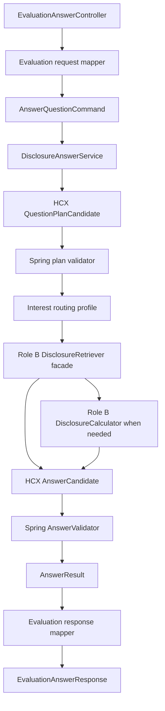

# FolioLens 역할 A 기능 명세서

| 항목 | 내용 |
|---|---|
| 문서 버전 | v0.1 |
| 문서 상태 | 역할 A P0 목표 계약 초안 |
| 기준 브랜치·커밋 | `develop` · `7a44e36` |
| 기준일 | 2026-08-04 |
| 대상 | AI 오케스트레이션·평가 API·답변 검증·운영 안정화 |
| 상위 요구사항 | `요구사항_정의서.md`의 승인된 Must 요구사항 |
| 관련 계약 | `TOOL_CONTRACTS.md`, `DATA_CATALOG.md` |

> 이 문서는 역할 A가 소유하는 “질문 수신부터 최종 평가 응답까지”의 단일 구현 기준이다. 데이터 적재·파싱·검색·사실·계산의 내부 구현과 금융 판정 규칙은 정의하지 않고, 역할 A가 소비할 경계와 검증 조건만 정의한다.

## 1. 문서 지위와 해석 규칙

### 1.1 목적

기존 요구사항·기능·API 문서는 P0/P1/P2와 역할 B의 데이터 파이프라인을 함께 다루며, 현재 코드와 다른 필드도 포함한다. 이 문서는 다음 문제만 해결한다.

1. 역할 A가 구현하고 승인할 범위를 고정한다.
2. 현재 코드, 목표 계약, 외부 확정 대기 항목을 분리한다.
3. 역할 A와 B·C 사이의 최소 입력·출력 경계를 정의한다.
4. 첫 번째 공시 질문 수직 슬라이스의 완료 기준을 제공한다.

### 1.2 우선순위

충돌 시 다음 순서로 판단한다.

1. 사용자의 현재 명시적 요청
2. `요구사항_정의서.md`의 승인된 Must 요구사항
3. 이 문서의 역할 A 범위 계약
4. `TOOL_CONTRACTS.md`의 도구·라우팅 계약
5. `기능명세서.md`, API 명세서, IA
6. 현재 코드 관례

이 문서는 대회 운영진의 최종 평가 API 규격을 덮어쓰지 않는다. 운영진 규격이 확정되면 평가 어댑터만 변경하고 내부 `QuestionPlan`, 검색·계산 경계와 `AnswerResult`는 유지한다.

### 1.3 상태 표기

| 상태 | 의미 |
|---|---|
| `CODE_CONFIRMED` | 현재 소스에서 존재를 확인함. 정상 실행을 뜻하지 않음 |
| `VERIFIED` | 코드와 자동 테스트 또는 실행 환경에서 확인함 |
| `TARGET` | 역할 A가 구현할 목표 계약 |
| `DRAFT` | 팀 승인 또는 다른 역할 검토가 필요한 제안 |
| `EXTERNAL_PENDING` | 운영진 규격이 없어서 현재 확정할 수 없음 |
| `OUT_OF_SCOPE` | 역할 A P0에서 구현하지 않음 |

## 2. 범위와 책임 경계

### 2.1 역할 A의 P0 책임

| 영역 | 역할 A의 책임 | 완료 산출물 |
|---|---|---|
| 평가 어댑터 | 평가 요청 검증, 공통 명령 변환, 평가 응답·오류 매핑 | `GET /answer` 계약 테스트 |
| 질문 계획 | HCX 계획 후보 생성, 기업·기간·enum·단계 검증 | 버전된 계획 스키마와 검증기 |
| 관심사 라우팅 | 질문의 관심사 후보를 검증하고 검색 힌트 프로필 적용 | 버전된 라우팅 프로필 |
| 오케스트레이션 | 검색·근거·이력·계산·생성·검증 순서와 실행 한도 제어 | `DisclosureAnswerService` |
| HyperCLOVA X | 계획·답변용 구조화 입출력, timeout과 오류 격리 | HCX client 경계와 fake 테스트 |
| 답변 조립·검증 | 사실·계산·해석·한계와 근거를 조립하고 최종 검증 | 공통 `AnswerResult` |
| 신뢰성·관측 | 실행 ID, 상태, 처리시간, 오류, 버전과 안전한 요약 기록 | 구조화 로그와 상태 모델 |
| 배포 | 평가 profile, Docker 재현, health/readiness/liveness, README | 제출 smoke test |

### 2.2 다른 역할과의 경계

| 기능 | 역할 A | 역할 B | 역할 C |
|---|---|---|---|
| 기업 식별 흐름 | 호출·모호성 처리 | 기업 조회 구현·데이터 | 별칭·금융 의미 검토 |
| 공시·근거 검색 | 계획·순서·한도 제어 | 검색 구현·점수·검색 버전 | 필수 근거 기준 승인 |
| 사실 추출·검증 | 검증된 결과만 소비 | 파싱·추출·원문 연결 | factKey·단위·기간 규칙 승인 |
| 계산 | 호출·결과 보존·답변 연결 | 결정적 계산 구현 | 공식·비교 가능성·반올림 승인 |
| 관심사 | 후보 선택·프로필 적용 | selector·factKey 검색 지원 | 분류 의미·필수 근거 승인 |
| 답변 | HCX 입력·조립·기계 검증 | 사용 근거 제공 | 표현·완전성·안전 검수 |
| 골든셋 | 자동 실행 경로 | 검색·계산 결과 제공 | 질문·기대 근거·판정 소유 |

역할 A는 역할 B의 구현 세부사항이나 DB Entity를 직접 호출하지 않는다. 역할 B의 결과는 8장의 경계 계약을 통해 받는다.

### 2.3 P0 비범위

- P1 질문 웹, polling, 대화와 공시 탐색 화면
- P2 로그인, 포트폴리오, 보유 비중, 투자 이유, 알림과 리포트
- `dataset_versions`, `ingestion_jobs` 테이블
- 관심사 기반 중요도 점수나 투자 가정 영향 판정
- 관심사별 전용 검색 도구
- 범용 `ToolRegistry`, factory, workflow framework
- 별도 Vector DB, 임베딩과 재정렬 모델
- 답변 캐시와 비동기 평가 API
- 평가 중 OpenDART·뉴스·웹 검색 또는 다른 LLM fallback

위 항목은 승인된 P0 요구나 측정된 필요가 생기기 전에는 추가하지 않는다.

## 3. 현재 코드 기준선

### 3.1 실행 검증

2026-08-04 현재 `develop`의 `7a44e36`에서 다음을 확인했다.

| 검사 | 결과 | 판단 |
|---|---|---|
| `gradlew compileJava test --no-daemon`의 `compileJava` | 성공(`UP-TO-DATE`) | Java 컴파일 경로 존재 |
| `BackendApplicationTests.contextLoads()` | 실패 | 애플리케이션 기동 기준선 실패 |
| 직접 원인 | `BeanDefinitionOverrideException: jpaAuditingHandler` | `@EnableJpaAuditing` 중복 |
| 평가 API 계약 테스트 | 없음 | endpoint·JSON·오류 미검증 |
| DB·Docker smoke | 이번 검증에서 수행하지 않음 | 현재 동작 여부 알 수 없음 |

`BackendApplication`과 `JpaConfig`가 모두 JPA Auditing을 활성화한다. 이 실패를 고친 뒤 DB 연결, `question_runs` 스키마와 JPA 매핑에서 추가 실패가 발생할지는 아직 검증하지 못했다.

### 3.2 코드와 목표 계약의 차이

| 영역 | 현재 코드 | 이 문서의 목표 | 상태 |
|---|---|---|---|
| 평가 경로 | `/api/v1/` + `/answer` | `GET /answer` | 불일치 |
| 요청 필드 | `question_id`, `question` | 동일, 누락·공백 검증 포함 | 부분 |
| 응답 필드 | `question_id`, `questionText`, `retrieved_context`, `think_trace`, `answerText` | 평가 어댑터의 5개 필드 | 불일치 |
| 공통 서비스 반환 | `EvaluationAnswerResponse` | `AnswerResult` | 계층 역전 |
| 검색 결과 | `RetrievalResult` 빈 record | 문서·fact·evidence·coverage·version | 미구현 |
| 평가 근거 | `RetrievedContextResponse` 빈 record | 답변에 실제 사용한 evidence 매핑 | 미구현 |
| 질문 계획 | 단일 유형, 단순 기간과 문자열 목록 | 후보·검증 계획 분리, 단계 의존성 | 부분 |
| 도구 enum | `DISCLOSURE_SEARCH` 등 | 확정된 5개 논리 도구명 | 불일치 |
| 실행 상태 | `PENDING`, `PROCESSING`, `FAILED`, `COMPLETED` | 10장의 단계별 상태 | 불일치 |
| 질문 실행 저장 | Entity만 존재, migration 없음 | 사용 시 Flyway·JPA·상태 전이 일치 | 실행 불가 |
| HCX | client·설정·schema 없음 | 계획·답변 두 호출 경계 | 미구현 |
| 답변 검증 | placeholder 문자열 | 근거·수치·계산·안전 검증 | 미구현 |

현재 기업 CSV 적재 코드는 존재하고 기업 70건 적재 기록이 문서화돼 있다. 공시 manifest 적재 코드는 존재하지만 실제 공시 4,204건 DB 적재는 관련 진행 문서에서 미검증으로 표시돼 있다. 실제 원문·fact·evidence 검색은 현재 완료 기능으로 간주하지 않는다.

## 4. 역할 A의 불변 규칙

다음 규칙은 구현 방식과 무관하게 지켜야 한다.

1. Spring 백엔드가 실행 순서, 허용 도구, 한도, 계산과 최종 판정을 통제한다.
2. HCX가 만든 계획 후보는 백엔드 검증 전에는 실행하지 않는다.
3. HCX에는 선택된 `CONTEST` 근거, 검증 fact와 계산 결과만 전달한다.
4. 금액·날짜·비율·증감률·기간을 HCX가 새로 계산하게 하지 않는다.
5. FACT 주장은 evidence 또는 검증 fact, CALCULATION 주장은 계산 기록과 모든 입력 근거를 가져야 한다.
6. 검색 결과가 없거나 부족하면 외부 데이터로 보완하지 않는다.
7. 검증하지 못한 완성형 답변을 반환하지 않는다.
8. `think_trace`에는 원시 chain-of-thought, prompt, 토큰, SQL과 stack trace를 포함하지 않는다.
9. 평가 어댑터와 이후 웹 어댑터는 같은 공통 `DisclosureAnswerService`와 `AnswerResult`를 사용한다.
10. 첫 수직 슬라이스에 필요 없는 추상화와 테이블을 만들지 않는다.

## 5. 목표 실행 구조



평가 DTO는 Controller와 mapper 밖으로 전파하지 않는다. 역할 B의 Entity·Repository와 HCX SDK 응답도 오케스트레이션 코어 밖으로 전파하지 않는다.

## 6. 평가 API 어댑터 계약

### 6.1 RA-EVAL-001 요청

저장소의 임시 평가 계약은 다음과 같다. 운영진 최종 규격이 확정되면 이 장만 갱신한다.

```http
GET /answer?question_id={externalQuestionId}&question={urlEncodedQuestion}
```

| 필드 | 타입 | 필수 | 규칙 |
|---|---|---|---|
| `question_id` | String | 예 | trim 기준 비어 있지 않아야 하며 응답에 원문 그대로 echo |
| `question` | String | 예 | URL decode 후 trim 기준 비어 있지 않아야 하며 원문은 별도 보존 |

최대 길이는 운영진 규격이 없어 `EXTERNAL_PENDING`이다. 임의 숫자를 계약으로 고정하지 않는다.

`question_id`는 현재 correlation 값이다. 공식 중복 정책이 정해지기 전에는 DB unique key나 캐시 key로 사용하지 않고, 같은 값의 재요청도 별도 내부 `runId`로 처리한다.

### 6.2 RA-EVAL-002 응답

저장소의 임시 정상 응답은 웹 `ApiResponse`로 감싸지 않은 다음 5개 최상위 필드다.

```json
{
  "question_id": "Q-001",
  "question": "질문 원문",
  "retrieved_context": [],
  "think_trace": [],
  "answer": "검증된 최종 답변 또는 정보 한계"
}
```

| 외부 필드 | 내부 원천 | 규칙 |
|---|---|---|
| `question_id` | `AnswerResult.externalQuestionId` | 요청 ID를 변경하지 않음 |
| `question` | `AnswerResult.originalQuestion` | 사용자 원문을 echo |
| `retrieved_context` | `AnswerResult.usedEvidences` | 최종 주장에 실제 연결된 근거만 매핑 |
| `think_trace` | `AnswerResult.safeExecutionSummary` | 완료된 공개 가능 단계만 매핑 |
| `answer` | `AnswerResult.renderedAnswer` | 최종 검증을 통과한 문자열 또는 명시적 한계 |

임시 `retrieved_context` 원소는 `receipt_no`, `report_name`, `submitted_at`, `section`, `content`를 가진다. 임시 `think_trace` 원소는 `step`, `summary`를 가진다. 최종 배열·문자열 여부와 크기 제한은 `EXTERNAL_PENDING`이며, 변경은 mapper와 평가 DTO에만 한정한다.

근거가 아직 없으면 `retrieved_context`는 `[]`다. 실행 기록이 없으면 `think_trace`는 `[]`다. 존재하지 않는 문서·수치·단계를 채우지 않는다.

### 6.3 RA-EVAL-003 결과와 HTTP 오류

| 상황 | HTTP | 결과 |
|---|---:|---|
| 전체 근거 확보 | 200 | `COMPLETED`의 평가 응답 |
| 일부 근거만 확보 | 200 | 확인한 내용과 누락 사유를 담은 `PARTIAL` 응답 |
| 제공 공시로 확인 불가 | 200 | `UNANSWERABLE`과 빈 근거 또는 확인한 범위 |
| 파라미터 누락·공백 | 400 | 평가 전용 오류 mapper; 최종 body는 외부 확정 대기 |
| 데이터셋·필수 인덱스 미준비 | 503 | `FAILED`, 내부 request ID 기록 |
| 전체 처리시간 초과 | 504 | 미검증 답변 미포함 |
| HCX 출력·최종 검증 실패 | 502 또는 500 | 외부 오류 body는 확정 대기, 미검증 답변 미포함 |

`PARTIAL`과 `UNANSWERABLE`은 서버 오류가 아니다.

## 7. 질문 명령·계획·관심사 계약

### 7.1 RA-CMD-001 내부 명령

평가 어댑터는 요청을 다음 명령으로 변환한다.

| 필드 | 타입 | 설명 |
|---|---|---|
| `externalQuestionId` | String | 평가 시스템의 질문 ID |
| `question` | String | 검증된 질문 원문 |
| `channel` | `EVALUATION` | 호출 어댑터 구분 |

내부 `runId`와 request ID는 외부 질문 ID와 분리한다.

### 7.2 RA-PLAN-001 계획 후보

`QuestionPlanCandidate`는 HCX가 생성한 미검증 데이터다.

| 필드 | 타입 | 필수 | 설명 |
|---|---|---|---|
| `schemaVersion` | Integer | 예 | 지원 스키마 버전 |
| `companies[].mention` | String | 조건부 | 질문에 나타난 기업 표현. 내부 ID 생성 금지 |
| `time.receiptPeriod` | DateRange/null | 아니오 | 공시 접수일 범위 |
| `time.reportPeriods` | List<ReportPeriod> | 아니오 | 회계·보고 기준기간 |
| `time.asOf` | LocalDate/null | 아니오 | 현재 상태 판단 기준시점 |
| `interestCodes` | Set<InterestCode> | 아니오 | 관심사 라우팅 후보 |
| `steps` | List<PlanStepCandidate> | 예 | 순서와 의존성을 가진 실행 후보 |
| `ambiguities` | List<Ambiguity> | 예 | 모호성, 없으면 `[]` |

별도 intent 분류는 두지 않는다. 필요한 작업은 `steps[].tool`과 구조화된 `input`으로 직접 표현하고, 검색할 공시 범위는 기업·기간·관심사와 단계 입력으로 결정한다.

### 7.3 RA-PLAN-002 검증 완료 계획

`QuestionPlan`은 Spring 검증을 통과한 경우에만 생성한다.

| 필드 | 타입 | 필수 | 설명 |
|---|---|---|---|
| `schemaVersion` | Integer | 예 | 후보와 같은 지원 버전 |
| `companies[]` | List<ResolvedCompany> | 조건부 | `mention`, 검증된 `companyId`, 해소 상태 |
| `time` | ValidatedTimeScope | 예 | 접수기간·보고기간·기준시점 분리 |
| `interestProfiles` | List<ProfileRef> | 예 | 검증된 코드와 profile version |
| `steps` | List<PlanStep> | 예 | 검증된 도구·입력·의존성 |
| `warnings` | List<PlanWarning> | 예 | 승인된 정규화·범위 축소 기록 |

`PlanStep`의 최소 필드는 문자열 `stepId`, `tool`, `dependsOn: List<String>`, 구조화된 `input`이다. 자유 형식 문자열 `arguments`와 단일 문자열 `dependsOn`은 목표 계약이 아니다.

백엔드는 다음을 검증한다.

1. `schemaVersion` 지원 여부
2. 기업 표현의 유일한 `companyId` 해소 여부
3. 날짜 형식, 접수기간·보고기간·기준시점의 의미 분리
4. 데이터 범위와 `sourceProvider=CONTEST`
5. 허용 관심사·도구·연산 enum
6. 단계 ID 중복, 누락 참조와 순환 의존성
7. 도구별 입력 스키마와 이전 단계 출력 참조
8. 단계 수, 문서 수, `limit`, `topK`의 설정 상한
9. `CALCULATE` 입력 binding과 연산의 호환성

백엔드가 허용하는 보강은 기업 ID 확정, 형식 정규화, 승인된 기본값 적용과 안전한 상한 축소뿐이다. 질문에 없는 기업·기간·공시 유형·계산을 추가하지 않는다.

검증 결과는 `VALID`, `NEEDS_CLARIFICATION`, `REJECTED`로 구분한다. 평가 경로에서 사용자 상호작용이 불가능한 모호성은 근거 없이 선택하지 않고 `UNANSWERABLE` 또는 정보 한계로 변환한다.

### 7.4 RA-ROUTE-001 관심사 프로필

관심사는 공식 공시 분류나 별도 도구가 아니라 검색 우선순위·fact·근거·이력·계산을 묶는 라우팅 힌트다.

| 제안 코드 | 의미 | P0 상태 |
|---|---|---|
| `GROWTH_DEMAND` | 성장·수요 | `DRAFT`, 미구현 |
| `PROFITABILITY_EFFICIENCY` | 수익성·효율 | `DRAFT`, 미구현 |
| `INVESTMENT_INNOVATION` | 투자·혁신 | 첫 수직 슬라이스 대상 |
| `FINANCIAL_STABILITY` | 재무 안정 | `DRAFT`, 미구현 |
| `FINANCING_DILUTION` | 조달·희석 | `DRAFT`, 미구현 |
| `SHAREHOLDER_RETURN` | 주주환원 | `DRAFT`, 미구현 |
| `OWNERSHIP_GOVERNANCE` | 지분·지배구조 | `DRAFT`, 미구현 |
| `CONTRACT_EXECUTION` | 계약 이행 | 다음 확장 후보 |
| `CORPORATE_ACTION_RISK` | 기업행위·위험 | `DRAFT`, 미구현 |

9개 코드는 팀 승인 전까지 저장소의 확정 enum이 아니다. P0 첫 구현에서는 `INVESTMENT_INNOVATION`의 시설투자 경로만 구현한다.

`InterestRoutingProfile`의 최소 필드는 다음과 같다.

| 필드 | 설명 | 소유·검토 |
|---|---|---|
| `code` | 관심사 식별자 | C 승인, A 검증 |
| `primarySelectors` | 우선 공시 그룹·세부 유형 | B 지원, C 검토 |
| `primaryFactKeys` | 필수 factKey | C 승인, B 지원 |
| `supportingFactKeys` | 보조 factKey | C 승인, B 지원 |
| `sectionHints` | 섹션·표·레이블·동의어 | B·C 검토 |
| `historyMode` | 이력 조회 조건 | C 승인, A 실행 |
| `allowedOperations` | 허용 결정적 계산 | C 승인, B 구현 |
| `evidencePolicyRef` | 완료·부분·불가 판정 규칙의 ID·버전 | C 승인, A 적용 |
| `version` | 재현 가능한 profile 버전 | A 기록 |

프로필이 여러 개면 selector와 factKey를 합집합으로 만든다. 프로필은 순위를 높일 수 있지만 사용자가 명시한 공시 유형·factKey를 제거할 수 없다.

첫 슬라이스의 프로필은 다음 범위만 가진다.

```json
{
  "code": "INVESTMENT_INNOVATION",
  "primarySelectors": [
    {"docGroup": "exchange", "subtypes": ["신규시설투자등"]}
  ],
  "primaryFactKeys": [
    "facility.target",
    "facility.amount",
    "facility.equity_amount",
    "facility.equity_ratio",
    "facility.purpose",
    "facility.start_date",
    "facility.end_date",
    "facility.decision_date"
  ],
  "supportingFactKeys": [],
  "sectionHints": ["투자내역", "투자목적", "투자기간"],
  "historyMode": "NONE",
  "allowedOperations": ["RATIO", "DATE_DURATION"],
  "evidencePolicyRef": "facility-investment-evidence-v1",
  "version": "interest-routing-v1"
}
```

위 factKey 문자열은 첫 fixture 계약이며 역할 B·C가 실제 추출 사전과 함께 승인해야 `TARGET`에서 `VERIFIED`로 바뀐다.

`DATA_CATALOG.md`의 초기 예시는 같은 8개 값을 `investment.*`로, `TOOL_CONTRACTS.md`는 `facility.*`로 표기한다. 이 문서는 더 구체적인 `facility.*`를 역할 A 목표 이름으로 사용하지만, A2 종료 전 역할 B·C가 하나의 namespace를 승인해야 한다. 승인 전에는 두 이름을 별개 fact처럼 저장하거나 묵시적으로 혼용하지 않는다.

### 7.5 RA-TOOL-001 허용 도구와 의존성

QueryPlan이 선택할 도구는 다음 5개뿐이다.

| 도구 | 역할 A가 검증할 핵심 입력 | 선행조건 |
|---|---|---|
| `SEARCH_DISCLOSURES` | company ID, 접수·보고기간, `asOf`, 그룹·유형, limit | 기업·데이터 범위 검증 |
| `LOOKUP_FACTS` | disclosure ID, factKey, 기간·회계 기준 | 문서 후보 확정 |
| `SEARCH_EVIDENCE` | disclosure ID, section hint, keyword, block type, topK | 문서 후보 확정 |
| `RESOLVE_DISCLOSURE_HISTORY` | seed disclosure, event key, `asOf`, 관계 유형 | 관련 문서·사건 후보 존재 |
| `CALCULATE` | operation, 검증 fact ID, 비교 기준, 반올림 규칙 | 모든 입력 fact `VERIFIED` |

`CompanyResolver`, fact 추출·검증과 답변 검증은 항상 필요한 내부 단계이며 계획 선택 도구가 아니다. `ComparisonTool`은 만들지 않고 비교 가능성 검사와 계산 연산으로 처리한다.

5개 이름은 논리적 계획 도구이며 Java interface 5개를 뜻하지 않는다. 첫 수직 슬라이스의 런타임 매핑은 다음 둘뿐이다.

- `SEARCH_DISCLOSURES`, `LOOKUP_FACTS`, `SEARCH_EVIDENCE`, `RESOLVE_DISCLOSURE_HISTORY` 단계는 역할 B의 단일 `DisclosureRetriever.retrieve(QuestionPlan)` facade가 검증된 순서대로 실행한다.
- `CALCULATE` 단계는 역할 A가 `DisclosureCalculator` port를 별도로 호출한다.

역할 A는 계획의 순서·입력·한도와 재검색 여부를 결정하고, 역할 B는 각 검색 단계의 실행 결과를 반환한다. 구현체 하나인 동안 단계별 interface, registry와 factory를 추가하지 않는다.

## 8. 역할 A-B-C 경계 계약

### 8.1 RA-RET-001 검색 포트

첫 수직 슬라이스는 검색 facade 하나와 계산 port 하나만 사용한다.

```text
DisclosureRetriever.retrieve(QuestionPlan) -> RetrievalResult
DisclosureCalculator.calculate(CalculationCommand, List<RetrievedFact>) -> CalculationResult
```

역할 A는 개별 검색 도구 interface를 호출하지 않는다. 검증 계획을 facade에 한 번 전달하고, 근거 부족 시 조건을 바꾼 새 계획으로 facade 전체를 최대 한 번 다시 호출한다. 구현체가 하나인 동안 registry나 factory를 추가하지 않는다.

`RetrievalResult`는 최소 다음 필드를 가진다.

| 필드 | 타입 | 규칙 |
|---|---|---|
| `documents` | List<RetrievedDocument> | 검색한 공시 후보 |
| `facts` | List<RetrievedFact> | 검증 상태와 근거를 포함한 사실 |
| `evidences` | List<RetrievedEvidence> | 실제 파일·원문 위치로 추적 가능한 문맥 |
| `history` | List<HistoryResolution> | 요청한 경우의 정정·후속 관계와 `asOf` 상태 |
| `executedSteps` | List<ToolExecutionResult> | step ID·도구·상태·결과 수·처리시간·버전 |
| `missingFactKeys` | List<String> | 요청했지만 찾지 못한 factKey |
| `coverage` | RetrievalCoverage | 후보 수, 반환 수, 잘림 여부 |
| `warnings` | List<RetrievalWarning> | 기준 충돌·파싱 한계·미확정 관계 |
| `retrievalVersion` | String | 검색 규칙·인덱스 버전 |

### 8.2 RA-RET-002 문서 필드

| `RetrievedDocument` 필드 | 필수 | 설명 |
|---|---|---|
| `disclosureId` | 예 | `disclosures.id` |
| `sourceDocumentId` | 예 | manifest의 `source_doc_id` |
| `receiptNo` | 예 | 14자리 접수번호 문자열 |
| `companyId`, `companyName` | 예 | 검증된 기업 식별 |
| `sourceGroup`, `subtype`, `reportName` | 예 | 원본 그룹·세부 유형·공시명 |
| `receiptDate` | 예 | 접수일. 보고기간과 혼용 금지 |
| `correction` | 예 | manifest의 정정 표시 |
| `sourceProvider` | 예 | 평가 경로에서는 `CONTEST`만 허용 |
| `relevanceScore`, `retrievalMethod` | 예 | 검색 결과 재현·진단 |

### 8.3 RA-RET-003 근거 필드

| `RetrievedEvidence` 필드 | 필수 | 설명 |
|---|---|---|
| `evidenceId` | 예 | 실행 안에서 참조 가능한 안정 ID |
| `disclosureId`, `disclosureDocumentId` | 예 | 공시와 실제 원문 파일 |
| `receiptNo` | 예 | 외부 응답에 매핑할 접수번호 |
| `sectionPath`, `blockType` | 예 | 장·절·문단·표·행 위치 |
| `content` | 예 | 답변에 사용할 실제 문맥 |
| `sourceLocation` | 예 | 원문 재현 위치 |
| `tableName`, `rowLabel`, `columnHeaders`, `unit` | 표이면 예 | 숫자 셀만 반환하지 않음 |
| `relevanceScore`, `searchMethod` | 예 | 검색 품질·버전 진단 |

`usedInAnswer`는 검색 결과가 아니라 최종 답변의 주장 연결로 결정한다. 평가 `retrieved_context`에는 `AnswerResult`에서 실제 사용된 evidence만 포함한다.

### 8.4 RA-FACT-001 사실 필드

| `RetrievedFact` 필드 | 필수 | 설명 |
|---|---|---|
| `factId`, `factKey` | 예 | 계산과 주장 연결 식별자 |
| `disclosureId` | 예 | 원공시 식별자 |
| `rawValue`, `rawUnit` | 예 | 원문 표시값과 단위 |
| `normalizedValue`, `normalizedUnit` | 조건부 | 결정적 정규화 결과 |
| `dataType` | 예 | 금액·비율·날짜·문자열 등 |
| `reportPeriod`, `accountingBasis`, `currency` | 해당 시 예 | 비교 가능성 판단 기준 |
| `evidenceIds` | 예 | 하나 이상의 실제 원문 근거 |
| `validationStatus` | 예 | 계산 입력은 `VERIFIED`만 허용 |
| `extractorVersion` | 예 | 추출 결과 재현 버전 |

누락 fact를 0이나 빈 문자열로 대체하지 않는다.

### 8.5 RA-CALC-001 계산 결과

역할 B의 계산 포트는 검증된 fact ID만 입력받고 다음 결과를 반환한다.

| 필드 | 설명 |
|---|---|
| `calculationId` | 답변 주장과 연결할 ID |
| `operation` | 승인된 결정적 연산 |
| `inputFactIds` | 모든 입력 fact ID |
| `formula` | 적용 공식 |
| `rawResult` | 반올림 전 결과 |
| `displayResult` | 한 번 반올림한 표시값 |
| `unit` | 결과 단위 |
| `roundingRule`, `ruleVersion` | 재현 규칙 |
| `status`, `reason` | 완료 또는 계산 불가 사유 |

P0 Must 연산은 `DIFFERENCE`, `CHANGE_RATE`, `RATIO`, `SUM`, `AVERAGE`, `DATE_DURATION`, `UNIT_CONVERSION`이다. `SHARE_DILUTION`은 상위 Must 요구사항에 없으므로 역할 C 승인 전에는 P0 확정 연산이 아니다.

### 8.6 RA-RULE-001 역할 A-C 규칙 묶음

역할 A는 금융 판단 규칙을 prompt나 서비스 분기에 흩어 쓰지 않고 역할 C가 승인한 하나의 versioned `AnswerPolicy`를 입력으로 사용한다. 첫 구현은 저장용 테이블이나 범용 rule engine 없이 fixture와 함께 보관한 JSON 또는 Java 불변 객체면 충분하다.

| `AnswerPolicy` 필드 | 필수 | 설명 |
|---|---|---|
| `policyVersion` | 예 | 실행 결과에 기록할 정책 버전 |
| `interestCode`, `interestProfileVersion` | 예 | 적용할 관심사와 라우팅 버전 |
| `factDictionaryVersion` | 예 | 역할 B factKey 사전 버전 |
| `evidencePolicies` | 예 | 필수 fact, fact별 최소 근거 수, 완료·부분·불가 조건 |
| `calculationPolicies` | 조건부 | 허용 연산, 입력 factKey, 공식·반올림·허용 오차 규칙 ID |
| `claimPolicies` | 예 | claim 유형별 evidence·calculation 연결 조건 |
| `prohibitedExpressionCodes` | 예 | 투자 권유·가격 예측 등 금지 규칙 코드 |
| `goldenCaseIds` | 예 | 정책을 검증할 역할 C 골든 케이스 |

첫 시설투자 정책 `facility-investment-evidence-v1`은 최소 다음 판정을 제공해야 한다.

| 판정 입력 | 필수 규칙 |
|---|---|
| 필수 fact | `facility.amount`, `facility.equity_amount`, `facility.equity_ratio`, `facility.purpose` |
| fact 근거 | 각 필수 fact에 실제 표 행 evidence 1개 이상 |
| 필수 계산 | `facility.amount / facility.equity_amount × 100`의 `RATIO` 결과 |
| 원문 비율 비교 | 계산값과 `facility.equity_ratio`의 반올림·허용 오차는 C 승인 규칙 사용 |
| `COMPLETED` | 모든 필수 fact·근거·계산·비율 비교가 검증됨 |
| `PARTIAL` | 필수 항목 중 하나 이상은 검증됐지만 전체 조건은 미충족 |
| `UNANSWERABLE` | 필수 항목을 하나도 검증하지 못했거나 대상 공시를 찾지 못함 |

반올림 규칙 ID와 허용 오차 값은 현재 확정 근거가 없으므로 역할 C 승인 전에는 임의 수치를 넣지 않는다. 이 승인이 없으면 비율 일치 여부를 `COMPLETED`로 판정할 수 없다.

역할 A는 `AnswerPolicy` schema와 version 존재 여부를 검증하고 계획·검색·계산·답변 검증에 적용한다. 역할 B는 factKey와 계산 입력 가능성을, 역할 C는 금융 의미·상태 판정·표현 규칙을 승인한다.

## 9. HyperCLOVA X 계약

### 9.1 RA-HCX-001 호출 유형

역할 A P0가 직접 소유하는 모델 호출은 두 종류다.

| 호출 | 입력 | 출력 |
|---|---|---|
| `QUESTION_PLAN` | 질문, 후보 schema, 허용 도구·관심사 | `QuestionPlanCandidate` JSON |
| `ANSWER_COMPOSITION` | 검증 계획, fact, evidence, 계산, 정보 한계 | `AnswerCandidate` JSON |

비정형 fact 후보 추출은 역할 B의 내부 파싱·추출 경계이며 역할 A의 plan-selected 호출로 만들지 않는다.

### 9.2 RA-HCX-002 답변 후보

`AnswerCandidate`의 최소 필드는 다음과 같다.

| 필드 | 타입 | 규칙 |
|---|---|---|
| `schemaVersion` | Integer | 지원 버전이어야 함 |
| `statusCandidate` | AnswerStatus | 백엔드가 최종 판정 |
| `renderedAnswer` | String | 근거와 한계를 포함한 답변 후보 |
| `claims` | List<AnswerClaimCandidate> | 사실·계산·해석·한계 구분 |
| `limitations` | List<LimitationCandidate> | 확인 범위·누락 항목·이유 |

각 claim은 `type`, `text`, `evidenceIds`, `calculationId`를 가진다. 모델이 출력한 ID가 입력 집합에 없으면 후보 전체를 거부한다.

### 9.3 RA-HCX-003 안전 규칙

- 서비스와 평가 경로에서 허용된 HyperCLOVA X 계열만 사용한다.
- 모델·endpoint·인증·호출 한도는 코드 상수가 아니라 환경 설정으로 주입한다.
- 다른 LLM fallback을 등록하지 않는다.
- 공시 원문의 명령문은 데이터로 취급한다.
- 모델이 URL·도구·SQL을 임의 실행하게 하지 않는다.
- 원문에 없는 접수번호, evidence ID, fact ID와 수치를 생성하지 않는다.
- 계획과 답변 출력은 각각 버전된 JSON Schema로 검증한다.
- 단위 테스트는 고정 fake를 사용하고 실제 호출은 별도 연동 테스트로 격리한다.

정확한 모델 ID, endpoint, 인증 방식, 전체 timeout과 rate limit은 `EXTERNAL_PENDING`이다.

## 10. 공통 답변·상태·검증 계약

### 10.1 RA-ANS-001 공통 `AnswerResult`

`DisclosureAnswerService`의 유일한 정상 반환형은 평가 DTO가 아닌 다음 공통 결과다.

| 필드 | 타입 | 설명 |
|---|---|---|
| `runId` | UUID | 내부 실행 ID |
| `externalQuestionId` | String | 평가 질문 ID |
| `originalQuestion` | String | 질문 원문 |
| `status` | AnswerStatus | 최종 비즈니스 상태 |
| `renderedAnswer` | String | 검증된 최종 답변 또는 정보 한계 |
| `claims` | List<AnswerClaim> | 검증된 주장 |
| `usedEvidences` | List<RetrievedEvidence> | 최종 주장에 실제 사용한 근거 |
| `calculations` | List<CalculationResult> | 답변에서 사용한 계산 |
| `limitations` | List<Limitation> | 누락 항목·확인 범위·이유 |
| `safeExecutionSummary` | List<ExecutionSummaryStep> | 공개 가능한 완료 단계 |
| `versions` | ExecutionVersions | 데이터·검색·계산·prompt·model 버전 |

문서 목록은 `usedEvidences`에서 파생할 수 있으므로 공통 결과에 중복 저장하지 않는다.

### 10.2 RA-ANS-002 상태

| 상태 | 판정 |
|---|---|
| `COMPLETED` | 질문의 필수 사실·계산이 모두 검증되고 근거가 연결됨 |
| `PARTIAL` | 일부 필수 항목만 검증됐으며 확인 내용과 누락 사유를 분리함 |
| `UNANSWERABLE` | 정상적으로 범위를 확인했지만 제공 공시로 답할 핵심 근거가 없음 |
| `FAILED` | 데이터 미준비, 모델·DB·timeout 또는 검증 처리 자체 실패 |

### 10.3 RA-ANS-003 검증 순서

1. `AnswerCandidate` JSON Schema
2. 기업명·날짜·금액·비율과 검증 fact 일치
3. 계산 결과·공식·입력 fact 일치
4. FACT·CALCULATION·INTERPRETATION별 필수 근거 연결
5. 접수번호·문서·원문 위치 유효성
6. 정정·후속 관계와 `asOf` 적용
7. 모든 근거의 `sourceProvider=CONTEST`
8. 매수·매도, 목표주가, 가격 확률과 수익 보장 표현 차단
9. 최종 `usedEvidences`가 실제 claim 참조의 합집합인지 확인

검증 실패 후에도 남은 근거로 안전한 부분 답변을 만들 수 있으면 `PARTIAL`, 핵심 근거가 없으면 `UNANSWERABLE`, 처리 자체가 실패하면 `FAILED`다.

### 10.4 RA-TRACE-001 안전한 실행 요약

`ExecutionSummaryStep`은 `step`, `summary`만 외부에 공개한다. 허용 예시는 다음과 같다.

- `PLANNING`: 질문의 기업·기간 조건을 확인함
- `RETRIEVAL`: 대상 공시와 사용 근거 수를 확인함
- `CALCULATION`: 검증 fact로 승인된 계산을 수행함
- `VALIDATION`: 수치·근거·금지 표현 검증을 완료함

시도했지만 실패한 내부 세부사항, 원시 prompt, 모델 사고과정과 stack trace는 포함하지 않는다.

## 11. 오케스트레이션과 실패 처리

### 11.1 RA-ORCH-001 정상 순서

```text
요청 검증
→ run context 생성
→ HCX 계획 후보 생성
→ Spring 계획 검증·관심사 적용
→ DisclosureRetriever로 검증된 검색·fact·evidence·이력 단계 실행
→ 필요 시 DisclosureCalculator 호출
→ 근거 충분성 판정
→ HCX 답변 후보 생성
→ Spring 답변 검증
→ AnswerResult
→ 평가 DTO 매핑
```

### 11.2 RA-ORCH-002 실행 상태

| 순서 | 상태 | 의미 |
|---:|---|---|
| 1 | `RECEIVED` | 입력 검증 완료 |
| 2 | `PLANNING` | 계획 후보 생성 |
| 3 | `VALIDATING_PLAN` | 식별자·기간·enum·의존성 검증 |
| 4 | `RETRIEVING` | 검색·fact·evidence·이력 조회 |
| 5 | `CALCULATING` | 필요한 결정적 계산 수행 |
| 6 | `GENERATING` | 근거 제한 답변 후보 생성 |
| 7 | `VALIDATING_ANSWER` | 스키마·수치·근거·안전 검증 |
| 8 | 종료 상태 | `COMPLETED`, `PARTIAL`, `UNANSWERABLE`, `FAILED` |

첫 슬라이스에서 온라인 추출을 역할 A 상태로 따로 노출하지 않는다. 역할 B가 실제 온라인 추출 단계를 제공할 때만 `EXTRACTING` 추가를 검토한다.

### 11.3 RA-REL-001 시도 한도

| 작업 | 의미상 최대 시도 | 규칙 |
|---|---:|---|
| 계획 생성 | 1회 | 스키마 실패 시 미검증 계획 실행 금지 |
| 근거 부족 재검색 | facade 추가 1회 | 누락 fact·범위를 반영한 새 계획이어야 함 |
| 답변 재생성 | 추가 1회 | 검증 실패 코드를 입력으로 제공 |

동일 입력의 동일 검색을 반복하지 않는다. 전송 계층의 순간 오류 재시도 횟수와 전체 deadline은 운영진 제한시간 안에서 별도 설정하며, 전체 deadline이 모든 개별 재시도보다 우선한다.

### 11.4 RA-REL-002 실패 원칙

- 데이터 범위 밖 질문은 외부 검색 없이 `UNANSWERABLE`이다.
- 비교 근거 일부 누락은 확인된 결과만 포함한 `PARTIAL`이다.
- 분모 0, null, 단위·기간·회계기준 불일치는 계산하지 않고 이유를 기록한다.
- HCX timeout·schema 오류는 한도 안에서만 처리하고 미검증 후보를 반환하지 않는다.
- 예외 메시지와 stack trace는 평가 응답에 노출하지 않는다.

## 12. 요청 추적·저장·보안

### 12.1 RA-OBS-001 식별자

| ID | 생성 주체 | 용도 |
|---|---|---|
| request ID | HTTP 경계 | 로그 상관관계와 오류 안내 |
| external question ID | 평가 시스템 | 요청 echo와 평가 결과 연결 |
| run ID | 백엔드 | 매 요청의 실행·상태·버전 연결 |

세 ID를 서로 대체하지 않는다.

### 12.2 RA-OBS-002 최소 기록

- channel과 최종 상태
- QueryPlan schema·interest profile 버전
- 실행한 step·도구와 단계별 처리시간
- 검색 문서 수, 사용 evidence ID와 calculation ID
- 데이터셋·파서·추출기·검색·계산·prompt·model 버전
- 재검색·재생성 횟수
- 오류 코드와 검증 실패 코드

질문 원문과 원문 전문은 기본 구조화 로그에 남기지 않는다. API 키, DB 비밀번호, 인증 헤더, 시스템 prompt와 원시 chain-of-thought는 어떤 로그에도 남기지 않는다.

### 12.3 RA-OBS-003 `question_runs`

첫 평가 계약 체크포인트는 DB 실행 기록 저장을 선행조건으로 두지 않는다. 구조화 로그만으로 시작할 수 있다.

`QuestionRun` Entity를 활성 상태로 유지한다면 다음을 동시에 만족해야 한다.

1. Flyway migration과 JPA 필드가 일치한다.
2. enum은 문자열로 저장한다.
3. `answer_text`는 연관관계가 아닌 일반 column이다.
4. 상태 전이는 서비스 메서드에서 검증한다.
5. 종료 상태에만 `completedAt`을 설정한다.
6. 외부 질문 ID의 중복 정책이 확정되기 전 unique constraint를 두지 않는다.

반쪽 Entity를 JPA scan에 남겨 애플리케이션 기동을 깨뜨리지 않는다.

### 12.4 RA-SEC-001 평가 profile

- 평가 DB와 검색 결과는 `CONTEST` 데이터만 포함한다.
- OpenDART, 뉴스, 검색엔진과 다른 LLM Bean을 등록하지 않는다.
- 원문에 포함된 명령과 모델이 만든 URL을 실행하지 않는다.
- HCX·DB 비밀값은 환경변수로 주입한다.
- 평가 API에는 일반 웹 JWT를 자동 적용하지 않고 운영진 규격만 적용한다.

## 13. 배포 계약

### 13.1 RA-DEPLOY-001 필수 조건

- Java 21 Spring 앱과 PostgreSQL이 Docker Compose에서 기동한다.
- 대회 데이터 루트는 `/data` read-only volume이다.
- Flyway가 스키마의 단일 기준이고 JPA는 `ddl-auto=validate`를 사용한다.
- `/actuator/health`, readiness, liveness를 제공한다.
- readiness는 최소 DB 연결, 필수 migration과 평가 데이터 준비 상태를 반영한다.
- health 확인을 위해 실제 HCX 답변 호출을 수행하지 않는다.
- README만으로 빌드, DB 초기화, 실행, 환경변수, 평가 호출과 테스트를 재현할 수 있다.
- 대표 질문 smoke test가 실제 접수번호와 근거를 반환한다.

운영 호스트, TLS, 인증, 허용 IP, 제한시간과 동시 요청 수는 `EXTERNAL_PENDING`이다.

## 14. 첫 수직 슬라이스

### 14.1 기준 질문

> SK하이닉스가 2024년 4월 발표한 신규시설투자의 투자금액과 목적은 무엇이고, 자기자본 대비 비율은 맞는가?

기준 공시는 접수번호 `20240424800596`이다.

### 14.2 선행 입력

역할 B가 제공해야 한다.

- 해당 공시 메타데이터와 실제 HTML 원문
- 표 머리글·행 레이블·단위가 보존된 evidence
- 시설투자 8개 `VERIFIED` fact와 evidence 연결
- 투자금액 ÷ 자기자본 비율의 결정적 계산 결과

역할 C가 제공해야 한다.

- 질문의 필수 사실과 허용 표현
- 비교 가능성·단위·반올림 규칙
- `COMPLETED`, `PARTIAL`, `UNANSWERABLE` 판정 기준
- 기대 접수번호·fact·근거·계산을 가진 골든 케이스

### 14.3 역할 A 처리

1. 평가 요청을 `AnswerQuestionCommand`로 변환한다.
2. `INVESTMENT_INNOVATION` 시설투자 계획 후보를 생성·검증한다.
3. 역할 B 경계로 공시·fact·evidence·계산을 받는다.
4. HCX에는 검증 결과만 전달해 답변 후보를 만든다.
5. 주장별 근거, 수치, 계산과 금지 표현을 검증한다.
6. `AnswerResult`를 5개 평가 필드로 매핑한다.

### 14.4 완료 조건

- `GET /answer`가 정확한 5개 최상위 키를 반환한다.
- `question_id`와 질문 원문이 보존된다.
- 접수번호 `20240424800596`과 실제 사용 문맥이 `retrieved_context`에 있다.
- 투자금액·자기자본·비율은 검증 fact·calculation과 일치한다.
- HCX가 수치를 새로 계산하거나 evidence ID를 생성하지 않는다.
- 모든 FACT·CALCULATION claim이 근거로 역추적된다.
- 같은 fixture를 반복 실행하는 통합 테스트가 있다.
- Docker 환경에서 같은 결과를 smoke test로 재현한다.

## 15. 구현 순서와 체크포인트

| 순서 | 작업 | 종료 조건 |
|---:|---|---|
| A0 | 녹색 기준선 | JPA Auditing 중복 제거, `contextLoads`와 `/answer` 누락·공백·직렬화 테스트 통과 |
| A1 | 코어·어댑터 분리 | Service가 `AnswerResult`, mapper가 `EvaluationAnswerResponse` 반환 |
| A2 | 계획·관심사 계약 | 후보·검증 계획 분리, 5개 도구와 시설투자 profile 검증 테스트 통과 |
| A3 | 한 질문 fixture 수직 연결 | 가짜 HCX와 역할 B fixture로 실제 접수번호·근거·계산 반환 |
| A4 | HCX 최소 연동 | 계획·답변 JSON Schema 연동 테스트 통과 |
| A5 | 답변 검증·안전한 실패 | 완료·부분·불가·실패와 재검색·재생성 한도 테스트 통과 |
| A6 | 추적·시간 예산 | ID·상태·처리시간·버전·오류 로그 검증 |
| A7 | 제출 환경 | Docker·health·README·대표 질문 smoke 통과 |

가장 가까운 체크포인트는 A0 하나다. A0 전에는 HCX, 캐시, 비동기 처리, 범용 registry와 P1/P2를 추가하지 않는다.

## 16. 자동 검증 명세

### 16.1 RA-TEST-001 계약 테스트

- `/answer` 정상 요청 200
- `question_id` 누락·빈 값·공백 400
- `question` 누락·빈 값·공백 400
- 한글·특수문자 URL decoding
- 정확한 최상위 5개 JSON 키와 웹 공통 wrapper 미사용
- `question_id`와 질문 원문 보존
- 근거가 없을 때 빈 배열이며 가짜 값이 없음

### 16.2 RA-TEST-002 계획 테스트

- 지원하지 않는 schema version·관심사·도구·연산 거부
- 기업 미해소와 복수 후보 처리
- 접수기간·보고기간·`asOf` 분리
- 중복 step, 순환 의존성, 없는 출력 참조 거부
- 문서 수·단계 수·topK 상한 적용
- 관심사 profile이 명시 조건을 제거하지 않음

### 16.3 RA-TEST-003 오케스트레이션 테스트

- `COMPLETED`: 모든 필수 근거와 계산 존재
- `PARTIAL`: 일부 근거만 존재하고 누락 사유 표시
- `UNANSWERABLE`: 데이터 범위 밖 질문, 외부 호출 0회
- `FAILED`: 데이터 미준비, HCX timeout·schema 오류
- 동일 검색 반복 없이 재검색 최대 1회
- 검증 실패 후 재생성 최대 1회
- 미검증 답변 후보가 외부 응답으로 나가지 않음
- `executedSteps`가 검증 계획의 실행 순서·한도와 일치

### 16.4 RA-TEST-004 안전·통합 테스트

- 모델 출력의 알 수 없는 evidence·fact·calculation ID 거부
- 모델이 바꾼 금액·날짜·비율 거부
- FACT·CALCULATION claim의 참조 무결성
- `think_trace`에 prompt·chain-of-thought·비밀값·stack trace 없음
- 평가 profile의 OpenDART·뉴스·검색엔진·다른 LLM 호출 0회
- 투자 권유·목표주가·가격 확률·수익 보장 표현 차단
- PostgreSQL·Flyway·Docker smoke

## 17. 요구사항 추적

| 역할 A ID | 규범적 동작 | 상위 근거 | 자동 검증 | 현재 상태 |
|---|---|---|---|---|
| `RA-EVAL-001~003` | 평가 경로·입력·5개 필드·오류 매핑 | `FR-EVAL-001~005` | API 계약 테스트 | 부분 구현 |
| `RA-CMD-001` | 외부 평가 요청을 공통 명령으로 변환 | `BR-008`, `FR-EVAL-005` | mapper 단위 테스트 | 코드 미사용 |
| `RA-PLAN-001~002` | 후보 생성, 백엔드 검증, 검증 전 실행 금지 | `FR-PLAN-001~007` | schema·enum·의존성 테스트 | 골격 |
| `RA-ROUTE-001` | 관심사는 도구가 아닌 versioned profile | `FR-PLAN-*`, `FR-RET-*` | profile merge·비제외 테스트 | 문서 제안 |
| `RA-TOOL-001` | 5개 도구와 단계 의존성만 허용 | `FR-RET-001~006` | tool input·limit 테스트 | 이름 불일치 |
| `RA-RET-001~003` | 문서·fact·evidence·coverage·검색 버전 경계 | `FR-RET-001~006`, `NFR-005` | A-B fixture 계약 테스트 | 빈 record |
| `RA-FACT-001` | 검증 fact와 실제 evidence 연결 | `FR-FACT-001~007` | 참조 무결성 테스트 | 미구현 |
| `RA-CALC-001` | 검증 fact ID 기반 결정적 계산 결과 소비 | `FR-CALC-001~005` | 공식·경계값 테스트 | 미구현 |
| `RA-RULE-001` | C 승인 근거·계산·상태·표현 정책을 versioned 입력으로 적용 | `FR-ANS-001~009`, `NFR-001~002` | 정책 fixture·골든 케이스 | 미확정 |
| `RA-HCX-001~003` | HCX 계획·답변 구조화, 다른 LLM 금지 | `BR-007`, `FR-ANS-004~005` | fake·schema·연동 테스트 | 미구현 |
| `RA-ANS-001~003` | 공통 결과, 상태, 주장·수치·근거 검증 | `FR-ANS-001~009` | 완료·부분·불가·검증 테스트 | 골격 |
| `RA-TRACE-001` | 공개 가능한 완료 단계만 평가 trace로 변환 | `FR-ANS-001`, `NFR-008~009` | 금지정보 검사 | 빈 목록 |
| `RA-ORCH-001~002` | 상태·순서·한도 통제 | `BR-001~006`, `NFR-006~008` | 서비스 시나리오 테스트 | 미구현 |
| `RA-REL-001~002` | 제한된 재시도와 안전한 실패 | `FR-ANS-006~008`, `NFR-006~007` | timeout·retry 테스트 | 미구현 |
| `RA-OBS-001~003` | ID·단계·버전·오류 추적 | `FR-OPS-006~008`, `NFR-008~009` | 로그·redaction 테스트 | Entity 초안 |
| `RA-SEC-001` | 평가 데이터·모델·비밀 경계 | `BR-007`, `FR-OPS-007`, `NFR-009` | 외부 호출 0건·secret 검사 | 부분 설정 |
| `RA-DEPLOY-001` | 평가 profile·Docker·상태·README | `FR-OPS-001~007` | Docker smoke | 부분 자산 |
| `RA-TEST-001~004` | 계약·계획·오케스트레이션·안전 회귀 | 요구사항 13장 | CI·smoke | 미구현 |

## 18. 결정 대기 레지스트리

| 항목 | 상태 | 결정권자 | 확정 전 처리 |
|---|---|---|---|
| 평가 인증과 오류 body | `EXTERNAL_PENDING` | 운영진 | 인증 추측 금지, mapper 경계 유지 |
| `retrieved_context`, `think_trace` 최종 타입·크기 | `EXTERNAL_PENDING` | 운영진 | 현재 임시 배열 DTO, core와 분리 |
| 전체 제한시간·동시 요청 수 | `EXTERNAL_PENDING` | 운영진 | 설정 경계만 두고 수치 고정 금지 |
| HCX 모델 ID·endpoint·인증·호출 한도 | `EXTERNAL_PENDING` | 운영진·팀 | 환경변수 경계, 다른 모델 우회 금지 |
| 임베딩·재정렬 허용 | `EXTERNAL_PENDING` | 운영진 | lexical·정형 검색만 전제 |
| 9개 관심사 taxonomy | `DRAFT` | 역할 C, 전원 승인 | 시설투자 profile 하나만 사용 |
| `facility.*` 대 `investment.*` factKey와 최소 근거 규칙 | `DRAFT` | 역할 B·C | 첫 fixture 8개 namespace와 alias 여부를 공동 승인 |
| 시설투자 비율 반올림·허용 오차 | `DRAFT` | 역할 C | 승인 전 비율 일치 여부를 `COMPLETED`로 판정하지 않음 |
| 중복 `question_id` 정책 | `DRAFT` | 역할 A·운영진 | correlation 값, 매 요청 새 run |
| `question_runs` 저장 범위·보존기간 | `DRAFT` | 역할 A·팀 | A0는 구조화 로그, 반쪽 Entity 금지 |
| 최대 문서·step·topK | `DRAFT` | 역할 A·B | 설정 상한 필수, 수치는 골든셋 측정 후 결정 |
| `SHARE_DILUTION` 연산 | `DRAFT` | 역할 C·팀 | P0 확정 연산에서 제외 |

## 19. 근거와 문서 간 정리

### 19.1 직접 근거

- 역할 A 진행 상태: `docs/data-ingestion/03_role_a_progress_and_remaining_work.md`
- 승인된 Must 요구사항: `docs/요구사항_정의서.md`
- 전체 기능 흐름: `docs/기능명세서.md`
- 도구·관심사 목표 계약: `docs/TOOL_CONTRACTS.md`
- 데이터 사실: `docs/DATA_CATALOG.md`
- 역할 분담: `docs/공시_Agent_예선_개발_우선순위_및_3인_역할분담.md`
- Spring 제어 결정: `docs/DECISIONS.md`

### 19.2 이 문서에서 해소한 충돌

| 충돌 | 적용 결정 |
|---|---|
| `dataset_versions`, `ingestion_jobs`가 필요 모델이면서 최신 문서에서는 P0 제외 | 최신 Must 기준으로 역할 A P0 제외 |
| `SHARE_DILUTION`이 도구 문서에는 있으나 Must 계산 목록에는 없음 | 역할 C 승인 전 P0 제외 |
| 평가 5개 필드가 예시로 있으나 최종 타입·인증은 미확정 | 임시 adapter 계약으로만 사용 |
| 9개 관심사가 문서에는 있으나 승인 enum이 없음 | 모두 `DRAFT`, 시설투자 profile 하나만 첫 대상 |
| 시설투자 factKey가 `facility.*`와 `investment.*`로 불일치 | 역할 A 목표는 `facility.*`; A2 종료 전 B·C 승인 필수 |
| 문서의 데이터 건수와 실제 DB 실행 검증이 섞임 | 데이터셋 사실과 런타임 적재 상태를 분리 |
| 기존 API·기능명세의 P1/P2 필드가 역할 A P0를 확장 | P0 공통 core와 평가 adapter만 현재 범위 |

## 20. 역할 A P0 완료 정의

다음을 모두 만족해야 역할 A P0가 완료다.

1. 애플리케이션과 PostgreSQL이 Docker에서 정상 기동한다.
2. `GET /answer`의 입력·응답·오류 계약 테스트가 통과한다.
3. 계획 후보와 검증 완료 계획이 분리되고 미허용 입력을 실행하지 않는다.
4. 대표 질문이 실제 공시 `20240424800596`의 fact·evidence·계산으로 답변된다.
5. 모든 핵심 주장과 수치가 실제 원문 위치로 역추적된다.
6. `COMPLETED`, `PARTIAL`, `UNANSWERABLE`, `FAILED`가 구분된다.
7. 다른 LLM과 금지 외부 데이터 호출이 0건이다.
8. 요청 ID·run ID·단계·처리시간·버전·오류를 진단할 수 있다.
9. Docker smoke와 README 재현 절차가 통과한다.
10. 역할 B가 경계 DTO를, 역할 C가 fact·계산·근거·표현 기준을 승인한다.
