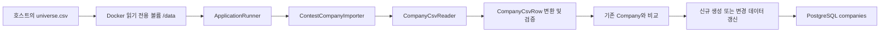

# 기업 CSV 데이터베이스 적재

| 항목 | 내용 |
|---|---|
| 작업 단계 | 01 |
| 작업 영역 | 데이터 적재(Data Ingestion) |
| 대상 데이터 | 대회 제공 `universe.csv` |
| 대상 테이블 | PostgreSQL `companies` |
| 데이터셋 버전 | `contest-2026q1-v1` |
| 시가총액 기준일 | 2026-07-24 |
| 작성일 | 2026-08-02 |
| 현재 결과 | 기업 70건 적재 완료 |

## 1. 작업 목적

대회에서 제공한 기업 마스터 파일 `universe.csv`를 읽고 검증한 뒤 PostgreSQL의 `companies` 테이블에 저장한다.

이 기업 데이터는 이후 공시 메타데이터를 기업과 연결하고, 기업 검색 및 공시 검색 조건을 생성할 때 기준 데이터로 사용한다.

## 2. 전체 처리 흐름



실제 호출 순서는 다음과 같다.

```text
ContestCompanyImportRunner.run()
  → ContestCompanyImporter.importCompanies()
    → CompanyCsvReader.read(universeCsvPath)
      → CompanyCsvRow 생성 및 검증
    → 전체 데이터셋 집계 검증
    → 기존 companies 데이터 조회
    → 신규·변경·동일 데이터 판별
    → 변경된 Company만 저장
    → ImportResult 로그 출력
```

## 3. 원본 데이터 위치와 Docker 연결

원본 데이터는 애플리케이션 저장소나 Docker 이미지 안에 복사하지 않고 별도 디렉터리에 보관한다.

기본 디렉터리 구조는 다음과 같다.

```text
portfolio-disclosure-guardian/
├─ foliolens-server/
│  └─ compose.yaml
└─ foliolens-data/
   └─ universe.csv
```

`compose.yaml`은 호스트의 데이터셋 디렉터리를 애플리케이션 컨테이너의 `/data`에 읽기 전용으로 연결한다.

```yaml
volumes:
  - type: bind
    source: ${FOLIOLENS_DATASET_PATH:-../foliolens-data}
    target: /data
    read_only: true
```

따라서 컨테이너 안에서 기업 CSV의 경로는 다음과 같다.

```text
/data/universe.csv
```

읽기 전용으로 연결하므로 애플리케이션이 대회 원본 파일을 변경하거나 삭제할 수 없다.

## 4. 데이터베이스 준비

Docker Compose는 PostgreSQL 17 컨테이너를 실행한다. 데이터는 Docker의 `postgres-data` 볼륨에 보존되므로 컨테이너를 다시 생성해도 `docker compose down -v`를 실행하지 않는 한 유지된다.

애플리케이션 시작 시 Flyway가 다음 마이그레이션을 적용한다.

```text
backend/src/main/resources/db/migration/V1__create_companies.sql
```

이 마이그레이션은 다음 항목을 생성한다.

- `companies` 테이블
- `corp_code`, `stock_code` 고유 제약조건
- 코드 형식, 시장, 섹터 번호, 결산월, 시가총액 등에 대한 검사 제약조건
- 기업명과 시장·섹터 검색을 위한 인덱스
- 생성일과 수정일 컬럼

Hibernate 설정은 `ddl-auto: validate`이므로 JPA가 테이블을 임의로 생성하지 않는다. 테이블 구조 변경은 Flyway 마이그레이션으로 관리한다.

## 5. 주요 구성요소와 책임

### 5.1 `CompanyCsvRow`

CSV 한 행을 나타내는 중간 객체다. CSV 값을 바로 `Company` 엔티티로 만들기 전에 값의 형식과 범위를 검증한다.

주요 검증 항목은 다음과 같다.

- `corp_code`: 8자리 숫자 문자열
- `stock_code`: 6자리 숫자 문자열
- `market`: `KOSPI` 또는 `KOSDAQ`
- `sector_no`: 1~20
- `fiscal_month`: 1~12
- `market_cap`: 0 이상
- `n_periodic`, `n_major`, `n_exchange`, `n_holding`: 0 이상
- 필수 문자열: 공백 불가
- `note`: 공백이면 `null`로 정규화

신규 기업은 `toCompany()`로 생성하고, 기존 기업은 `updateCompany()`로 갱신한다.

### 5.2 `CompanyCsvReader`

`universe.csv`를 UTF-8로 읽고 `List<CompanyCsvRow>`로 변환한다.

처리 내용은 다음과 같다.

1. 경로가 존재하고 읽을 수 있는 일반 파일인지 확인한다.
2. UTF-8 BOM을 제거한다.
3. Apache Commons CSV로 헤더와 행을 파싱한다.
4. 필수 헤더 17개가 모두 있는지 확인한다.
5. 날짜, 숫자, Enum 값을 Java 타입으로 변환한다.
6. CSV 내부의 `corp_code`와 `stock_code` 중복을 검사한다.

파싱 오류는 `DATASET_503_1` 오류를 가진 `BusinessException`으로 변환한다.

### 5.3 `ContestCompanyImporter`

파싱한 데이터와 기존 DB 데이터를 비교하여 실제 저장 작업을 수행한다.

전체 데이터셋이 올바른 파일인지 다음 기준으로 먼저 확인한다.

| 검증 항목 | 예상값 |
|---|---:|
| 기업 수 | 70 |
| 정기공시 수 합계 | 1,054 |
| 주요사항보고서 수 합계 | 598 |
| 거래소공시 수 합계 | 1,469 |
| 지분공시 수 합계 | 1,083 |

이 검증을 통과한 뒤 `corp_code`를 기준으로 기존 기업을 찾는다.

- 같은 `corp_code`가 없으면 신규 기업을 생성한다.
- 같은 `corp_code`가 있고 값이 달라졌으면 기존 기업을 갱신한다.
- 모든 값이 같으면 저장하지 않고 `unchangedCount`만 증가시킨다.
- 같은 `stock_code`가 다른 기업에 사용되고 있으면 적재를 중단한다.

적재 전체는 하나의 트랜잭션으로 처리된다. 검증 또는 저장 중 오류가 발생하면 이번 기업 적재 작업 전체가 롤백된다.

### 5.4 `ContestCompanyImportRunner`

Spring Boot 서버가 시작될 때 기업 적재를 호출하는 진입점이다.

다음 설정이 `true`일 때만 Bean이 생성되어 실행된다.

```yaml
foliolens:
  dataset:
    import-companies-on-startup: true
```

환경변수로는 다음 값을 사용한다.

```env
FOLIOLENS_IMPORT_COMPANIES_ON_STARTUP=true
```

기본값은 `false`다. 적재 기능을 명시적으로 활성화했는데 적재에 실패하면 서버 시작도 실패한다. 데이터가 비어 있는데 서버만 정상인 상태를 방지하기 위한 정책이다.

## 6. CSV 필드와 DB 저장 여부

| CSV 필드 | DB 컬럼 | 사용 방식 |
|---|---|---|
| `corp_code` | `corp_code` | 기업 식별 및 멱등성 기준 |
| `stock_code` | `stock_code` | 종목 식별 및 충돌 검사 |
| `corp_name` | `corp_name` | 공식 법인명 |
| `listed_name` | `listed_name` | 거래소 통용 종목명 |
| `corp_eng_name` | `corp_eng_name` | 영문 법인명 |
| `market` | `market` | KOSPI·KOSDAQ 구분 |
| `industry` | `industry` | 업종 대분류 |
| `sector_no` | `sector_no` | 세부 섹터 번호 |
| `sector` | `sector` | 세부 섹터명 |
| `listing_date` | `listing_date` | 상장일 |
| `fiscal_month` | `fiscal_month` | `12월`을 `12`로 변환 |
| `market_cap` | `market_cap` | 시가총액, 단위 억원 |
| `note` | `note` | 사명 변경 등 참고사항 |
| `n_periodic` | 저장하지 않음 | 데이터셋 완전성 검증용 |
| `n_major` | 저장하지 않음 | 데이터셋 완전성 검증용 |
| `n_exchange` | 저장하지 않음 | 데이터셋 완전성 검증용 |
| `n_holding` | 저장하지 않음 | 데이터셋 완전성 검증용 |

다음 값은 CSV에 없지만 적재 설정 또는 애플리케이션에서 추가한다.

| DB 컬럼 | 입력값 |
|---|---|
| `id` | UUID 자동 생성 |
| `market_cap_as_of` | `FOLIOLENS_MARKET_CAP_AS_OF`, 기본값 `2026-07-24` |
| `listed` | 적재 시 `true` |
| `source_provider` | `CONTEST` |
| `source_dataset_version` | `FOLIOLENS_DATASET_VERSION`, 기본값 `contest-2026q1-v1` |
| `created_at` | JPA Auditing 또는 DB 기본값 |
| `updated_at` | JPA Auditing 또는 DB 기본값 |

## 7. 적재 실행 방법

### 7.1 환경변수 활성화

저장소 루트의 실제 `.env` 파일에서 다음 값을 설정한다.

```env
FOLIOLENS_DATASET_PATH=../foliolens-data
FOLIOLENS_IMPORT_COMPANIES_ON_STARTUP=true
```

### 7.2 Docker 실행

새 코드가 Docker 이미지에 포함되도록 빌드와 함께 실행한다.

```powershell
docker compose up --build
```

백그라운드에서 실행하려면 다음 명령을 사용한다.

```powershell
docker compose up -d --build
docker compose logs -f app
```

### 7.3 완료 로그 확인

최초 적재에서 확인한 로그는 다음과 같다.

```text
Contest company dataset import completed.
input=70, created=70, updated=0, unchanged=0, total=70
```

각 값의 의미는 다음과 같다.

| 값 | 의미 |
|---|---|
| `input` | CSV에서 읽은 기업 수 |
| `created` | DB에 새로 생성한 기업 수 |
| `updated` | CSV 값으로 갱신한 기존 기업 수 |
| `unchanged` | 기존 DB와 값이 같아 저장하지 않은 기업 수 |
| `total` | 작업 완료 후 DB의 전체 기업 수 |

## 8. DB에서 결과 검증

PostgreSQL 컨테이너에 접속한다.

```powershell
docker compose exec db psql -U foliolens -d foliolens
```

테이블과 건수를 확인한다.

```sql
\dt
\d companies

SELECT COUNT(*)
FROM companies;
```

결과는 70이어야 한다.

일부 데이터를 조회한다.

```sql
SELECT corp_code,
       stock_code,
       corp_name,
       listed_name,
       market,
       sector,
       market_cap,
       market_cap_as_of,
       source_provider,
       source_dataset_version
FROM companies
ORDER BY corp_name
LIMIT 20;
```

중복 여부도 확인할 수 있다.

```sql
SELECT corp_code, COUNT(*)
FROM companies
GROUP BY corp_code
HAVING COUNT(*) > 1;

SELECT stock_code, COUNT(*)
FROM companies
GROUP BY stock_code
HAVING COUNT(*) > 1;
```

두 쿼리 모두 결과가 없어야 한다.

## 9. 재실행과 멱등성

이 적재 로직은 같은 CSV를 다시 실행해도 기업을 중복 생성하지 않도록 구현했다.

동일한 데이터를 다시 적재하면 예상 결과는 다음과 같다.

```text
input=70, created=0, updated=0, unchanged=70, total=70
```

CSV의 기업 정보가 바뀌면 해당 기업만 `updated`로 처리한다. 적재가 끝난 뒤에는 서버를 시작할 때마다 CSV를 검사할 필요가 없으므로 `.env` 값을 다시 비활성화한다.

```env
FOLIOLENS_IMPORT_COMPANIES_ON_STARTUP=false
```

환경변수 변경만 반영할 때는 이미지를 다시 빌드할 필요 없이 컨테이너 설정을 갱신하면 된다.

```powershell
docker compose up -d
```

## 10. 오류가 발생했을 때 확인할 항목

| 증상 | 확인할 내용 |
|---|---|
| CSV 파일이 없다는 오류 | `.env`의 `FOLIOLENS_DATASET_PATH`와 실제 `universe.csv` 위치 |
| 필수 헤더 오류 | CSV의 17개 컬럼명과 철자 |
| 특정 행 형식 오류 | 로그에 표시된 행의 날짜·숫자·시장·결산월 형식 |
| 기업 수 또는 공시 합계 불일치 | 잘못된 버전이거나 일부 행이 누락된 CSV인지 확인 |
| 종목코드 충돌 | 같은 `stock_code`가 다른 `corp_code`에 연결되었는지 확인 |
| DB 연결 실패 | `db` 컨테이너의 상태와 `.env`의 PostgreSQL 접속값 |
| Flyway 검증 실패 | 이미 적용된 마이그레이션 파일을 수정했는지 확인 |

상태 확인 명령은 다음과 같다.

```powershell
docker compose ps
docker compose logs app
docker compose logs db
```

## 11. 관련 파일

| 파일 | 역할 |
|---|---|
| `docs/DATA_CATALOG.md` | 대회 제공 원본 데이터 구조와 적재 기준 |
| `backend/src/main/resources/db/migration/V1__create_companies.sql` | `companies` 테이블 생성 |
| `backend/src/main/java/com/foliolens/backend/company/domain/Company.java` | 기업 엔티티 |
| `backend/src/main/java/com/foliolens/backend/company/repository/CompanyRepository.java` | 기업 DB 접근 |
| `backend/src/main/java/com/foliolens/backend/company/infrastructure/dataset/CompanyCsvRow.java` | CSV 행 모델·검증·엔티티 변환 |
| `backend/src/main/java/com/foliolens/backend/company/infrastructure/dataset/CompanyCsvReader.java` | CSV 파일 읽기·파싱 |
| `backend/src/main/java/com/foliolens/backend/company/infrastructure/dataset/ContestCompanyImporter.java` | 데이터셋 검증·신규/변경 판별·저장 |
| `backend/src/main/java/com/foliolens/backend/company/infrastructure/dataset/ContestCompanyImportRunner.java` | 서버 시작 시 조건부 적재 실행 |
| `backend/src/main/resources/application.yml` | 데이터셋 경로·버전·실행 옵션 |
| `compose.yaml` | PostgreSQL 실행과 데이터셋 볼륨 연결 |
| `.env.example` | 로컬 환경변수 예시 |

## 12. 현재 완료 상태와 다음 단계

현재 완료된 범위는 다음과 같다.

- `companies` 테이블 생성
- 기업 CSV 읽기와 행 단위 검증
- 데이터셋 전체 건수 검증
- 기업 70건 최초 적재
- 재실행 시 중복 생성을 방지하는 비교 로직
- 환경변수로 시작 시 적재 여부 제어
- 로그와 SQL을 통한 결과 확인

다음 데이터 적재 단계는 `manifest.jsonl`을 기준으로 공시 메타데이터 4,204건을 검증하고 DB에 멱등 적재하는 것이다. 해당 작업을 시작하기 전에 공시·문서·적재 작업 상태를 저장할 테이블과 Flyway 마이그레이션을 먼저 확정해야 한다.

