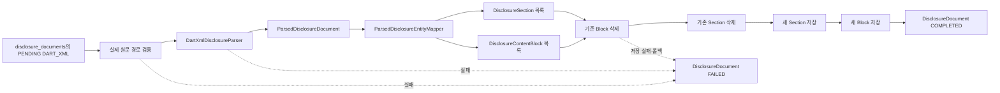

# DART XML 파싱 결과 데이터베이스 적재

| 항목 | 내용 |
|---|---|
| 문서 상태 | 파싱 결과 저장 파이프라인 구현 및 단계 적재 검증 완료본 |
| 작성일 | 2026-08-16 |
| 대상 데이터 | 대회 제공 데이터의 `DART_XML` 원문 |
| 전체 대상 문서 | 3,147개 |
| 선행 문서 | `05_dart_xml_parsing_and_validation.md` |
| 대상 테이블 | `disclosure_sections`, `disclosure_content_blocks` |
| 파서 | `DartXmlDisclosureParser` 1.0.0 |
| 마지막 DB 검증 | COMPLETED 660개, PENDING 2,487개, FAILED 0개 |

## 1. 문서 목적

이 문서는 검증이 완료된 DART XML 파싱 결과를 PostgreSQL에 저장하기 위해 구현한 모델, 매핑, 트랜잭션, 배치 실행 및 실제 적재 검증 과정을 기록한다.

구체적으로 다음 내용을 다룬다.

- 파싱 결과 저장을 위해 추가한 Flyway V6 스키마
- 파싱 모델과 JPA 엔티티의 대응 관계
- 표와 이미지 구조를 JSONB로 저장하는 규칙
- 기존 결과를 안전하게 교체하는 트랜잭션
- 실패 상태를 독립적으로 기록하는 방법
- PENDING DART XML을 청크 단위로 적재하는 Runner
- Testcontainers PostgreSQL 통합 테스트
- 실제 500건 반복 배치 및 누적 DB 검증 결과
- 전체 3,147개 적재 완료 기준과 후속 작업

선행 문서인 `05_dart_xml_parsing_and_validation.md`는 XML을 어떤 규칙으로 파싱하는지를 설명한다. 이 문서는 그 결과 객체를 어떻게 데이터베이스 엔티티로 변환하고 저장하는지를 설명한다.

## 2. 완료 범위

### 2.1 구현 완료

- `disclosure_sections` Flyway 스키마와 JPA 엔티티
- `disclosure_content_blocks` Flyway 스키마와 JPA 엔티티
- SECTION-N 부모·자식 관계 저장
- preamble 블록 저장
- 제목·문단 텍스트 저장
- 표·이미지 JSONB 저장
- 페이지 구분 저장
- 원문 등장 순서와 행 위치 저장
- 파싱 모델에서 엔티티로 변환하는 Mapper
- 문서 단위 전체 교체 저장
- 실패 시 전체 롤백
- 별도 트랜잭션 실패 상태 기록
- PENDING DART XML 청크 반복 적재
- 적재 상한과 실패 임계치
- PENDING 없음 정상 종료
- PostgreSQL 통합 테스트
- 실제 500건 연속 적재와 DB 무결성 검사

### 2.2 현재 실제 DB 상태

마지막으로 실제 PostgreSQL에서 확인한 상태는 다음과 같다.

| 콘텐츠 형식 | 파싱 상태 | 문서 수 |
|---|---|---:|
| DART_XML | COMPLETED | 660 |
| DART_XML | PENDING | 2,487 |
| DART_XML | FAILED | 0 |
| DART_XML | PARTIAL | 0 |
| HTML | PENDING | 1,472 |
| PDF | PENDING | 3 |

따라서 저장 파이프라인과 단계 배치 검증은 완료됐지만 DART XML 3,147개 전체 적재는 아직 진행 중이다.

이 문서에서 `적재 구현 완료`는 전체 저장 경로와 검증이 끝났다는 뜻이며, `전체 적재 완료`는 DART XML 3,147개가 모두 COMPLETED가 됐다는 뜻으로 구분한다.

### 2.3 제외 범위

- HTML 1,472개 파싱과 저장
- PDF 3개 파싱과 저장
- 검색용 `disclosure_chunks` 생성
- 짧은 문단 병합과 검색 청크 정규화
- 공시 유형별 Fact 추출
- 금액·날짜·비율 계산
- LLM 검색 컨텍스트 생성
- 표의 행·셀을 별도 관계형 테이블로 정규화

## 3. 전체 처리 흐름



실제 호출 순서는 다음과 같다.

```text
XmlParsingPersistenceBatchRunner.run()
  → XmlParsingPersistenceBatchService.persistNextChunk()
    → DisclosureDocumentParsingService.parseAndStore()
      → DartXmlDisclosureParser.parse()
      → DisclosureParsingPersistenceService.replaceParsedResult()
        → ParsedDisclosureEntityMapper.map()
        → 기존 ContentBlock 삭제
        → 기존 Section 삭제
        → 새 Section 저장
        → 새 ContentBlock 저장
        → DisclosureDocument.markCompleted()
```

파싱이나 저장이 실패하면 다음 경로를 사용한다.

```text
예외 발생
  → DisclosureDocumentParsingService.markFailed()
    → DisclosureParsingFailureRecorder.markFailed()
      → REQUIRES_NEW 트랜잭션
      → DisclosureDocument.markFailed()
```

## 4. Flyway V6 스키마

마이그레이션 파일:

```text
backend/src/main/resources/db/migration/
└─ V6__create_disclosure_parsing_tables.sql
```

V6는 기존 `disclosure_documents`를 변경하는 대신 파싱 결과를 저장하는 테이블 두 개를 추가한다.

```text
disclosure_documents
├─ disclosure_sections
└─ disclosure_content_blocks
```

### 4.1 `disclosure_sections`

XML의 `SECTION-N` 하나를 한 행으로 저장한다.

| 필드 | 의미 |
|---|---|
| `id` | 섹션 UUID |
| `disclosure_document_id` | 섹션이 속한 원문 문서 |
| `parent_section_id` | 상위 SECTION. 최상위이면 NULL |
| `section_level` | SECTION-N의 N 값 |
| `sequence_no` | 원문 안에서 섹션이 시작된 전역 순서 |
| `title` | 섹션 제목. 없으면 NULL |
| `source_line_start` | SECTION 시작 행. 알 수 없으면 -1 |
| `source_line_end` | SECTION 종료 행. 알 수 없으면 -1 |
| `created_at` | 생성 시각 |
| `updated_at` | 수정 시각 |

예시:

```xml
<SECTION-1>
    <TITLE>II. 사업의 내용</TITLE>
    <SECTION-2>
        <TITLE>1. 사업의 개요</TITLE>
    </SECTION-2>
</SECTION-1>
```

```text
II. 사업의 내용
└─ 1. 사업의 개요
```

두 번째 섹션의 `parent_section_id`는 첫 번째 섹션의 ID를 참조한다.

### 4.2 `disclosure_content_blocks`

원문의 제목·문단·표·이미지·페이지 구분을 한 블록씩 저장한다.

| 필드 | 의미 |
|---|---|
| `id` | 블록 UUID |
| `disclosure_document_id` | 블록이 속한 원문 문서 |
| `section_id` | 소속 섹션. preamble이면 NULL |
| `block_type` | HEADING, PARAGRAPH, TABLE, IMAGE, PAGE_BREAK |
| `sequence_no` | 원문 안에서 블록이 등장한 전역 순서 |
| `text_content` | 제목 또는 문단 텍스트 |
| `structured_content` | 표 또는 이미지 JSONB |
| `source_line_start` | 블록 시작 행 |
| `source_line_end` | 블록 종료 행 |
| `created_at` | 생성 시각 |
| `updated_at` | 수정 시각 |

### 4.3 블록별 저장 규칙

| 블록 타입 | `text_content` | `structured_content` |
|---|---|---|
| HEADING | 필수 | NULL |
| PARAGRAPH | 필수 | NULL |
| TABLE | NULL | JSON 객체 필수 |
| IMAGE | NULL | JSON 객체 필수 |
| PAGE_BREAK | NULL | NULL |

이 규칙은 엔티티 생성 메서드와 DB CHECK 제약조건에서 모두 검증한다.

### 4.4 무결성 제약

- 한 문서 안에서 섹션 `sequence_no` 중복 금지
- 한 문서 안에서 블록 `sequence_no` 중복 금지
- 부모와 자식 섹션이 같은 원문 문서에 속하도록 보장
- 블록과 연결된 섹션이 같은 원문 문서에 속하도록 보장
- `section_level >= 1`
- `sequence_no >= 1`
- 원문 종료 행이 시작 행보다 앞서지 않도록 보장
- TABLE·IMAGE의 JSONB 최상위 타입이 object인지 검증
- 블록 타입별 텍스트와 JSONB 조합 검증

V6가 실제 DB에 한 번 적용된 뒤에는 파일을 수정하지 않는다. 스키마 변경이 필요하면 V7 이상의 새 마이그레이션을 추가한다.

## 5. JPA 엔티티

### 5.1 `DisclosureSection`

- `DisclosureDocument`를 필수 참조한다.
- `parentSection`으로 자기 참조 계층을 표현한다.
- 대량 문서에서 전체 계층을 한 번에 로딩하지 않도록 `@OneToMany` 역방향 컬렉션은 두지 않았다.
- 정적 팩토리 `create()`에서 레벨, 순서와 원문 행을 검증한다.

### 5.2 `DisclosureContentBlock`

- `DisclosureDocument`를 필수 참조한다.
- preamble 블록은 `section=null`이다.
- TABLE과 IMAGE는 Hibernate JSON 타입으로 PostgreSQL JSONB에 저장한다.
- 블록 종류별 정적 팩토리를 사용한다.

```text
DisclosureContentBlock.text()
DisclosureContentBlock.structured()
DisclosureContentBlock.pageBreak()
```

`structured_content` 필드 설정:

```java
@JdbcTypeCode(SqlTypes.JSON)
@Column(columnDefinition = "jsonb")
private JsonNode structuredContent;
```

## 6. 파싱 모델에서 엔티티로 변환

`ParsedDisclosureEntityMapper`는 DB를 호출하지 않고 파싱 결과를 엔티티 목록으로만 변환한다.

```text
ParsedDisclosureDocument
  → List<DisclosureSection>
  → List<DisclosureContentBlock>
  → DisclosureParseMappingResult
```

### 6.1 문서 검증

DB의 `DisclosureDocument.fileName`과 파싱 결과의 `fileName`이 같은지 확인한다. 다른 파일의 파싱 결과가 잘못 연결되는 것을 방지한다.

### 6.2 preamble

첫 SECTION 이전의 블록은 특정 섹션에 속하지 않는다.

```text
ParsedDisclosureDocument.preambleBlocks
→ DisclosureContentBlock.section = null
```

### 6.3 섹션 재귀 매핑

최상위 섹션부터 부모 엔티티를 먼저 만들고 자식 섹션을 재귀적으로 변환한다.

```text
SECTION-1
├─ 블록
└─ SECTION-2
   ├─ 블록
   └─ SECTION-3
```

SECTION 레벨이 1씩 연속이어야 한다고 가정하지 않고 파서가 만든 실제 부모·자식 관계를 저장한다.

### 6.4 블록 매핑

| 파싱 블록 | 엔티티 생성 방식 |
|---|---|
| HEADING | `DisclosureContentBlock.text()` |
| PARAGRAPH | `DisclosureContentBlock.text()` |
| TABLE | `DisclosureContentBlock.structured()` |
| IMAGE | `DisclosureContentBlock.structured()` |
| PAGE_BREAK | `DisclosureContentBlock.pageBreak()` |

매핑 완료 후 섹션과 블록을 각각 `sequence_no` 순서로 정렬한다.

## 7. 표와 이미지 JSONB

표의 약 2,319만 셀을 별도 JPA 엔티티로 저장하지 않고 TABLE 블록 하나의 JSONB에 행·셀 구조를 함께 보존한다.

### 7.1 표 JSONB

```json
{
  "schemaVersion": 1,
  "table": {
    "order": 1,
    "sourceLineStart": 100,
    "sourceLineEnd": 110,
    "rows": [
      {
        "rowIndex": 0,
        "sourceLineStart": 101,
        "sourceLineEnd": 103,
        "cells": [
          {
            "cellIndex": 0,
            "type": "HEADER",
            "rowSpan": 1,
            "colSpan": 1,
            "text": "구분",
            "nestedTables": [],
            "images": []
          }
        ]
      }
    ]
  }
}
```

보존 정보:

- 표 순서
- 표와 행·셀의 원문 위치
- HEADER와 DATA 구분
- rowspan과 colspan
- 셀 내부 줄바꿈
- 중첩 표
- 셀 내부 이미지 메타데이터

### 7.2 이미지 JSONB

```json
{
  "schemaVersion": 1,
  "image": {
    "fileName": "1.jpg",
    "caption": "내부회계관리제도 운영실태보고서",
    "width": 615,
    "height": 834,
    "alignment": "CENTER",
    "sourceLineStart": 200,
    "sourceLineEnd": 204
  }
}
```

이미지 바이너리는 제공되지 않았으므로 파일명과 캡션 등 XML에 존재하는 메타데이터만 저장한다.

`schemaVersion`은 이후 JSON 구조가 변경됐을 때 기존 데이터와 새 데이터를 구분하기 위한 값이다.

## 8. 문서 단위 저장 트랜잭션

`DisclosureParsingPersistenceService.replaceParsedResult()`가 문서 하나의 저장을 담당한다.

```text
1. 기존 ContentBlock 벌크 삭제
2. 기존 Section 벌크 삭제
3. DisclosureDocument 재조회
4. 파싱 모델을 엔티티로 매핑
5. 새 Section 저장 및 flush
6. 새 ContentBlock 저장 및 flush
7. 문서명 갱신
8. parse_status를 COMPLETED로 변경
```

### 8.1 삭제 순서

블록이 섹션을 참조하므로 다음 순서를 지킨다.

```text
삭제: ContentBlock → Section
저장: Section → ContentBlock
```

섹션 삭제의 cascade만 사용하지 않는 이유는 preamble 블록의 `section_id`가 NULL이어서 섹션 삭제만으로 제거되지 않기 때문이다.

### 8.2 전체 교체 방식

재파싱 시 기존 데이터와 새 데이터를 섞지 않고 문서 단위로 전체 교체한다.

```text
기존 Section 17개
기존 Block 850개
    ↓ 재파싱
기존 결과 삭제
새 Section·Block 저장
```

동일한 문서를 다시 처리해도 `sequence_no` 중복 행이 남지 않는다.

### 8.3 벌크 삭제 후 재조회

Repository의 벌크 삭제는 다음 옵션을 사용한다.

```java
@Modifying(
    flushAutomatically = true,
    clearAutomatically = true
)
```

벌크 삭제 후 영속성 컨텍스트가 초기화되므로 `DisclosureDocument`를 삭제 이후 다시 조회한다. 그래야 마지막 `markCompleted()` 변경이 정상적으로 감지된다.

### 8.4 롤백

삭제·저장·COMPLETED 변경은 하나의 트랜잭션이다.

```text
기존 데이터 삭제
→ 새 Section 저장
→ Block 저장 중 오류
→ 전체 트랜잭션 롤백
→ 기존 데이터 복구
→ COMPLETED 변경 취소
```

파싱 결과가 절반만 저장된 상태를 허용하지 않는다.

## 9. 실패 상태 기록

저장 트랜잭션이 실패하면 같은 트랜잭션에서 `markFailed()`를 호출해도 함께 롤백될 수 있다.

따라서 `DisclosureParsingFailureRecorder`는 새로운 트랜잭션을 사용한다.

```java
@Transactional(propagation = Propagation.REQUIRES_NEW)
```

저장 정보:

```text
parse_status = FAILED
parser_name = DartXmlDisclosureParser
parser_version = 1.0.0
parse_error_message = 최하위 예외 타입과 메시지
parsed_at = 실패 기록 시각
```

오류 메시지는 최대 4,000자로 제한하고 stack trace 전체는 DB에 저장하지 않는다.

경로 검증 단계에서 파일을 찾지 못한 경우처럼 파서 호출 전에 발생한 실패도 같은 경로로 기록한다.

## 10. 배치 적재 Runner

### 10.1 대상 조회

다음 조건을 모두 만족하는 문서만 조회한다.

```text
content_format = DART_XML
parse_status = PENDING
ORDER BY id ASC
```

처리된 문서는 COMPLETED 또는 FAILED가 되므로 다음 조회에서 제외된다. 따라서 페이지를 증가시키지 않고 항상 첫 페이지를 조회한다.

```java
PageRequest.of(0, chunkSize)
```

### 10.2 청크 반복

기본 실행은 다음과 같다.

```text
PENDING 50개 조회
→ 50개 문서별 파싱·저장
→ 다음 PENDING 50개 조회
→ 최대 500개까지 반복
```

한 문서의 파싱과 저장이 끝난 뒤 다음 문서를 처리하므로 전체 파싱 결과를 메모리에 한꺼번에 올리지 않는다.

### 10.3 실행 제한

| 설정 | 기본값 | 의미 |
|---|---:|---|
| `chunk-size` | 50 | 한 번에 조회하는 문서 수 |
| `max-documents` | 500 | 한 번의 서버 시작에서 처리할 최대 문서 수 |
| `max-failures` | 10 | 누적 실패가 이 값 이상이면 중단 |

규칙:

- `chunk-size` 허용 범위는 1~100이다.
- `max-documents=0`은 남은 PENDING 전체 처리다.
- `max-failures=0`은 실패 개수 제한을 사용하지 않는다.
- 마지막 청크가 요청 크기보다 작으면 PENDING이 소진된 것으로 보고 종료한다.
- PENDING이 0개면 오류를 발생시키지 않고 정상 종료한다.

### 10.4 문서별 독립 처리

한 문서가 실패해도 다음 문서를 계속 처리한다.

```text
문서 1 SUCCESS
문서 2 FAILED
문서 3 SUCCESS
```

문서 2는 FAILED가 되어 다음 PENDING 조회에서 제외된다. 누적 실패가 설정한 임계치에 도달하면 시스템 오류 가능성을 고려해 전체 실행을 중단한다.

## 11. 실행 설정

`application.yml`:

```yaml
foliolens:
  parsing:
    xml-persistence:
      batch:
        enabled: ${FOLIOLENS_PERSIST_XML_PARSING_ON_STARTUP:false}
        chunk-size: ${FOLIOLENS_PERSIST_XML_PARSING_LIMIT:50}
        max-documents: ${FOLIOLENS_PERSIST_XML_PARSING_MAX_DOCUMENTS:500}
        max-failures: ${FOLIOLENS_PERSIST_XML_PARSING_MAX_FAILURES:10}
```

`.env` 예시:

```env
FOLIOLENS_VALIDATE_XML_PARSING_ON_STARTUP=false

FOLIOLENS_PERSIST_XML_PARSING_ON_STARTUP=true
FOLIOLENS_PERSIST_XML_PARSING_LIMIT=50
FOLIOLENS_PERSIST_XML_PARSING_MAX_DOCUMENTS=500
FOLIOLENS_PERSIST_XML_PARSING_MAX_FAILURES=10
```

500건 단계 적재:

```powershell
docker compose up -d --build --force-recreate app
docker compose logs -f app
```

남은 DART XML 전체 적재:

```env
FOLIOLENS_PERSIST_XML_PARSING_MAX_DOCUMENTS=0
```

전체 적재가 끝난 뒤에는 서버 재시작 시 Runner가 다시 실행되지 않도록 비활성화한다.

```env
FOLIOLENS_PERSIST_XML_PARSING_ON_STARTUP=false
```

## 12. JPA 대량 저장 설정

블록 INSERT 성능을 위해 Hibernate JDBC batching을 사용한다.

```yaml
spring:
  jpa:
    properties:
      hibernate:
        jdbc:
          batch_size: 500
        order_inserts: true
        order_updates: true
```

이 설정은 전체 약 259만 블록을 하나의 트랜잭션으로 저장한다는 뜻이 아니다. 문서 하나씩 독립적으로 저장하면서 같은 테이블 INSERT를 가능한 범위에서 묶어 전송한다.

## 13. 테스트

### 13.1 Parser 회귀 테스트

`DartXmlDisclosureParserTest` 7개를 통해 기존 파싱 규칙이 유지되는지 확인한다.

### 13.2 저장 통합 테스트

`DisclosureParsingPersistenceIntegrationTest`는 Testcontainers PostgreSQL을 사용한다.

개발 DB가 아닌 일회성 PostgreSQL에 Flyway V1~V6를 적용하고 다음을 검증한다.

1. 최초 Section·Block 저장
2. preamble의 `section_id=NULL`
3. 부모·자식 Section 관계
4. TABLE·IMAGE JSONB 객체
5. JSON `schemaVersion=1`
6. 문서 상태 COMPLETED
7. 재파싱 전체 교체와 중복 방지
8. 저장 실패 시 기존 행 복구
9. REQUIRES_NEW 실패 상태 기록

통합 테스트 결과:

```text
테스트 3개
성공 3개
실패 0개
건너뜀 0개
```

### 13.3 배치 Service 테스트

`XmlParsingPersistenceBatchServiceTest` 5개:

- PENDING DART XML 첫 페이지 조회
- 문서 실패 후 다음 문서 계속 처리
- chunkSize 1~100 검증
- 경로 실패의 FAILED 기록
- PENDING 없음 빈 결과 반환

### 13.4 배치 Runner 테스트

`XmlParsingPersistenceBatchRunnerTest` 5개:

- 50개 청크를 최대 처리량까지 반복
- 마지막 부분 청크에서 정상 종료
- PENDING 없음 정상 종료
- 실패 임계치 도달 시 중단
- 음수 최대 처리량·실패 한도 거부

### 13.5 테스트 결과 요약

| 테스트 | 결과 |
|---|---:|
| Parser 회귀 테스트 | 7/7 성공 |
| 저장 통합 테스트 | 3/3 성공 |
| Batch Service 테스트 | 5/5 성공 |
| Batch Runner 테스트 | 5/5 성공 |
| 컴파일 | 성공 |
| Docker Compose 설정 검증 | 성공 |

## 14. 실제 단계 적재 결과

### 14.1 최근 500건 반복 배치

```text
chunkSize=50
maxDocuments=500
maxFailures=10
```

실행 결과:

| 항목 | 결과 |
|---|---:|
| 청크 | 10개 |
| 대상 문서 | 500개 |
| 성공 | 500개 |
| 실패 | 0개 |
| 저장 Section | 13,755개 |
| 저장 ContentBlock | 417,233개 |
| 소요 시간 | 327.325초, 약 5분 27초 |

각 청크는 50개 문서를 처리했고 모든 청크의 `failedCount`가 0이었다.

### 14.2 누적 DB 상태

마지막 검증 시점의 누적 결과:

| 항목 | 결과 |
|---|---:|
| DART XML 전체 | 3,147개 |
| COMPLETED | 660개 |
| PENDING | 2,487개 |
| FAILED | 0개 |
| PARTIAL | 0개 |
| 저장 Section | 18,235개 |
| 저장 ContentBlock | 545,514개 |

블록별 개수:

| 블록 타입 | 개수 |
|---|---:|
| HEADING | 11,436 |
| PARAGRAPH | 183,845 |
| PAGE_BREAK | 25,629 |
| TABLE | 323,682 |
| IMAGE | 922 |
| 합계 | 545,514 |

### 14.3 DB 용량

| 대상 | 용량 |
|---|---:|
| `disclosure_sections` | 약 5.3MB |
| `disclosure_content_blocks` | 약 481MB |
| 전체 PostgreSQL DB | 약 500MB |

TABLE JSONB가 표의 행·셀·중첩 표를 포함하므로 ContentBlock 테이블이 대부분의 용량을 사용한다.

## 15. 실제 DB 무결성 검사

660개 누적 적재 상태에서 다음 결과를 확인했다.

| 검사 항목 | 오류 건수 |
|---|---:|
| COMPLETED지만 블록이 없는 문서 | 0 |
| 원문 문서가 없는 고아 블록 | 0 |
| 원문 문서가 없는 고아 섹션 | 0 |
| 잘못된 블록 payload | 0 |
| 중복 block sequence | 0 |
| 중복 section sequence | 0 |
| 잘못된 COMPLETED 메타데이터 | 0 |

따라서 현재까지 저장된 문서는 상태, 참조 관계, 블록 payload 및 순서 제약을 모두 만족한다.

## 16. 운영 확인 SQL

### 16.1 형식·상태별 문서 수

```sql
SELECT
    content_format,
    parse_status,
    COUNT(*) AS document_count
FROM disclosure_documents
GROUP BY content_format, parse_status
ORDER BY content_format, parse_status;
```

### 16.2 최근 처리 문서

```sql
SELECT
    dd.id,
    d.receipt_no,
    dd.file_name,
    dd.document_name,
    dd.parse_status,
    dd.parser_name,
    dd.parser_version,
    dd.parsed_at
FROM disclosure_documents dd
JOIN disclosures d ON d.id = dd.disclosure_id
WHERE dd.content_format = 'DART_XML'
  AND dd.parse_status IN ('COMPLETED', 'FAILED')
ORDER BY dd.parsed_at DESC
LIMIT 20;
```

### 16.3 섹션과 블록 집계

```sql
SELECT COUNT(*) AS section_count
FROM disclosure_sections;

SELECT block_type, COUNT(*) AS block_count
FROM disclosure_content_blocks
GROUP BY block_type
ORDER BY block_type;
```

### 16.4 문서별 저장 개수

```sql
SELECT
    dd.id AS document_id,
    d.receipt_no,
    dd.file_name,
    dd.parse_status,
    (
        SELECT COUNT(*)
        FROM disclosure_sections s
        WHERE s.disclosure_document_id = dd.id
    ) AS section_count,
    (
        SELECT COUNT(*)
        FROM disclosure_content_blocks b
        WHERE b.disclosure_document_id = dd.id
    ) AS block_count,
    dd.parsed_at
FROM disclosure_documents dd
JOIN disclosures d ON d.id = dd.disclosure_id
WHERE dd.content_format = 'DART_XML'
ORDER BY dd.parsed_at DESC NULLS LAST
LIMIT 20;
```

### 16.5 TABLE JSONB 확인

```sql
SELECT
    disclosure_document_id,
    sequence_no,
    jsonb_pretty(structured_content)
FROM disclosure_content_blocks
WHERE block_type = 'TABLE'
LIMIT 1;
```

### 16.6 완료 문서 중 블록이 없는 문서

```sql
SELECT COUNT(*) AS completed_without_blocks
FROM disclosure_documents dd
WHERE dd.content_format = 'DART_XML'
  AND dd.parse_status = 'COMPLETED'
  AND NOT EXISTS (
      SELECT 1
      FROM disclosure_content_blocks b
      WHERE b.disclosure_document_id = dd.id
  );
```

### 16.7 DB 용량

```sql
SELECT
    pg_size_pretty(
        pg_total_relation_size('disclosure_sections')
    ) AS sections_size,
    pg_size_pretty(
        pg_total_relation_size('disclosure_content_blocks')
    ) AS blocks_size,
    pg_size_pretty(
        pg_database_size(current_database())
    ) AS database_size;
```

## 17. 전체 적재 완료 기준

DART XML 전체 적재 완료 시 형식별 상태는 다음과 같아야 한다.

```text
DART_XML | COMPLETED | 3147
DART_XML | PENDING   | 0
DART_XML | FAILED    | 0
```

파싱 검증 결과와 저장 결과가 일치한다면 예상 구조 집계는 다음과 같다.

| 항목 | 기대값 |
|---|---:|
| Section | 86,343 |
| 전체 ContentBlock | 2,587,948 |
| HEADING | 56,619 |
| PARAGRAPH | 849,925 |
| PAGE_BREAK | 117,870 |
| TABLE | 1,559,230 |
| IMAGE | 4,304 |

HTML 1,472개와 PDF 3개는 현재 Runner의 대상이 아니므로 DART XML 적재가 완료돼도 전체 테이블 기준 PENDING은 1,475개 남는 것이 정상이다. 반드시 `content_format`별로 상태를 집계한다.

## 18. 운영 주의사항

### 18.1 Runner 재실행

Runner가 활성화된 상태에서 app 컨테이너를 다시 생성하면 다음 PENDING 문서를 다시 처리한다.

```text
app 시작
→ PENDING 조회
→ 최대 maxDocuments 처리
```

이미 COMPLETED인 문서는 조회하지 않으므로 중복 저장되지는 않는다. 전체 적재 완료 뒤에는 Runner를 비활성화한다.

### 18.2 Docker 볼륨

다음 명령은 컨테이너만 종료하며 DB 데이터는 보존한다.

```powershell
docker compose down
```

다음 명령은 PostgreSQL 볼륨과 적재 결과를 삭제하므로 사용에 주의한다.

```powershell
docker compose down -v
```

### 18.3 전체 적재 전 디스크

660개 적재 시점의 DB가 약 500MB였다. 전체 데이터에는 대형 표 JSONB가 포함되므로 수 GB의 디스크 공간을 확보한 뒤 전체 적재한다.

### 18.4 FAILED 재처리

현재 배치는 PENDING만 조회한다. FAILED 문서를 수정 후 다시 처리하려면 실패 원인을 확인하고 해당 문서를 PENDING으로 되돌리는 별도 재처리 정책이 필요하다. 운영 중 임의 SQL로 상태만 바꾸기보다 재처리 서비스 또는 관리 명령을 추가하는 것이 안전하다.

## 19. 관련 코드

### 스키마와 엔티티

| 파일 | 역할 |
|---|---|
| `V6__create_disclosure_parsing_tables.sql` | Section·ContentBlock 테이블과 제약조건 |
| `DisclosureSection.java` | SECTION-N 엔티티 |
| `DisclosureContentBlock.java` | 본문 블록 엔티티 |
| `DisclosureContentBlockType.java` | 블록 타입 |

### Mapper와 저장

| 파일 | 역할 |
|---|---|
| `ParsedDisclosureEntityMapper.java` | 파싱 모델을 엔티티로 변환 |
| `DisclosureParseMappingResult.java` | 변환된 Section·Block 묶음 |
| `DisclosureParsingPersistenceService.java` | 기존 결과 교체와 COMPLETED 처리 |
| `DisclosureParsingFailureRecorder.java` | 별도 트랜잭션 FAILED 기록 |
| `DisclosureDocumentParsingService.java` | Parser와 저장 서비스 연결 |

### Repository

| 파일 | 역할 |
|---|---|
| `DisclosureDocumentRepository.java` | PENDING DART XML 조회 |
| `DisclosureSectionRepository.java` | Section 조회·벌크 삭제 |
| `DisclosureContentBlockRepository.java` | Block 조회·벌크 삭제 |

### 배치

| 파일 | 역할 |
|---|---|
| `XmlParsingPersistenceBatchRunner.java` | 서버 시작 시 청크 반복 실행 |
| `XmlParsingPersistenceBatchService.java` | 다음 PENDING 청크 처리 |
| `XmlParsingPersistenceBatchResult.java` | 전체·청크 결과 집계 |
| `XmlParsingPersistenceRow.java` | 문서 한 건의 처리 결과 |
| `XmlParsingPersistenceStatus.java` | SUCCESS·FAILED |

### 테스트

| 파일 | 역할 |
|---|---|
| `DartXmlDisclosureParserTest.java` | 파서 회귀 테스트 |
| `DisclosureParsingPersistenceIntegrationTest.java` | PostgreSQL 저장·롤백 통합 테스트 |
| `XmlParsingPersistenceBatchServiceTest.java` | 문서 청크 처리 테스트 |
| `XmlParsingPersistenceBatchRunnerTest.java` | 반복·상한·종료·실패 임계치 테스트 |

## 20. 다음 작업

1. `max-documents=0`으로 남은 DART XML 2,487개 전체 적재
2. 형식·상태별 문서 수 확인
3. 전체 Section·ContentBlock 수를 파싱 검증 기대값과 비교
4. FAILED 문서가 있다면 예외·원문·재처리 정책 확인
5. Runner 비활성화
6. 검색용 `disclosure_chunks` 스키마와 생성 규칙 설계
7. 문단 병합과 표 검색 텍스트 직렬화 구현
8. 공시 유형별 Fact 추출과 근거 연결
9. HTML 1,472개 파서 설계
10. PDF 3개 처리 정책 결정

## 21. 완료 체크리스트

- [x] Flyway V6 작성
- [x] Section·ContentBlock 엔티티 작성
- [x] Repository 작성
- [x] 파싱 모델 → 엔티티 Mapper 작성
- [x] 문서 단위 전체 교체 저장 구현
- [x] 실패 상태 별도 트랜잭션 구현
- [x] 소규모 배치 Runner 구현
- [x] 50개 청크 반복과 최대 처리량 구현
- [x] PENDING 없음 정상 종료 구현
- [x] PostgreSQL 통합 테스트
- [x] 실제 500건 연속 적재 검증
- [x] 누적 660건 DB 무결성 검증
- [ ] DART XML 3,147개 전체 적재
- [ ] 전체 적재 결과와 파싱 검증 집계 교차 검증
- [ ] 적재 완료 후 Runner 비활성화
- [ ] 검색 청크 생성

