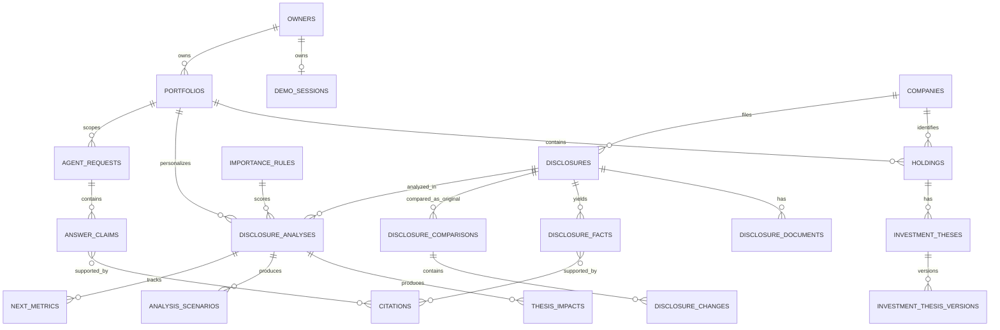

# FolioLens ERD

## 산출물

- `foliolens_schema.sql`: PostgreSQL용 기준 스키마. 테이블, PK, FK, UNIQUE, CHECK, 인덱스 및 v1 기준 데이터를 포함한다.
- `foliolens_full.erd`: DBeaver 26.0.5 형식의 전체 테이블 배치 파일.

## DBeaver에서 확인하는 방법

`.erd` 파일은 테이블 정의를 내장하지 않는다. DBeaver의 custom ERD는 기존 DB 객체를 참조하고, 파일에는 객체 경로와 배치가 저장된다. 따라서 다음 순서로 확인한다.

1. PostgreSQL에 빈 데이터베이스를 만든다. `.erd`의 기본 데이터베이스명은 `foliolens`, 스키마명은 `public`이다.
2. DBeaver SQL Editor에서 `foliolens_schema.sql` 전체를 실행한다.
3. 가장 확실한 방법은 Database Navigator에서 `public` 스키마를 열고 `Diagram` 탭 또는 `View Diagram`을 선택하는 것이다.
4. 저장된 배치를 사용하려면 `foliolens_full.erd`를 DBeaver 프로젝트의 `ER Diagrams` 폴더에 넣어 연다. 데이터 소스 선택 창이 뜨면 2단계에서 사용한 연결을 선택한다.
5. 실제 데이터베이스명이 `foliolens`가 아니면 `.erd`에서 `<path name="foliolens"/>`를 실제 데이터베이스명으로 바꾼다. 스키마가 `public`이 아니면 `<path name="public"/>`도 함께 바꾼다.

`foliolens_full.erd`를 바로 열었을 때 테이블이 보이지 않으면 파일 문제가 아니라, 참조 대상 DB 객체가 아직 없거나 데이터베이스·스키마 경로가 다른 경우다. 이때는 3단계의 스키마 Diagram을 사용하면 된다.

## 핵심 관계

## 설계 판단

### 1. 소유권은 `owners`로 추상화

API 명세의 현재 결정은 데모 세션이지만 로그인 도입 여부는 미결정이다. 포트폴리오가 세션 토큰 자체를 참조하지 않도록 `owners`를 두고, MVP에서는 `demo_sessions`가 owner와 1:1로 연결된다.

### 2. 투자 가정은 안정 ID와 버전을 분리

`investment_theses.id`는 API의 `thesisId`로 유지하고, 원문·주제·기대 방향·지표는 `investment_thesis_versions`에 보존한다. 사용자 수정 후에도 과거 분석이 사용한 투자 가정 버전을 식별할 수 있다.

### 3. 공시 사실과 해석을 물리적으로 분리

- 원문 사실: `disclosure_facts`
- 결정적 비교 계산: `disclosure_comparisons`, `disclosure_changes`
- 개인화 해석: `disclosure_analyses`, `thesis_impacts`, `analysis_scenarios`
- 근거: `citations`와 각 연결 테이블

이 구조는 사실과 Agent 해석을 분리하고 핵심 주장에 원문 근거를 연결해야 한다는 Must 요구사항을 반영한다.

### 4. 분석 결과는 덮어쓰지 않는 스냅샷

`disclosure_analyses`는 `portfolio_id + disclosure_id + input_fingerprint`로 유일하다. `input_fingerprint`에는 문서 해시, 포트폴리오 입력 버전, 투자 가정 버전, 중요도 규칙·프롬프트·모델 버전을 반영한다. 입력이 바뀌면 새 분석 행을 만들고 이전 결과는 재현용으로 유지한다.

### 5. JSONB 사용 범위

독립 조회와 무결성이 중요한 사실, 점수, 근거, 영향 관계는 정규화했다. 순서가 있는 문자열 목록이나 아직 계약이 바뀔 가능성이 큰 설정·실패 상세는 JSONB로 두었다.

## DB만으로 완전히 보장하지 않는 규칙

다음 규칙은 단일 행 제약으로 표현할 수 없거나 요청 권한 문맥이 필요하므로 Spring 서비스의 트랜잭션·계약 테스트가 필요하다.

- 한 포트폴리오의 활성 holding 비중 합계가 100 이하인지 검증
- `investment_theses.current_version_id`가 같은 thesis 소속 버전인지 검증
- citation, fact, analysis가 동일한 disclosure 문맥에 속하는지 검증
- 선택 holding·disclosure가 질문의 portfolio에 포함되는지 검증
- 중요도 총점이 여섯 `analysis_score_components`의 합과 같은지 검증
- 사용자 또는 세션별 접근 권한 격리

## 현재 ERD에서 제외한 범위

문서에서 P1/P2 또는 미결정으로 분류된 다음 기능은 MVP 기준 ERD에 확정하지 않았다.

- 알림·읽음 상태
- 공통 위험 전용 모델
- 뉴스·공시 불일치
- 주간 리포트
- 공식 평가 API 요청·응답 저장 모델
- 사용자 계정·인증 자격 증명

평가 API는 내부 도메인 테이블을 직접 바꾸지 않는 어댑터로 구현한다.
