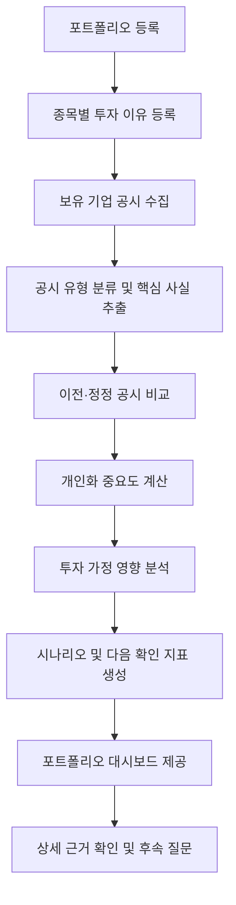
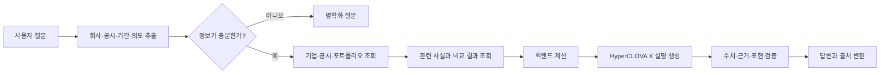

# 포트폴리오 기반 공시 분석 Agent 기능명세서

| 항목 | 내용 |
|---|---|
| 프로젝트 가칭 | Portfolio Disclosure Guardian |
| 문서 버전 | v0.1 |
| 문서 상태 | 초안 |
| 작성일 | 2026-07-21 |
| 대상 | 미래에셋증권 AI Festival 공시 Agent |

## 1. 서비스 정의

### 1.1 한 줄 정의

> 사용자의 보유 종목과 투자 이유를 기준으로 신규 공시를 분석하여, 기존 투자 가정의 변화와 포트폴리오 위험을 근거와 함께 추적하는 개인화 공시 분석 Agent

### 1.2 해결하려는 문제

일반 투자자는 많은 공시 중 무엇을 먼저 읽어야 하는지 판단하기 어렵고, 공시 내용이 자신의 보유 종목과 포트폴리오에 어떤 의미가 있는지 연결하기 어렵다.

본 서비스는 다음 문제를 해결한다.

- 보유 종목과 관련된 공시만 선별한다.
- 보유 비중과 공시 성격을 이용해 읽어야 할 우선순위를 제공한다.
- 공시의 핵심 사실을 이전 공시 및 정정 전 공시와 비교한다.
- 사용자가 저장한 투자 이유가 유지·강화·약화됐는지 분석한다.
- 단정적인 주가 전망 대신 조건별 시나리오와 다음 확인 지표를 제시한다.
- 모든 핵심 판단에 공시 원문 근거를 연결한다.

### 1.3 차별점

| 일반 공시 서비스 | 본 서비스 |
|---|---|
| 모든 공시를 동일하게 제공 | 사용자의 보유 종목 공시를 우선 제공 |
| 공시 원문 또는 단순 요약 | 보유 비중과 투자 이유를 반영한 개인화 분석 |
| 기업 한 곳의 정보만 분석 | 포트폴리오 전체의 공통 위험을 연결 |
| 호재·악재로 단순 분류 | 사실, 영향 경로, 조건별 시나리오로 분리 |
| 현재 공시만 설명 | 과거·정정 공시와 변경 사항 비교 |
| 출처가 불분명한 생성 답변 | 접수번호, 원문 URL, 근거 문장을 함께 제공 |

### 1.4 제품 원칙

1. 공시 원문의 사실과 Agent의 해석을 명확히 구분한다.
2. 수치 계산과 규칙 판정은 백엔드에서 수행한다.
3. 언어모델은 질문 이해, 관련성 판단, 설명 생성을 담당한다.
4. 매수·매도 추천이나 목표주가를 제공하지 않는다.
5. 근거가 부족하면 `판단 불가` 또는 `추가 확인 필요`로 표시한다.
6. 모든 분석에 데이터 기준 시점과 출처를 표시한다.

## 2. 목표 및 범위

### 2.1 MVP 목표

사용자가 포트폴리오와 종목별 투자 이유를 등록하면, 보유 기업의 공시를 찾아 다음 결과를 제공한다.

- 공시 핵심 사실 구조화
- 이전 또는 정정 전 공시와 변경 사항 비교
- 보유 비중 기반 중요도 표시
- 투자 가정별 영향 분석
- 긍정·부정 시나리오
- 다음에 확인할 지표
- 공시 원문 출처

### 2.2 MVP 지원 범위(P0)

- 국내 상장 주식
- 사용자 포트폴리오 1개
- 보유 종목 및 비중 등록·수정·삭제
- 종목별 투자 이유 등록
- 보유 기업의 공시 목록 조회
- 핵심 공시 유형 분류
- 공시 핵심 필드 추출
- 원본·정정공시 비교
- 개인화 중요도 계산
- 투자 가정 영향 분석
- 공시 상세 분석 화면
- 자연어 후속 질문
- 근거 및 원문 링크 제공

초기 핵심 공시 유형은 다음으로 제한한다.

1. 유상증자·무상증자
2. 전환사채·신주인수권부사채 발행
3. 신규시설투자 및 투자 정정
4. 단일판매·공급계약
5. 배당
6. 최대주주 변경
7. 횡령·배임 및 거래정지 관련 공시
8. 영업실적·잠정실적

### 2.3 확장 범위(P1)

- 여러 포트폴리오 관리
- 공시 발생 알림
- 투자 가정 변경 이력
- 포트폴리오 공통 산업·위험 요인 분석
- 사용자 피드백을 이용한 중요도 개인화
- 기업별 공시 타임라인

### 2.4 선택 확장 범위(P2)

- 뉴스와 공시 내용 불일치 탐지
- ETF 편입 종목을 이용한 간접 노출 분석
- 기업 간 공급망·산업 연결 그래프
- 이메일·앱 푸시 알림
- 공시 기반 주간 포트폴리오 리포트

### 2.5 명시적 제외 범위

- 목표주가 산출
- 상승·하락 확률 예측
- 자동 매수·매도
- 수익 보장 표현
- 공시 근거가 없는 종목 추천
- 실시간 주가 예측
- 세무·법률 자문

## 3. 주요 사용자

### 3.1 핵심 사용자

- 국내 주식 여러 종목을 보유한 개인투자자
- 공시 전문용어를 이해하기 어려운 투자자
- 종목을 매수한 이유가 현재도 유효한지 점검하고 싶은 투자자
- 보유 종목의 중요한 변화를 놓치고 싶지 않은 투자자

### 3.2 핵심 사용자 스토리

1. 사용자는 자신의 보유 종목과 비중을 등록할 수 있다.
2. 사용자는 각 종목을 보유한 이유를 자연어로 저장할 수 있다.
3. 사용자는 자신의 포트폴리오에 중요한 공시를 우선순위대로 볼 수 있다.
4. 사용자는 공시에서 무엇이 새로 발생하거나 변경됐는지 확인할 수 있다.
5. 사용자는 공시가 자신의 투자 이유에 어떤 영향을 주는지 확인할 수 있다.
6. 사용자는 분석의 근거가 된 공시 원문을 확인할 수 있다.
7. 사용자는 분석 결과에 후속 질문을 할 수 있다.

## 4. 핵심 용어

| 용어 | 정의 |
|---|---|
| 포트폴리오 | 사용자가 등록한 보유 종목과 각 종목의 비중 집합 |
| 투자 가정 | 사용자가 종목을 보유하는 이유 또는 앞으로 확인하려는 기대 요인 |
| 공시 이벤트 | 신규 제출, 정정 제출 등 분석이 필요한 하나의 공시 사건 |
| 공시 사실 | 원문에서 직접 확인할 수 있는 금액, 날짜, 목적, 대상 등 구조화된 정보 |
| 영향 경로 | 공시 사실이 성장성, 현금흐름, 지분 희석 등으로 연결되는 조건부 과정 |
| 중요도 | 사용자가 해당 공시를 얼마나 먼저 확인해야 하는지를 나타내는 우선순위 |
| 투자 가정 상태 | `강화 가능`, `유지`, `약화 가능`, `직접 관련 없음`, `판단 불가` 중 하나 |
| 근거 | 판단에 사용된 공시의 접수번호, 원문 URL, 항목명 및 인용 가능한 원문 위치 |

## 5. 전체 사용자 흐름



## 6. 기능 요구사항

### FR-001. 포트폴리오 등록 및 관리

사용자는 보유 종목을 검색해 포트폴리오에 추가하고 비중을 입력할 수 있다.

필수 입력:

- 종목명 또는 종목코드
- 보유 비중

선택 입력:

- 보유 수량
- 평균 매입가
- 투자 시작일
- 메모

처리 규칙:

- 종목명은 기업 고유번호와 종목코드로 정규화한다.
- 동일 종목의 중복 등록을 허용하지 않는다.
- 비중은 0 초과 100 이하의 값만 허용한다.
- 전체 비중이 100을 초과하면 저장하지 않는다.
- 금액과 현재가가 모두 있을 경우 비중을 자동 계산할 수 있다.
- 입력한 금융정보는 분석 목적으로만 사용한다.

완료 기준:

- 사용자가 종목을 추가·수정·삭제할 수 있다.
- 저장 후 합계 비중과 미분류 비중을 확인할 수 있다.
- 잘못된 종목명은 후보 목록을 제시하거나 재입력을 요청한다.

### FR-002. 투자 가정 등록 및 관리

사용자는 종목별로 하나 이상의 투자 이유를 자연어로 저장할 수 있다.

예시:

- 반도체 업황 회복
- HBM 매출 성장
- 안정적인 현금흐름과 배당

시스템은 투자 이유를 다음 구조로 정규화한다.

```json
{
  "original_text": "HBM 매출이 계속 증가할 것으로 기대",
  "topic": "HBM",
  "expected_direction": "growth",
  "metrics": ["관련 사업 매출", "설비투자", "영업이익"],
  "status": "active"
}
```

처리 규칙:

- 원문은 반드시 보존한다.
- Agent가 정규화한 결과는 사용자가 수정할 수 있다.
- 투자 가정은 삭제보다 비활성화 및 이력 보존을 우선한다.
- 투자 이유가 없어도 공시 요약과 중요도 분석은 제공한다.

### FR-003. 기업 식별 및 매핑

시스템은 사용자 입력 종목명을 기업 고유번호, 종목코드 및 정식 회사명과 연결한다.

우선순위:

1. 종목코드 정확 일치
2. 정식 회사명 정확 일치
3. 회사명 별칭 일치
4. 유사 회사명 후보 제시

완료 기준:

- 동명이거나 유사한 회사가 있으면 자동 확정하지 않고 사용자에게 선택을 요청한다.
- 상장폐지, 회사명 변경, 합병 이력을 구분할 수 있어야 한다.

### FR-004. 보유 기업 공시 수집

시스템은 대회 제공 데이터 또는 허용된 공식 공시 API를 이용해 보유 기업의 공시를 수집한다.

저장 항목:

- 접수번호
- 기업 고유번호
- 보고서명
- 접수일시
- 제출인
- 공시 유형
- 정정 여부
- 원문 URL
- 원문 또는 원문 저장 위치
- 원문 해시
- 수집 시각

처리 규칙:

- 접수번호를 기준으로 중복 저장을 방지한다.
- 동일 접수번호를 재수집해도 결과가 달라지지 않아야 한다.
- 정정공시는 원공시와 관계를 생성한다.
- 외부 API 장애 시 재시도하고 실패 원인을 기록한다.

### FR-005. 공시 유형 분류

시스템은 공시 제목과 원문을 기준으로 지원 공시 유형을 분류한다.

출력 예시:

```json
{
  "disclosure_type": "CONVERTIBLE_BOND",
  "confidence": 0.97,
  "supported": true
}
```

분류는 가능하면 보고서 코드·제목 등 결정적 규칙을 우선하고, 모호한 경우에만 언어모델을 사용한다.

### FR-006. 공시 핵심 사실 구조화

시스템은 공시 유형별 핵심 필드를 구조화한다.

공통 필드:

- 사건 유형
- 주요 금액
- 기준일·시작일·종료일
- 상대방
- 목적
- 자금 조달 방식
- 회사 자기자본 또는 자산 대비 비율
- 원문 근거 위치

예: 신규시설투자

- 투자 금액
- 자기자본 대비 비율
- 투자 목적
- 투자 시작일
- 투자 종료 예정일
- 자금 조달 방식

예: 전환사채

- 발행 금액
- 만기일
- 표면·만기 이자율
- 전환가액
- 전환 가능 주식 수
- 발행주식 대비 비율
- 자금 사용 목적

처리 규칙:

- 금액은 원문 문자열과 정규화 숫자를 함께 저장한다.
- 통화와 단위를 반드시 저장한다.
- 연결·별도 기준을 구분한다.
- 찾지 못한 값은 추측하지 않고 `null`로 저장한다.

### FR-007. 원공시·정정공시 비교

정정공시가 존재하면 시스템은 원공시와 정정공시의 핵심 필드를 비교한다.

출력 항목:

- 변경 필드
- 변경 전 값
- 변경 후 값
- 절대 변화량
- 변화율
- 변경 사유
- 관련 원문 근거

예시:

```json
{
  "field": "investment_amount",
  "before": 200000000000,
  "after": 240000000000,
  "unit": "KRW",
  "change_rate": 20.0,
  "evidence": ["원공시 근거", "정정공시 근거"]
}
```

### FR-008. 개인화 중요도 계산

시스템은 시장 가격을 예측하지 않고 사용자가 먼저 읽어야 할 공시 순서를 계산한다.

초기 점수안:

| 요소 | 점수 범위 | 설명 |
|---|---:|---|
| 보유 비중 | 0~35 | 포트폴리오에서 해당 종목이 차지하는 비중 |
| 공시 유형 위험도 | 0~30 | 횡령·배임, 상장폐지, 대규모 자금조달 등 유형별 기본 점수 |
| 재무적 규모 | 0~15 | 공시 금액을 자기자본·자산·매출 등과 비교 |
| 투자 가정 관련성 | 0~10 | 사용자가 입력한 보유 이유와의 직접 관련성 |
| 정정·반복성 | 0~5 | 중요 필드 정정 또는 유사 사건 반복 여부 |
| 재무 취약성 | 0~5 | 부채, 현금흐름 등 확인 가능한 범위의 보정 점수 |

```text
importanceScore
= holdingWeightScore
+ disclosureTypeScore
+ financialMagnitudeScore
+ thesisRelevanceScore
+ correctionRepeatScore
+ financialVulnerabilityScore
```

초기 등급:

- 70~100: 긴급
- 40~69: 주의
- 0~39: 참고

처리 규칙:

- 각 점수의 근거를 응답에 포함한다.
- 데이터가 없는 요소는 0점 처리하되 `데이터 부족`을 표시한다.
- 공시 유형별 기본 점수표는 코드가 아니라 설정 또는 규칙 테이블로 관리한다.
- 점수 구간과 가중치는 평가 데이터로 조정 가능해야 한다.
- 언어모델이 최종 점수를 임의로 생성하지 않는다.

### FR-009. 투자 가정 영향 분석

시스템은 공시 사실과 사용자의 투자 가정을 연결한다.

투자 가정별 출력:

- 상태: `강화 가능`, `유지`, `약화 가능`, `직접 관련 없음`, `판단 불가`
- 관련 공시 사실
- 조건부 영향 경로
- 반대 해석 또는 불확실성
- 신뢰도
- 다음 확인 지표

예시:

```json
{
  "thesis": "신규 배터리 사업 성장",
  "status": "WEAKENED_POSSIBLE",
  "reason": "투자 종료 예정일이 8개월 연기됨",
  "counterpoint": "투자 목적과 사업 방향은 변경되지 않음",
  "confidence": 0.82,
  "next_metrics": ["분기별 투자 집행액", "관련 사업 매출", "차입금"]
}
```

### FR-010. 시나리오 및 다음 확인 지표

시스템은 주가 방향을 예측하지 않고 조건별 시나리오를 제공한다.

필수 출력:

- 긍정 시나리오
- 부정 시나리오
- 각 시나리오가 성립하는 조건
- 다음 분기 또는 다음 공시에서 확인할 지표
- 현재 판단의 한계

금지 출력:

- 상승 가능성 N%
- 매수·매도 추천
- 목표주가
- 수익 보장
- 근거 없는 호재·악재 단정

### FR-011. 포트폴리오 대시보드

대시보드는 다음 정보를 제공한다.

- 중요도순 신규 공시 목록
- 종목명 및 보유 비중
- 긴급·주의·참고 등급
- 공시 유형
- 한 줄 핵심 변화
- 영향을 받는 투자 가정
- 미확인 공시 수
- 데이터 기준 시각

기본 정렬은 중요도 내림차순, 같은 등급에서는 최신 공시 우선이다.

### FR-012. 공시 상세 분석

상세 화면은 다음 순서를 따른다.

1. 원문에서 확인된 사실
2. 이전 공시와 달라진 내용
3. 개인화 중요도와 산정 근거
4. 투자 가정별 영향
5. 긍정·부정 시나리오
6. 다음 확인 지표
7. 불확실성과 분석 한계
8. 공시 원문 출처

사실과 해석은 화면상 별도 영역으로 표시한다.

### FR-013. 공시 기반 후속 질문

사용자는 현재 공시 및 자신의 포트폴리오를 기준으로 후속 질문을 할 수 있다.

예시:

- 왜 이 공시가 긴급으로 분류됐어?
- 전환이 모두 이뤄지면 지분 희석 규모는 어느 정도야?
- 이전 시설투자 공시와 비교해줘.
- 내 투자 이유 중 어떤 항목과 관련 있어?

처리 규칙:

- 질문에서 회사, 기간, 공시 유형, 지표 및 비교 조건을 구조화한다.
- 대화 문맥보다 명시적으로 선택된 공시를 우선한다.
- 저장된 자료로 답할 수 없으면 필요한 데이터와 답할 수 없는 이유를 설명한다.
- 답변 문장별 또는 핵심 주장별 근거를 제공한다.

### FR-014. 포트폴리오 공통 위험 분석(P1)

시스템은 여러 보유 자산이 공통으로 노출된 위험 요인을 식별한다.

초기 위험 범주:

- 산업·업황
- 원자재 가격
- 환율
- 금리
- 주요 고객사
- 공급망
- 규제
- 자금 조달

출력에는 관련 종목, 합산 보유 비중, 근거 공시, 영향 경로 및 중복 노출 가능성을 포함한다.

### FR-015. 뉴스·공시 불일치 탐지(P2)

뉴스는 보조 근거로만 사용하며, 공시 원문을 우선한다.

비교 항목:

- 금액
- 확정 여부
- 일정
- 계약 당사자
- 조건부 표현
- 계획과 실행의 구분

출력은 `일치`, `과장 가능`, `정보 누락`, `판단 불가` 중 하나로 표시하고 양쪽 출처를 제공한다.

## 7. 분석 결과 표준 형식

```json
{
  "analysisId": "analysis-uuid",
  "portfolioId": "portfolio-uuid",
  "company": {
    "corpCode": "00126380",
    "stockCode": "005930",
    "corpName": "삼성전자",
    "holdingWeight": 18.0
  },
  "disclosure": {
    "receiptNo": "20260721000001",
    "reportName": "신규시설투자등",
    "submittedAt": "2026-07-21T10:00:00+09:00",
    "isCorrection": true,
    "sourceUrl": "https://..."
  },
  "importance": {
    "score": 78,
    "level": "URGENT",
    "reasons": [
      "포트폴리오 비중 18%",
      "투자금액 20% 증가",
      "핵심 투자 가정과 직접 관련"
    ],
    "missingFactors": []
  },
  "facts": [],
  "changes": [],
  "thesisImpacts": [],
  "scenarios": {
    "positive": [],
    "negative": []
  },
  "nextMetrics": [],
  "limitations": [],
  "citations": [],
  "generatedAt": "2026-07-21T10:02:00+09:00",
  "modelVersion": "HCX-model-name",
  "promptVersion": "disclosure-analysis-v1"
}
```

## 8. 데이터 모델 초안

### 8.1 주요 테이블

| 테이블 | 목적 | 주요 필드 |
|---|---|---|
| users | 사용자 | id, email, created_at |
| portfolios | 포트폴리오 | id, user_id, name, created_at |
| holdings | 보유 종목 | id, portfolio_id, company_id, weight, quantity, average_price |
| investment_theses | 투자 가정 | id, holding_id, original_text, topic, status, version |
| companies | 기업 기준정보 | corp_code, stock_code, corp_name, aliases |
| disclosures | 공시 메타데이터 | receipt_no, company_id, report_name, type, submitted_at, source_url |
| disclosure_documents | 공시 원문 | disclosure_id, storage_path, content_hash, fetched_at |
| disclosure_relations | 공시 관계 | source_id, target_id, relation_type |
| disclosure_facts | 구조화 사실 | disclosure_id, field_name, value, unit, period, evidence_location |
| disclosure_analyses | 분석 결과 | disclosure_id, portfolio_id, score, level, result_json, versions |
| citations | 근거 | analysis_id, disclosure_id, label, source_url, evidence_text |
| agent_requests | 요청 추적 | request_id, query, status, latency_ms, error_code, created_at |

### 8.2 저장 데이터와 실시간 처리 데이터

영구 저장:

- 포트폴리오와 보유 비중
- 투자 가정 및 변경 이력
- 기업 식별 정보
- 공시 메타데이터와 원문 해시
- 구조화된 공시 사실
- 정정·원공시 관계
- 중요도 및 분석 결과 버전
- 출처, 모델 버전, 프롬프트 버전

요청 시 생성:

- 후속 질문의 의도 분석
- 선택 공시에 대한 맞춤 설명
- 사용자 수준에 맞춘 표현
- 이미 저장된 사실을 조합한 비교 답변

캐시 가능:

- 기업 코드 매핑
- 공시 원문
- 동일 포트폴리오·공시 조합의 분석 결과
- 반복 질문 결과

## 9. 백엔드 API 초안

### 9.1 포트폴리오

```http
POST /api/v1/portfolios
GET  /api/v1/portfolios/{portfolioId}
POST /api/v1/portfolios/{portfolioId}/holdings
PATCH /api/v1/portfolios/{portfolioId}/holdings/{holdingId}
DELETE /api/v1/portfolios/{portfolioId}/holdings/{holdingId}
```

### 9.2 투자 가정

```http
POST  /api/v1/holdings/{holdingId}/theses
PATCH /api/v1/holdings/{holdingId}/theses/{thesisId}
DELETE /api/v1/holdings/{holdingId}/theses/{thesisId}
```

### 9.3 대시보드 및 분석

```http
GET  /api/v1/portfolios/{portfolioId}/dashboard
GET  /api/v1/portfolios/{portfolioId}/disclosures
GET  /api/v1/portfolios/{portfolioId}/disclosures/{receiptNo}/analysis
POST /api/v1/portfolios/{portfolioId}/disclosures/{receiptNo}/analysis
```

### 9.4 질문 API

```http
POST /api/v1/questions
```

요청:

```json
{
  "portfolioId": "portfolio-uuid",
  "query": "A사 시설투자 정정공시가 내 투자 이유에 어떤 영향을 줘?",
  "selectedReceiptNo": "20260721000001",
  "sessionId": "session-uuid"
}
```

응답:

```json
{
  "requestId": "request-uuid",
  "answer": "투자 목적은 유지됐지만 완료 일정이 연기되어 실행 위험은 커질 수 있습니다.",
  "evidence": [],
  "toolsUsed": ["companyResolver", "disclosureLookup", "correctionComparator"],
  "confidence": 0.84,
  "status": "SUCCESS",
  "latencyMs": 1830
}
```

### 9.5 운영 API

```http
GET /actuator/health
GET /actuator/readiness
GET /actuator/liveness
```

대회 평가 API 경로와 스키마는 공식 규격이 공개되면 별도 어댑터로 연결한다.

## 10. Agent 처리 흐름

### 10.1 신규 공시 분석

1. 신규 공시를 수집한다.
2. 접수번호와 원문 해시로 중복을 확인한다.
3. 기업 및 정정 대상 원공시를 연결한다.
4. 규칙을 우선해 공시 유형을 분류한다.
5. 유형별 핵심 필드를 추출한다.
6. 금액·단위·날짜를 정규화하고 검증한다.
7. 원공시 또는 이전 유사 공시와 비교한다.
8. 해당 기업을 보유한 포트폴리오를 찾는다.
9. 보유 비중, 유형, 규모, 투자 가정 관련성으로 중요도를 계산한다.
10. HyperCLOVA X가 공시 사실과 투자 가정의 영향 경로를 설명한다.
11. 백엔드 검증기가 숫자, 근거, 금지 표현을 검사한다.
12. 결과를 버전과 함께 저장하고 대시보드에 노출한다.

### 10.2 사용자 질문 처리



## 11. 언어모델과 백엔드의 책임

### 11.1 HyperCLOVA X 책임

- 자연어 질문에서 회사, 기간, 공시 유형 및 비교 조건 추출
- 투자 이유의 주제 및 확인 지표 구조화
- 공시 사실과 투자 가정의 관련성 판단
- 조건부 영향 경로 설명
- 긍정·부정 시나리오 작성
- 금융 초보자가 이해할 수 있는 표현 생성

### 11.2 백엔드 책임

- 기업 코드 매핑
- 공시 검색과 원문 조회
- 정정공시 연결
- 금액·날짜·단위 정규화
- 변화율, 지분 희석률 등 계산
- 중요도 점수 계산
- 데이터 저장, 캐시, 재시도 및 중복 방지
- 원문 근거 연결
- 출력 스키마 검증
- 금지 표현과 근거 없는 수치 차단

### 11.3 생성 결과 검증 규칙

- 답변에 등장한 숫자는 `facts` 또는 계산 결과에 존재해야 한다.
- 모든 핵심 주장은 최소 하나의 citation을 가져야 한다.
- 근거에 없는 회사·날짜·금액은 출력하지 않는다.
- `확정`, `반드시`, `무조건`, `매수`, `매도`, `목표주가` 등 표현을 검사한다.
- 분석 실패 시 원문 요약만 제공하고 실패 사실을 표시한다.

## 12. 예외 및 오류 처리

| 상황 | 처리 방법 |
|---|---|
| 종목명을 식별할 수 없음 | 유사 기업 후보를 제시하고 선택 요청 |
| 포트폴리오 비중 합계 100 초과 | 저장 거절 및 수정 안내 |
| 투자 이유가 없음 | 일반 중요도와 공시 분석만 제공 |
| 공시 원문이 없음 | 메타데이터만 제공하고 분석 보류 표시 |
| 지원하지 않는 공시 유형 | 일반 요약 및 원문 링크 제공 |
| 정정 대상 원공시를 찾지 못함 | 정정공시 단독 분석, 비교 불가 표시 |
| 단위가 모호함 | 수치 사용을 중단하고 원문 표현 유지 |
| 연결·별도 수치가 혼재 | 비교 중단 후 사용자에게 기준 표시 |
| 외부 API 요청 제한 | 지수 백오프 재시도 및 캐시 사용 |
| HyperCLOVA X 실패 | 제한 횟수 재시도 후 사실 중심 대체 응답 |
| 관련 근거 부족 | `판단 불가`와 필요한 추가 데이터 표시 |
| 과거 값이 0인 증감률 | 퍼센트 대신 절대 변화량 표시 |

## 13. 비기능 요구사항

### 13.1 정확성과 재현성

- 모든 분석 결과에 공시 접수번호와 데이터 기준 시각을 기록한다.
- 모델명, 프롬프트 버전, 규칙 버전을 기록한다.
- 동일 원문과 동일 버전으로 분석한 결과를 재현할 수 있어야 한다.
- 공시 사실과 생성된 해석을 분리 저장한다.

### 13.2 성능 목표

초기 목표이며 대회 평가 규격에 따라 조정한다.

- 캐시된 분석 조회: p95 2초 이하
- 신규 단일 공시 분석: p95 15초 이하
- 질문 API: 타임아웃과 재시도 횟수를 설정으로 관리
- 대량 공시 분석은 비동기 작업으로 처리

### 13.3 안정성

- 외부 API 호출에 타임아웃, 재시도, 서킷 브레이커를 적용한다.
- 공시 수집과 분석 작업은 멱등성을 보장한다.
- 분석 상태를 `PENDING`, `PROCESSING`, `COMPLETED`, `PARTIAL`, `FAILED`로 관리한다.

### 13.4 보안 및 개인정보

- API 키와 DB 비밀번호는 환경변수 또는 Secret으로 관리한다.
- 포트폴리오 정보는 사용자별로 접근을 제한한다.
- 로그에 인증정보, 평균 매입가 등 민감 정보를 불필요하게 남기지 않는다.
- 질문 로그는 익명화 또는 보존기간 정책을 적용한다.

### 13.5 관측 가능성

요청별로 다음 항목을 기록한다.

- requestId
- 사용자 질문 유형
- 호출한 도구
- 외부 API 상태
- 모델 호출 시간
- 전체 지연시간
- 사용한 공시 접수번호
- 분석 성공·부분 성공·실패 상태
- 오류 코드

## 14. 평가 계획

### 14.1 골든 질문셋

최소 40개 질문을 유형별로 작성한다.

- 공시 검색 8개
- 핵심 사실 추출 8개
- 정정 전후 비교 8개
- 투자 가정 영향 8개
- 모호한 질문 및 데이터 없음 4개
- 위험한 투자 조언 요구 4개

각 질문에는 기대 공시, 기대 수치, 필수 근거, 허용 표현 및 금지 표현을 기록한다.

### 14.2 평가 지표

| 지표 | 측정 내용 |
|---|---|
| 기업 식별 정확도 | 질문의 기업을 올바른 기업 코드와 연결했는가 |
| 공시 검색 정확도 | 질문에 필요한 공시를 찾았는가 |
| 사실 추출 정확도 | 금액, 날짜, 목적 등을 정확히 추출했는가 |
| 비교 정확도 | 변경 전후 값과 변화량이 정확한가 |
| 근거 충실도 | 핵심 주장에 실제 원문 근거가 있는가 |
| 투자 가정 관련성 | 사용자 투자 이유와 관련된 분석인가 |
| 불확실성 처리 | 데이터 부족 시 단정하지 않는가 |
| 안전성 | 매수·매도 및 목표주가를 생성하지 않는가 |
| 응답 시간 | 평가 제한 시간 안에 응답하는가 |

### 14.3 핵심 인수 시나리오

다음 시나리오가 처음부터 끝까지 동작하면 MVP의 핵심이 완성된 것으로 본다.

1. 사용자가 A사 비중 40%와 `신규 배터리 사업 성장`이라는 투자 이유를 등록한다.
2. A사의 시설투자 정정공시가 수집된다.
3. 투자액 증가와 완료일 연기가 구조화된다.
4. 원공시와 정정공시의 변경 사항이 정확히 계산된다.
5. 보유 비중과 투자 가정 관련성을 반영해 중요도가 산출된다.
6. 성장 방향은 유지될 수 있지만 일정 신뢰도와 재무 부담은 약화될 수 있다는 조건부 분석을 제공한다.
7. 투자 집행액, 차입금, 관련 사업 매출을 다음 확인 지표로 제시한다.
8. 모든 핵심 사실에서 원문 근거를 열 수 있다.

## 15. 개발 우선순위

### Sprint 0. 계약과 샘플

- 대표 질문 10개와 기대 답변 작성
- 분석 결과 JSON Schema 확정
- 포트폴리오·기업·공시 테이블 초안
- 시설투자 정정공시 샘플 1건 확보
- 외부 데이터 이용 정책 확인

### Sprint 1. 단일 공시 수직 기능

- 종목 등록
- 기업 코드 매핑
- 공시 1건 조회
- 핵심 필드 추출
- 원공시·정정공시 비교
- 답변과 근거 반환

### Sprint 2. 개인화

- 투자 이유 등록 및 구조화
- 보유 비중 기반 중요도 계산
- 투자 가정 영향 분석
- 시나리오와 다음 확인 지표

### Sprint 3. 품질 및 평가

- 골든 질문 자동 평가
- 숫자·출처 검증기
- 캐시, 재시도 및 오류 처리
- 평가 API 어댑터
- Docker 배포와 부하 테스트

### Sprint 4. 차별화 기능

- 공통 위험 분석 또는 뉴스·공시 불일치 탐지 중 하나 선택
- 대시보드 시각화
- 라이브 데모 시나리오 완성

## 16. 권장 임시 역할 분담

백엔드 역할을 영구적으로 나누지 않더라도 Sprint 단위 책임자는 둔다.

| 담당 | 1차 책임 |
|---|---|
| Spring 백엔드 A | 포트폴리오 API, HyperCLOVA X 연동, 분석 오케스트레이션, 질문 API |
| Spring 백엔드 B | 공시 수집, 기업 매핑, 원문 파싱, DB, 정정공시 비교 |
| 경제학과 팀원 | 공시 유형별 영향 규칙, 투자 가정 예시, 골든 질문, 결과 검수, 발표 논리 |

공통 책임:

- API·데이터 계약은 두 백엔드가 함께 확정한다.
- 각 기능은 담당자가 구현하고 다른 백엔드가 PR을 리뷰한다.
- 경제학과 팀원이 승인하지 않은 금융 해석은 골든 답변으로 확정하지 않는다.

## 17. 미결정 사항

다음 항목은 대회 데이터와 평가 규격 공개 후 확정한다.

1. 제공 데이터의 공시 범위와 기간
2. 외부 OpenDART 및 뉴스 데이터 추가 사용 가능 범위
3. 평가 API 요청·응답 스키마와 제한 시간
4. 지원해야 하는 공시 유형 전체 목록
5. 사용자 포트폴리오 정보가 평가 질의에 포함되는 방식
6. 과거 공시 원문 및 정정 관계 제공 여부
7. 포트폴리오 비중을 직접 입력할지 보유 수량과 현재가로 계산할지
8. 공시 알림을 MVP에 포함할지
9. 포트폴리오 공통 위험과 뉴스 불일치 중 결선 차별화 기능 우선순위

## 18. 최종 제품 메시지

권장 표현:

> 보유 종목의 공시를 자동으로 읽고, 보유 비중과 투자 이유를 기준으로 무엇이 달라졌는지 추적하는 개인화 공시 분석 Agent

피해야 할 표현:

> 공시와 뉴스를 요약해 주가를 전망하고 종목을 추천하는 AI 서비스

본 서비스의 핵심은 공시를 많이 요약하는 것이 아니라, 사용자의 자산과 투자 가정을 기준으로 중요한 변화를 선별하고 그 판단 근거를 재현 가능하게 제공하는 것이다.
