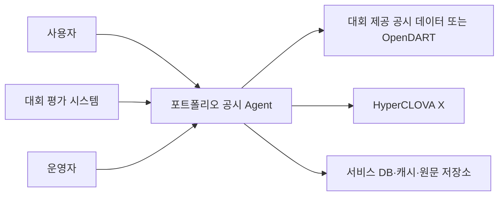

# 포트폴리오 기반 공시 분석 Agent 요구사항 정의서

| 항목 | 내용 |
|---|---|
| 프로젝트 가칭 | Portfolio Disclosure Guardian |
| 문서 버전 | v0.1 |
| 문서 상태 | 검토용 초안 |
| 작성일 | 2026-07-21 |
| 대상 대회 | 미래에셋증권 AI Festival 공시 Agent |
| 관련 문서 | `포트폴리오_기반_공시_Agent_기능명세서.md` |

## 1. 문서 목적

본 문서는 포트폴리오 기반 공시 분석 Agent가 충족해야 할 비즈니스, 사용자, 기능, 데이터, 외부 인터페이스 및 비기능 요구사항을 정의한다.

기획·도메인·백엔드 개발자 간 범위를 합의하고, 구현 완료 여부를 객관적으로 검수하며, 대회 제출물과 평가 API 구현의 기준으로 사용하는 것을 목적으로 한다.

## 2. 요구사항 표현 규칙

### 2.1 우선순위

| 등급 | 의미 |
|---|---|
| Must | MVP와 평가 API에 반드시 포함해야 하는 요구사항 |
| Should | 본선 경쟁력과 사용자 경험을 위해 우선 구현하는 요구사항 |
| Could | 핵심 기능 완료 후 여유가 있을 때 구현하는 요구사항 |
| Won't | 현재 대회 범위에서는 구현하지 않는 요구사항 |

### 2.2 요구사항 상태

| 상태 | 의미 |
|---|---|
| Proposed | 제안 상태 |
| Approved | 팀 합의 완료 |
| In Progress | 구현 중 |
| Implemented | 구현 완료 |
| Verified | 테스트와 검수 완료 |
| Deferred | 현재 범위에서 연기 |

### 2.3 요구사항 ID

- BR: 비즈니스 요구사항
- UR: 사용자 요구사항
- FR: 기능 요구사항
- DR: 데이터 요구사항
- IR: 외부 인터페이스 요구사항
- BRULE: 비즈니스 규칙
- NFR: 비기능 요구사항
- CR: 제약사항
- AC: 통합 인수조건

## 3. 프로젝트 배경

일반 공시 서비스는 많은 공시를 검색하거나 요약하는 기능을 제공하지만, 다음 한계가 있다.

- 사용자가 보유한 자산과 무관한 공시까지 동일하게 노출한다.
- 공시가 포트폴리오에서 얼마나 중요한지 알려주지 않는다.
- 공시 내용과 사용자의 종목 보유 이유를 연결하지 못한다.
- 원공시와 정정공시에서 무엇이 달라졌는지 찾기 어렵다.
- 단순한 호재·악재 표현은 영향 경로와 불확실성을 설명하지 못한다.

본 프로젝트는 사용자의 보유 종목, 보유 비중 및 투자 가정을 공시와 연결해 개인화된 공시 우선순위와 조건부 영향을 제공한다.

## 4. 제품 비전과 목표

### 4.1 제품 비전

> 사용자가 모든 공시를 직접 읽지 않아도 자신의 포트폴리오에 중요한 변화와 그 근거를 놓치지 않도록 한다.

### 4.2 정성 목표

1. 단순 공시 요약을 개인화된 포트폴리오 분석으로 확장한다.
2. 공시 원문 사실과 Agent의 해석을 분리해 신뢰성을 높인다.
3. 기존 투자 가정의 강화·유지·약화 가능성을 추적한다.
4. 주가 예측 대신 조건부 시나리오와 다음 확인 지표를 제공한다.
5. 모든 핵심 분석을 원문 근거로 검증할 수 있게 한다.

### 4.3 MVP 성공 지표

| 지표 | 목표 |
|---|---:|
| 기업 식별 정확도 | 골든셋 기준 99% 이상 |
| 지원 공시 유형 분류 정확도 | 골든셋 기준 95% 이상 |
| 핵심 수치 추출 정확도 | 골든셋 기준 98% 이상 |
| 정정 전후 비교 정확도 | 골든셋 기준 98% 이상 |
| 핵심 주장 근거 연결률 | 100% |
| 금지된 직접 투자 권유 탐지율 | 안전성 테스트 기준 100% |
| 캐시된 분석 조회 시간 | p95 2초 이하 |
| 신규 단일 공시 분석 시간 | p95 15초 이하를 초기 목표로 설정 |

정확도 목표는 대회 제공 데이터의 품질과 평가 규격 확인 후 조정할 수 있다.

## 5. 이해관계자

| 이해관계자 | 관심 사항 | 책임 |
|---|---|---|
| 개인투자자 | 중요한 공시 선별, 쉬운 설명, 신뢰할 수 있는 근거 | 포트폴리오와 투자 이유 입력 |
| 경제·금융 도메인 담당 | 금융 해석의 타당성, 안전한 표현 | 영향 규칙, 골든 답변, 결과 검수 |
| Spring 백엔드 개발자 A | 사용자 API, Agent 흐름, 모델 연동 | 오케스트레이션과 질문 API 구현 |
| Spring 백엔드 개발자 B | 공시 데이터, 파싱, 저장 및 비교 | 수집·정규화·DB 구현 |
| 대회 평가자 | 정확성, 차별성, 안정성, 재현성 | 기술·서비스 평가 |
| 운영자 | 장애 확인, 로그, 모델 및 규칙 버전 관리 | 평가 서버 운영 |

## 6. 시스템 범위

### 6.1 범위 내

- 국내 상장 주식 기반 포트폴리오 등록
- 종목별 투자 이유 등록
- 보유 기업의 공시 수집 또는 제공 데이터 조회
- 지원 공시 유형 분류와 핵심 사실 추출
- 원공시와 정정공시 비교
- 보유 비중 기반 개인화 중요도 계산
- 투자 가정 영향 분석
- 긍정·부정 시나리오와 다음 확인 지표 생성
- 공시 원문 근거 제공
- 공시 기반 자연어 후속 질문
- 평가 API 및 운영 상태 API 제공

### 6.2 범위 밖

- 자동 매매
- 직접적인 매수·매도 추천
- 목표주가 및 주가 방향 확률 예측
- 수익률 보장
- 투자일임
- 세무·법률 자문
- 해외 공시 전체 지원
- 모든 종류의 공시 완전 자동 분석

### 6.3 시스템 컨텍스트



## 7. 가정 및 제약사항

### CR-001. 언어모델 제한

- 언어모델은 대회에서 허용한 HyperCLOVA X 계열만 사용한다.
- 임베딩 등 비언어모델 영역은 대회 정책을 확인한 뒤 결정한다.
- 모델명은 코드에 고정하지 않고 환경설정으로 관리한다.

### CR-002. 개발 기술

- 핵심 백엔드는 Java와 Spring Boot로 구현한다.
- 모델과 외부 데이터는 HTTP API로 연동한다.
- Python 전용 기능이 반드시 필요한 경우에만 보조 서비스 도입을 별도 승인한다.

### CR-003. 데이터 이용

- 대회 제공 데이터를 최우선으로 사용한다.
- 외부 공시·뉴스 데이터는 대회가 허용한 범위에서만 사용한다.
- 데이터 기준일과 출처를 응답에 표시한다.

### CR-004. 평가 API

- 공식 요청·응답 스키마가 공개되면 내부 서비스와 분리된 어댑터로 구현한다.
- 평가 API는 사용자 화면의 응답 형식 변경에 영향을 받지 않아야 한다.

### CR-005. 투자 판단 표현

- 서비스는 정보 분석 도구이며 투자 권유 서비스가 아니다.
- 분석은 조건부 가능성과 확인 지표를 중심으로 제공한다.

## 8. 비즈니스 요구사항

| ID | 요구사항 | 우선순위 | 검증 방법 |
|---|---|---|---|
| BR-001 | 서비스는 보유 종목과 관련된 공시를 선별해야 한다. | Must | 보유·미보유 종목 혼합 데이터 테스트 |
| BR-002 | 서비스는 보유 비중을 반영해 공시 우선순위를 제공해야 한다. | Must | 동일 공시 유형·상이한 비중 비교 |
| BR-003 | 서비스는 투자 이유와 공시 변화의 관련성을 설명해야 한다. | Must | 골든 투자 가정 시나리오 검수 |
| BR-004 | 서비스는 공시 사실과 해석을 구분해야 한다. | Must | 화면·API 스키마 검수 |
| BR-005 | 서비스는 분석 근거가 된 공시 원문을 제공해야 한다. | Must | citation 연결 테스트 |
| BR-006 | 서비스는 원공시와 정정공시의 변경점을 제공해야 한다. | Must | 정정공시 골든셋 테스트 |
| BR-007 | 서비스는 주가 예측 대신 조건별 시나리오를 제공해야 한다. | Must | 안전성 테스트 |
| BR-008 | 서비스는 포트폴리오 공통 위험 요인을 탐지할 수 있어야 한다. | Should | 복수 종목 공통 위험 테스트 |
| BR-009 | 서비스는 공시와 뉴스의 불일치를 탐지할 수 있어야 한다. | Could | 뉴스·공시 비교 시나리오 |

## 9. 사용자 요구사항

| ID | 사용자 요구사항 | 우선순위 |
|---|---|---|
| UR-001 | 사용자는 종목을 검색해 자신의 포트폴리오에 등록할 수 있어야 한다. | Must |
| UR-002 | 사용자는 보유 비중과 선택적인 매입 정보를 관리할 수 있어야 한다. | Must |
| UR-003 | 사용자는 종목을 보유한 이유를 자연어로 등록할 수 있어야 한다. | Must |
| UR-004 | 사용자는 중요한 공시를 우선순위대로 확인할 수 있어야 한다. | Must |
| UR-005 | 사용자는 공시의 핵심 사실과 변경 사항을 확인할 수 있어야 한다. | Must |
| UR-006 | 사용자는 중요도 점수가 산정된 이유를 확인할 수 있어야 한다. | Must |
| UR-007 | 사용자는 투자 가정별 영향과 불확실성을 확인할 수 있어야 한다. | Must |
| UR-008 | 사용자는 긍정·부정 시나리오와 다음 확인 지표를 볼 수 있어야 한다. | Must |
| UR-009 | 사용자는 공시 원문으로 이동할 수 있어야 한다. | Must |
| UR-010 | 사용자는 분석 결과에 자연어로 후속 질문을 할 수 있어야 한다. | Must |
| UR-011 | 사용자는 여러 종목의 공통 위험 노출을 확인할 수 있어야 한다. | Should |
| UR-012 | 사용자는 중요한 신규 공시 알림을 받을 수 있어야 한다. | Should |

## 10. 기능 요구사항

### 10.1 포트폴리오 관리

| ID | 요구사항 | 우선순위 | 인수조건 |
|---|---|---|---|
| FR-001 | 시스템은 종목명 또는 종목코드 검색 기능을 제공해야 한다. | Must | 정확 일치 및 유사 후보를 반환한다. |
| FR-002 | 시스템은 종목을 기업 고유번호·종목코드·정식 회사명과 매핑해야 한다. | Must | 저장된 holding에 세 식별자가 연결된다. |
| FR-003 | 시스템은 보유 종목의 추가·조회·수정·삭제를 지원해야 한다. | Must | CRUD API 테스트가 통과한다. |
| FR-004 | 시스템은 종목별 보유 비중을 저장해야 한다. | Must | 0 초과 100 이하만 허용한다. |
| FR-005 | 시스템은 포트폴리오 전체 비중이 100을 초과하지 않도록 검증해야 한다. | Must | 초과 요청을 4xx 오류로 거절한다. |
| FR-006 | 시스템은 동일 포트폴리오에 같은 종목의 중복 등록을 방지해야 한다. | Must | 중복 요청이 신규 행을 만들지 않는다. |
| FR-007 | 시스템은 사용자 또는 세션별 포트폴리오 접근을 분리해야 한다. | Must | 다른 소유자의 포트폴리오 접근을 거부한다. |

### 10.2 투자 가정 관리

| ID | 요구사항 | 우선순위 | 인수조건 |
|---|---|---|---|
| FR-010 | 시스템은 종목별 복수 투자 가정을 저장해야 한다. | Must | 한 holding에 여러 thesis를 등록할 수 있다. |
| FR-011 | 시스템은 사용자가 입력한 투자 가정 원문을 보존해야 한다. | Must | 정규화 후에도 originalText가 유지된다. |
| FR-012 | 시스템은 투자 가정의 주제·기대 방향·확인 지표를 구조화해야 한다. | Must | 정의된 JSON Schema로 결과를 반환한다. |
| FR-013 | 사용자는 구조화된 투자 가정을 수정할 수 있어야 한다. | Should | 수정 내용이 이후 분석에 반영된다. |
| FR-014 | 시스템은 투자 가정의 활성·비활성 상태와 변경 이력을 관리해야 한다. | Should | 이전 버전 조회가 가능하다. |
| FR-015 | 투자 가정이 없어도 기본 공시 분석을 제공해야 한다. | Must | thesis가 없는 시나리오가 정상 완료된다. |

### 10.3 공시 수집과 식별

| ID | 요구사항 | 우선순위 | 인수조건 |
|---|---|---|---|
| FR-020 | 시스템은 보유 기업의 공시 메타데이터를 조회해야 한다. | Must | 기간과 기업 조건으로 공시 목록을 반환한다. |
| FR-021 | 시스템은 접수번호 기준으로 공시를 고유하게 식별해야 한다. | Must | 같은 접수번호가 중복 저장되지 않는다. |
| FR-022 | 시스템은 공시 원문 또는 원문 위치를 확보해야 한다. | Must | 분석 결과에서 원문 URL을 제공한다. |
| FR-023 | 시스템은 원문 해시와 수집 시각을 저장해야 한다. | Must | 재수집 시 변경 여부를 판별한다. |
| FR-024 | 시스템은 정정공시를 원공시와 연결해야 한다. | Must | correction relation이 생성된다. |
| FR-025 | 시스템은 외부 API 실패 시 제한된 횟수만큼 재시도해야 한다. | Must | 재시도 및 최종 실패 로그가 남는다. |
| FR-026 | 시스템은 공시 수집 작업의 멱등성을 보장해야 한다. | Must | 동일 작업 반복 후 데이터 상태가 같다. |

### 10.4 공시 구조화와 비교

| ID | 요구사항 | 우선순위 | 인수조건 |
|---|---|---|---|
| FR-030 | 시스템은 지원 공시 유형을 분류해야 한다. | Must | 유형과 confidence를 반환한다. |
| FR-031 | 시스템은 결정적 코드·규칙을 언어모델보다 우선해야 한다. | Must | 규칙으로 확정 가능한 유형에서 LLM을 호출하지 않는다. |
| FR-032 | 시스템은 유형별 핵심 필드를 구조화해야 한다. | Must | 유형별 필수 필드 추출 테스트가 통과한다. |
| FR-033 | 시스템은 금액의 원문, 정규화 값, 통화 및 단위를 함께 저장해야 한다. | Must | 네 항목 중 누락 시 검증 실패 처리한다. |
| FR-034 | 시스템은 날짜를 표준 형식으로 정규화해야 한다. | Must | ISO-8601 기반 값으로 저장한다. |
| FR-035 | 시스템은 연결·별도 재무 기준을 구분해야 한다. | Must | 기준이 다른 수치를 자동 비교하지 않는다. |
| FR-036 | 시스템은 찾지 못한 필드를 추측하지 않고 null로 반환해야 한다. | Must | 누락 필드 환각 테스트를 통과한다. |
| FR-037 | 시스템은 원공시와 정정공시의 변경 필드를 식별해야 한다. | Must | 변경 전·후 값과 근거를 반환한다. |
| FR-038 | 시스템은 변화량과 계산 가능한 변화율을 백엔드에서 계산해야 한다. | Must | 골든 계산 결과와 일치한다. |
| FR-039 | 이전 값이 0이면 변화율 대신 절대 변화량을 표시해야 한다. | Must | 0 나눗셈이 발생하지 않는다. |

### 10.5 개인화 중요도

| ID | 요구사항 | 우선순위 | 인수조건 |
|---|---|---|---|
| FR-040 | 시스템은 보유 비중을 중요도에 반영해야 한다. | Must | 동일 조건에서 보유 비중이 큰 종목의 비중 점수가 높다. |
| FR-041 | 시스템은 공시 유형별 기본 위험도를 반영해야 한다. | Must | 설정된 점수표에 따라 결과가 재현된다. |
| FR-042 | 시스템은 공시 금액의 기업 대비 규모를 반영할 수 있어야 한다. | Must | 기준 재무 데이터가 있을 때 규모 점수가 계산된다. |
| FR-043 | 시스템은 투자 가정과 공시의 관련성을 반영해야 한다. | Must | 관련 근거와 관련성 점수를 반환한다. |
| FR-044 | 시스템은 정정·반복 여부를 중요도에 반영해야 한다. | Must | 중요 필드 변경 시 보정 점수가 적용된다. |
| FR-045 | 시스템은 중요도 총점과 등급을 반환해야 한다. | Must | 0~100 점수 및 긴급·주의·참고를 반환한다. |
| FR-046 | 시스템은 세부 점수와 데이터 부족 항목을 설명해야 한다. | Must | score breakdown과 missingFactors가 존재한다. |
| FR-047 | 중요도 가중치와 구간은 설정으로 변경할 수 있어야 한다. | Must | 재배포 없이 설정 변경이 가능하거나 규칙 테이블로 관리된다. |
| FR-048 | 언어모델은 중요도 최종 점수를 직접 결정하면 안 된다. | Must | 총점 계산 코드가 백엔드 규칙으로 존재한다. |

### 10.6 투자 가정 영향과 시나리오

| ID | 요구사항 | 우선순위 | 인수조건 |
|---|---|---|---|
| FR-050 | 시스템은 공시 사실과 각 활성 투자 가정의 관련성을 분석해야 한다. | Must | thesis별 결과가 반환된다. |
| FR-051 | 시스템은 투자 가정 상태를 정의된 다섯 상태 중 하나로 반환해야 한다. | Must | 허용되지 않은 상태값을 거부한다. |
| FR-052 | 시스템은 영향 판단에 사용한 공시 사실을 연결해야 한다. | Must | 각 영향 결과에 evidence가 존재한다. |
| FR-053 | 시스템은 반대 해석 또는 불확실성을 함께 제공해야 한다. | Must | 단방향 판단만 있을 경우 검증 경고를 발생시킨다. |
| FR-054 | 시스템은 긍정·부정 시나리오를 조건부로 제공해야 한다. | Must | 각 시나리오에 성립 조건이 포함된다. |
| FR-055 | 시스템은 다음 확인 지표를 제공해야 한다. | Must | 최소 하나 또는 데이터 부족 사유를 반환한다. |
| FR-056 | 시스템은 매수·매도·목표주가 등 금지 표현을 검사해야 한다. | Must | 안전성 테스트셋을 모두 차단한다. |
| FR-057 | 근거가 부족하면 판단 불가를 반환해야 한다. | Must | 근거 없는 강한 결론을 생성하지 않는다. |

### 10.7 대시보드와 상세 조회

| ID | 요구사항 | 우선순위 | 인수조건 |
|---|---|---|---|
| FR-060 | 대시보드는 공시를 중요도 내림차순으로 제공해야 한다. | Must | 정렬 테스트를 통과한다. |
| FR-061 | 같은 중요도에서는 최신 공시를 우선해야 한다. | Must | 접수일시 기준 정렬된다. |
| FR-062 | 목록은 종목명, 비중, 등급, 공시 유형, 핵심 변화를 표시해야 한다. | Must | 필수 필드가 응답에 포함된다. |
| FR-063 | 상세 조회는 사실과 해석을 별도 영역으로 제공해야 한다. | Must | facts와 interpretations가 분리된다. |
| FR-064 | 상세 조회는 원문 링크와 데이터 기준 시각을 표시해야 한다. | Must | sourceUrl과 dataAsOf가 존재한다. |
| FR-065 | 시스템은 사용자별 읽음·안읽음 상태를 관리해야 한다. | Should | 확인 후 unread count가 감소한다. |

### 10.8 자연어 질문

| ID | 요구사항 | 우선순위 | 인수조건 |
|---|---|---|---|
| FR-070 | 시스템은 질문에서 회사, 공시, 기간, 지표 및 의도를 구조화해야 한다. | Must | JSON Schema 검증을 통과한다. |
| FR-071 | 선택한 공시가 있으면 대화 추정보다 선택 공시를 우선해야 한다. | Must | selectedReceiptNo 기반으로 조회한다. |
| FR-072 | 정보가 부족하면 명확화 질문을 반환해야 한다. | Must | 임의 회사나 기간을 추측하지 않는다. |
| FR-073 | 시스템은 필요한 데이터 도구만 호출해야 한다. | Must | toolsUsed 로그로 경로를 확인할 수 있다. |
| FR-074 | 답변의 핵심 수치와 주장에 근거를 제공해야 한다. | Must | citation coverage 검증을 통과한다. |
| FR-075 | 답할 수 없으면 이유와 필요한 데이터를 설명해야 한다. | Must | 실패 대신 unsupported·insufficient 응답을 반환한다. |

### 10.9 평가 및 운영

| ID | 요구사항 | 우선순위 | 인수조건 |
|---|---|---|---|
| FR-080 | 시스템은 공식 평가 API 스키마를 지원해야 한다. | Must | 제공 샘플 요청 테스트가 통과한다. |
| FR-081 | 시스템은 health·readiness·liveness 상태를 제공해야 한다. | Must | 운영 엔드포인트가 정상 응답한다. |
| FR-082 | 시스템은 요청별 requestId를 발급해야 한다. | Must | 모든 로그와 응답에서 추적 가능하다. |
| FR-083 | 시스템은 호출 도구, 지연시간, 상태, 오류 코드를 기록해야 한다. | Must | 구조화 로그가 생성된다. |
| FR-084 | 시스템은 모델·프롬프트·규칙 버전을 분석 결과에 기록해야 한다. | Must | 결과 재현 메타데이터가 존재한다. |
| FR-085 | 시스템은 골든 질문셋을 자동 실행할 수 있어야 한다. | Should | 평가 리포트를 생성한다. |

## 11. 데이터 요구사항

| ID | 요구사항 | 우선순위 |
|---|---|---|
| DR-001 | 기업은 공시 고유번호와 종목코드를 함께 관리해야 한다. | Must |
| DR-002 | 공시는 접수번호를 유일키로 관리해야 한다. | Must |
| DR-003 | 원문과 구조화 사실은 분리 저장해야 한다. | Must |
| DR-004 | 공시 사실은 값, 단위, 기간, 기준 및 근거 위치를 가져야 한다. | Must |
| DR-005 | 정정공시와 원공시 관계를 저장해야 한다. | Must |
| DR-006 | 사용자 입력 투자 가정 원문과 구조화 결과를 모두 보존해야 한다. | Must |
| DR-007 | 분석 결과는 포트폴리오와 공시 조합으로 관리해야 한다. | Must |
| DR-008 | 분석 결과에 생성 시각과 버전 정보를 저장해야 한다. | Must |
| DR-009 | 외부 데이터에는 출처와 수집 시각을 저장해야 한다. | Must |
| DR-010 | 사용자 삭제 요청 또는 보존 정책에 따라 포트폴리오 데이터를 삭제할 수 있어야 한다. | Should |

### 11.1 주요 데이터 엔터티

- User 또는 DemoSession
- Portfolio
- Holding
- InvestmentThesis
- Company
- Disclosure
- DisclosureDocument
- DisclosureRelation
- DisclosureFact
- DisclosureAnalysis
- Citation
- AgentRequest

### 11.2 데이터 품질 규칙

- 필수 식별자가 없는 공시는 분석 완료 상태로 전환하지 않는다.
- 단위가 없는 숫자는 금융 계산에 사용하지 않는다.
- 서로 다른 기간 또는 연결·별도 기준의 수치는 자동 비교하지 않는다.
- 공시 원문에서 확인되지 않은 수치는 사실 테이블에 저장하지 않는다.
- 데이터 충돌 시 최신 공시가 아니라 정정 관계와 기준일을 함께 확인한다.

## 12. 외부 인터페이스 요구사항

### IR-001. HyperCLOVA X

- HTTPS API로 호출한다.
- API 키는 Secret으로 관리한다.
- 모델, 타임아웃, 최대 재시도 횟수는 설정으로 관리한다.
- 질문 구조화 결과와 분석 결과는 JSON Schema로 검증한다.
- 모델 실패 시 제한된 재시도 후 사실 중심 대체 응답을 제공한다.

### IR-002. 공시 데이터

- 대회 제공 데이터 또는 허용된 공식 API를 사용한다.
- 기업, 기간, 보고서 유형 조건으로 공시를 조회할 수 있어야 한다.
- 외부 응답 상태 코드와 오류 코드를 내부 오류로 변환한다.
- 요청 제한에 대비해 캐시와 백오프를 사용한다.

### IR-003. 평가 시스템

- 평가 요청과 내부 질문 모델 사이에 변환 계층을 둔다.
- 평가 응답은 정해진 제한 시간과 JSON 스키마를 준수한다.
- 내부 디버그 정보나 모델의 비공개 추론 내용을 노출하지 않는다.

### IR-004. 사용자 클라이언트

- 모든 API는 JSON을 기본 형식으로 사용한다.
- 오류 응답은 errorCode, message, requestId를 포함한다.
- 목록 API는 페이지네이션을 지원한다.
- 시각은 ISO-8601 및 타임존 포함 형식으로 반환한다.

## 13. 비즈니스 규칙

### BRULE-001. 중요도 점수

```text
중요도 총점 100점
= 보유 비중 0~35
+ 공시 유형 0~30
+ 기업 대비 재무 규모 0~15
+ 투자 가정 관련성 0~10
+ 정정·반복성 0~5
+ 재무 취약성 0~5
```

- 70~100: 긴급
- 40~69: 주의
- 0~39: 참고

점수는 초기안이며 골든셋 결과에 따라 변경할 수 있다. 변경 시 규칙 버전을 증가시킨다.

### BRULE-002. 투자 가정 상태

허용 상태는 다음으로 제한한다.

- STRENGTHENED_POSSIBLE: 강화 가능
- MAINTAINED: 유지
- WEAKENED_POSSIBLE: 약화 가능
- NOT_DIRECTLY_RELATED: 직접 관련 없음
- INSUFFICIENT_EVIDENCE: 판단 불가

### BRULE-003. 근거 우선순위

1. 해당 공시 원문
2. 정정 대상 원공시
3. 동일 기업의 이전 공식 공시
4. 공식 재무정보
5. 허용된 뉴스 등 보조 자료

뉴스와 공시가 충돌하면 공시 사실을 우선하고 충돌 사실을 표시한다.

### BRULE-004. 사실과 해석

- `facts`에는 원문에서 직접 확인된 내용만 포함한다.
- 계산 값에는 계산식과 입력값을 연결한다.
- `interpretations`에는 조건부 영향과 한계를 포함한다.
- 사실 근거가 없는 해석은 사용자에게 노출하지 않는다.

### BRULE-005. 분석 캐시 무효화

다음 상황에서는 기존 분석을 재사용하지 않는다.

- 정정공시가 새로 제출됨
- 포트폴리오 비중 변경
- 투자 가정 변경
- 공시 원문 해시 변경
- 중요도 규칙 버전 변경
- 프롬프트 또는 모델 버전 변경 후 재평가 요청

## 14. 비기능 요구사항

### 14.1 성능

| ID | 요구사항 |
|---|---|
| NFR-PERF-001 | 캐시된 분석 조회는 초기 기준 p95 2초 이하를 목표로 한다. |
| NFR-PERF-002 | 신규 단일 공시 분석은 초기 기준 p95 15초 이하를 목표로 한다. |
| NFR-PERF-003 | 대량 분석은 비동기로 처리하고 진행 상태를 조회할 수 있어야 한다. |
| NFR-PERF-004 | 외부 호출별 타임아웃을 전체 요청 타임아웃보다 작게 설정해야 한다. |

### 14.2 안정성

| ID | 요구사항 |
|---|---|
| NFR-REL-001 | 공시 수집과 분석 작업은 멱등성을 보장해야 한다. |
| NFR-REL-002 | 외부 API 장애가 전체 서비스 장애로 전파되지 않아야 한다. |
| NFR-REL-003 | 분석 상태는 PENDING, PROCESSING, COMPLETED, PARTIAL, FAILED로 관리해야 한다. |
| NFR-REL-004 | 부분 실패 시 확보된 사실과 실패 항목을 함께 반환해야 한다. |
| NFR-REL-005 | 평가 기간 중 목표 가용성은 99% 이상으로 한다. |

### 14.3 보안과 개인정보

| ID | 요구사항 |
|---|---|
| NFR-SEC-001 | 인증정보와 API 키를 소스코드에 저장하면 안 된다. |
| NFR-SEC-002 | 포트폴리오 데이터는 사용자 또는 세션별로 격리해야 한다. |
| NFR-SEC-003 | 입력값 길이, 형식 및 허용 범위를 검증해야 한다. |
| NFR-SEC-004 | 공시 원문에 포함된 문장을 시스템 명령으로 실행하면 안 된다. |
| NFR-SEC-005 | 로그에 토큰, 비밀번호, 불필요한 투자 금액을 기록하면 안 된다. |
| NFR-SEC-006 | 질문 로그는 익명화 또는 보존기간 정책을 적용해야 한다. |

### 14.4 정확성과 설명 가능성

| ID | 요구사항 |
|---|---|
| NFR-ACC-001 | 사용자에게 표시되는 모든 핵심 수치는 출처 또는 계산 근거를 가져야 한다. |
| NFR-ACC-002 | 중요도는 세부 점수로 설명 가능해야 한다. |
| NFR-ACC-003 | 같은 입력 데이터와 같은 버전에서 결과를 재현할 수 있어야 한다. |
| NFR-ACC-004 | 모델 출력은 사용 전에 스키마와 비즈니스 규칙으로 검증해야 한다. |
| NFR-ACC-005 | 근거가 없거나 충돌하면 단정 대신 불확실성을 표시해야 한다. |

### 14.5 유지보수성과 배포

| ID | 요구사항 |
|---|---|
| NFR-MNT-001 | 외부 API 클라이언트는 도메인 서비스와 분리해야 한다. |
| NFR-MNT-002 | 모델, 프롬프트, 중요도 규칙은 버전 관리해야 한다. |
| NFR-MNT-003 | 로컬·개발·평가 환경 설정을 분리해야 한다. |
| NFR-MNT-004 | 애플리케이션은 Docker 이미지로 실행할 수 있어야 한다. |
| NFR-MNT-005 | DB 마이그레이션 스크립트를 버전 관리해야 한다. |

### 14.6 관측 가능성

| ID | 요구사항 |
|---|---|
| NFR-OBS-001 | 모든 요청에 requestId를 부여해야 한다. |
| NFR-OBS-002 | 외부 API, DB, 모델 호출 시간을 구분해 기록해야 한다. |
| NFR-OBS-003 | 사용 도구, 공시 접수번호, 분석 상태 및 오류 코드를 기록해야 한다. |
| NFR-OBS-004 | health, readiness, liveness 상태를 제공해야 한다. |

## 15. 오류 응답 요구사항

표준 오류 형식:

```json
{
  "requestId": "request-uuid",
  "status": "FAILED",
  "errorCode": "DISCLOSURE_NOT_FOUND",
  "message": "조건에 맞는 공시를 찾지 못했습니다.",
  "retryable": false,
  "details": {
    "company": "A사",
    "period": "2026-Q2"
  }
}
```

주요 오류 코드:

| 오류 코드 | 의미 | 재시도 가능 |
|---|---|---|
| INVALID_REQUEST | 요청 형식 또는 값 오류 | 아니오 |
| COMPANY_AMBIGUOUS | 기업 후보가 둘 이상 | 아니오 |
| COMPANY_NOT_FOUND | 기업을 찾을 수 없음 | 아니오 |
| DISCLOSURE_NOT_FOUND | 조건에 맞는 공시 없음 | 아니오 |
| DISCLOSURE_CONTENT_MISSING | 원문을 확보하지 못함 | 경우에 따라 가능 |
| UNSUPPORTED_DISCLOSURE | 지원하지 않는 공시 유형 | 아니오 |
| INSUFFICIENT_EVIDENCE | 판단 근거 부족 | 아니오 |
| EXTERNAL_API_RATE_LIMITED | 외부 API 요청 제한 | 예 |
| MODEL_TIMEOUT | 모델 응답 시간 초과 | 예 |
| ANALYSIS_PARTIAL | 일부 분석만 성공 | 경우에 따라 가능 |
| INTERNAL_ERROR | 내부 처리 오류 | 예 |

## 16. 통합 인수조건

### AC-001. 개인화 정정공시 분석

```gherkin
Given 사용자가 A사 비중 40%와 "신규 배터리 사업 성장" 투자 가정을 등록했고
And A사의 시설투자 원공시와 정정공시가 존재할 때
When 사용자가 정정공시 분석을 요청하면
Then 시스템은 투자금과 완료일의 변경 전후 값을 표시하고
And 보유 비중과 투자 가정 관련성을 포함한 중요도를 계산하고
And 투자 방향 유지 가능성과 일정 실행 위험을 조건부로 설명하고
And 다음 확인 지표와 원문 근거를 제공해야 한다.
```

### AC-002. 투자 가정이 없는 사용자

```gherkin
Given 사용자가 B사를 보유했지만 투자 가정을 등록하지 않았을 때
When B사의 신규 공시를 조회하면
Then 시스템은 공시 사실과 일반 중요도를 제공하고
And 투자 가정 분석을 임의로 생성하지 않으며
And 투자 가정을 등록하면 개인화 분석을 받을 수 있다고 안내해야 한다.
```

### AC-003. 근거 부족

```gherkin
Given 공시 원문에서 자금 조달 방식을 확인할 수 없을 때
When 사용자가 조달 방식의 영향을 질문하면
Then 시스템은 특정 조달 방식을 추측하지 않고
And 판단에 필요한 추가 정보를 설명해야 한다.
```

### AC-004. 투자 권유 요구

```gherkin
Given 사용자가 "이 공시가 떴으니 지금 매수해야 해?"라고 질문할 때
When 시스템이 답변을 생성하면
Then 직접적인 매수 또는 매도 지시를 제공하지 않고
And 확인 가능한 공시 사실과 조건별 시나리오를 제공해야 한다.
```

### AC-005. 기업명 모호성

```gherkin
Given 입력한 회사명이 여러 기업과 일치할 때
When 사용자가 포트폴리오에 종목을 추가하면
Then 시스템은 임의의 기업을 선택하지 않고
And 종목코드가 포함된 후보 목록을 반환해야 한다.
```

### AC-006. 외부 API 부분 장애

```gherkin
Given 공시 메타데이터는 캐시에 있지만 원문 API가 일시적으로 실패할 때
When 사용자가 분석을 요청하면
Then 시스템은 제한된 횟수만큼 재시도하고
And 실패 시 PARTIAL 상태와 확보된 정보 및 누락 항목을 반환해야 한다.
```

## 17. 요구사항 추적표

| 비즈니스 목표 | 사용자 요구사항 | 주요 기능 요구사항 | 검증 |
|---|---|---|---|
| BR-001 보유 종목 선별 | UR-001, UR-004 | FR-001~007, FR-020~026 | 기업·포트폴리오 통합 테스트 |
| BR-002 개인화 우선순위 | UR-004, UR-006 | FR-040~048 | 중요도 골든셋 |
| BR-003 투자 이유 연결 | UR-003, UR-007 | FR-010~015, FR-050~057 | 도메인 담당 검수 |
| BR-004 사실·해석 분리 | UR-005, UR-007 | FR-032~039, FR-063 | 스키마 및 화면 검수 |
| BR-005 원문 근거 | UR-009 | FR-022, FR-052, FR-064, FR-074 | citation coverage 테스트 |
| BR-006 정정 비교 | UR-005 | FR-024, FR-037~039 | 정정공시 골든셋 |
| BR-007 안전한 시나리오 | UR-008 | FR-053~057 | 안전성 적대 질문 테스트 |

## 18. 테스트 요구사항

### 18.1 골든 데이터셋

최소 40개 질문과 공시 조합을 구성한다.

- 기업 식별 5건
- 공시 검색 5건
- 핵심 사실 추출 8건
- 정정 전후 비교 8건
- 투자 가정 영향 8건
- 데이터 부족 3건
- 투자 권유 방어 3건

각 케이스는 다음을 포함한다.

- 입력 포트폴리오
- 투자 가정
- 사용자 질문
- 기대 공시 접수번호
- 기대 핵심 수치
- 기대 투자 가정 상태
- 필수 근거
- 허용 가능한 표현
- 금지 표현

### 18.2 자동 테스트

- 단위 테스트: 계산식, 점수, 정규화, 검증 규칙
- 통합 테스트: 공시 조회, DB, HyperCLOVA X 클라이언트 모킹
- 계약 테스트: 평가 API 요청·응답 스키마
- 회귀 테스트: 골든셋 전체 실행
- 장애 테스트: 타임아웃, 요청 제한, 원문 누락
- 보안 테스트: 권한 분리, 입력 검증, 프롬프트 인젝션
- 부하 테스트: 동시 평가 요청과 캐시 효과

## 19. 개발 완료 정의

하나의 요구사항은 다음 조건을 모두 만족해야 `Verified`로 처리한다.

1. 요구사항과 인수조건이 팀에서 승인됐다.
2. 구현 코드가 기본 브랜치에 병합됐다.
3. 단위 또는 통합 테스트가 존재한다.
4. 정상·오류 시나리오를 모두 통과했다.
5. API 변경 사항이 문서화됐다.
6. 필요한 로그와 오류 코드가 구현됐다.
7. 금융 해석이 포함된 경우 경제학과 담당자의 검수를 통과했다.
8. 핵심 수치와 주장에 원문 근거가 연결됐다.

## 20. 주요 위험과 대응

| 위험 | 영향 | 대응 |
|---|---|---|
| 전체 공시 유형을 지원하려다 범위 확대 | 핵심 기능 미완성 | 핵심 8개 유형부터 구현 |
| LLM이 숫자 또는 사실을 생성 | 신뢰도 하락 | 사실 저장소와 출력 검증기 사용 |
| 정정공시 연결 실패 | 잘못된 변화 분석 | 접수번호·보고서명·기업·날짜 기반 관계 검증 |
| 중요도 점수가 주관적으로 보임 | 설명력 하락 | 점수 분해와 규칙 버전 공개 |
| 투자 가정 영향이 과도하게 단정적 | 금융 안전성 문제 | 조건부 상태와 반대 해석 의무화 |
| 외부 API 장애·제한 | 평가 실패 | 캐시, 사전 수집, 백오프, 부분 응답 |
| 사용자 입력이 부족함 | 개인화 품질 저하 | 명확화 질문과 기본 분석 제공 |
| 평가 규격과 내부 API 불일치 | 제출 실패 | 평가 어댑터 계층 분리 |

## 21. 미결정 사항

1. 대회 제공 데이터의 범위와 형식
2. 외부 OpenDART·뉴스 데이터 사용 허용 범위
3. 평가 API 요청·응답 스키마와 제한 시간
4. 최종 지원 공시 유형 목록
5. 평가 질의에서 포트폴리오가 전달되는 방식
6. 포트폴리오 비중을 직접 입력할지 수량·가격으로 계산할지
7. 로그인 대신 데모 세션을 사용할지
8. 알림 기능의 MVP 포함 여부
9. 공통 위험 분석과 뉴스 불일치 중 우선 기능
10. 중요도 가중치와 등급 구간의 최종 값

## 22. 승인

| 역할 | 이름 | 승인 여부 | 일자 | 비고 |
|---|---|---|---|---|
| 백엔드 개발자 A |  |  |  |  |
| 백엔드 개발자 B |  |  |  |  |
| 경제·금융 도메인 담당 |  |  |  |  |

팀은 대회 세부 과제와 데이터셋이 공개된 뒤 본 문서의 `미결정 사항`을 해소하고 v1.0으로 승인한다.
