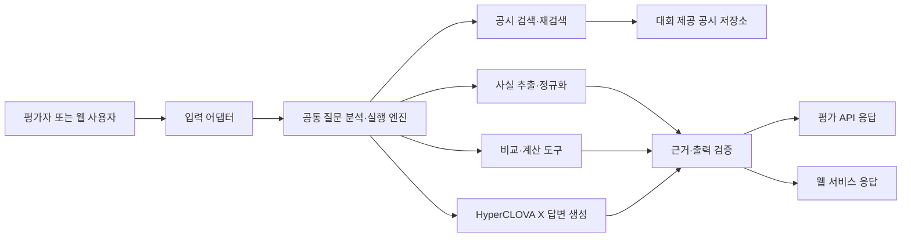

# FolioLens 공시 Agent 요구사항 정의서

| 항목 | 내용 |
|---|---|
| 프로젝트명 | FolioLens |
| 문서 버전 | v1.0 |
| 문서 상태 | 공식 과제 반영 개정안 |
| 작성일 | 2026-07-28 |
| 대상 대회 | 제10회 2026 미래에셋증권 AI Festival 공시 Agent 부문 |
| 기준 문서 | 대회 과제소개자료, `PROJECT_CONTEXT.md`, `DECISIONS.md` |
| 후속 정합화 대상 | 기능명세서, IA, API 명세서, ERD |

## 1. 문서 목적

본 문서는 FolioLens가 대회 예선 평가와 서비스 시연을 위해 충족해야 하는 비즈니스, 사용자, 기능, 데이터, 인터페이스 및 비기능 요구사항을 정의한다.

이 문서는 다음 용도로 사용한다.

1. 세 명의 팀원이 동일한 제품 목표와 구현 범위를 공유한다.
2. 평가에 필요한 핵심 기능과 서비스 차별화 기능의 우선순위를 구분한다.
3. 기능명세서, IA, API 명세서, ERD 및 테스트 케이스의 기준 문서로 사용한다.
4. 구현 완료 여부를 객관적인 인수조건으로 검증한다.
5. 대회 금지사항과 데이터 사용 범위를 개발 전 과정에서 통제한다.

## 2. 요구사항 적용 원칙

### 2.1 문서 우선순위

요구사항이 충돌할 경우 다음 순서로 판단한다.

1. 현재 사용자의 명시적인 요청
2. 본 문서에서 승인된 Must 요구사항
3. 기능명세서
4. IA
5. `PROJECT_CONTEXT.md`
6. 기존 코드와 구현 관례

대회 운영진이 새 규격이나 공지를 제공하면 해당 내용을 먼저 확인하고 본 문서를 개정한다.

### 2.2 우선순위

| 등급 | 의미 | 이번 프로젝트에서의 적용 |
|---|---|---|
| Must | 예선 평가와 최소 제출물에 반드시 필요 | 평가 API, 제공 공시 데이터 검색·분석·계산·근거 답변 |
| Should | 평가 코어 완료 후 경쟁력과 시연 품질을 위해 구현 | 질문 중심 웹 UI, 후속 질문, 답변 탐색 경험 |
| Could | 핵심 기능과 제출 안정성을 해치지 않는 범위에서 구현 | 포트폴리오 개인화, 투자 가정 추적, 알림 |
| Won't | 현재 대회 범위에서 구현하거나 사용하지 않음 | 외부 뉴스·OpenDART 실시간 조회, 매수·매도 추천 |

### 2.3 요구사항 상태

| 상태 | 의미 |
|---|---|
| Proposed | 제안되었으나 팀 합의 전 |
| Approved | 팀 합의가 완료되어 구현 기준으로 사용 |
| In Progress | 구현 중 |
| Implemented | 코드 구현 완료 |
| Verified | 테스트와 인수조건 검증 완료 |
| Deferred | 현재 제출 범위에서 연기 |

### 2.4 요구사항 ID

| 접두어 | 의미 |
|---|---|
| BR | 비즈니스 요구사항 |
| UR | 사용자·평가자 요구사항 |
| CR | 대회 및 제품 제약사항 |
| FR-EVAL | 평가 API 요구사항 |
| FR-QUERY | 질문 이해 및 실행 계획 요구사항 |
| FR-DATA | 공시 데이터 적재·정규화 요구사항 |
| FR-RET | 검색·검색 증강 요구사항 |
| FR-FACT | 사실 추출·근거 요구사항 |
| FR-CALC | 비교·계산·이력 요구사항 |
| FR-ANS | 답변 생성·검증 요구사항 |
| FR-WEB | 웹 서비스 요구사항 |
| FR-PORT | 포트폴리오 개인화 요구사항 |
| FR-OPS | 운영·관리 요구사항 |
| DR | 데이터 요구사항 |
| IR | 외부 인터페이스 요구사항 |
| BRULE | 비즈니스 규칙 |
| NFR | 비기능 요구사항 |
| AC | 통합 인수조건 |

## 3. 프로젝트 배경과 문제 정의

기업 공시는 투자 판단에 필요한 공식 정보이지만 문서의 양이 많고 형식과 용어가 복잡하다. 하나의 질문에 답하기 위해 여러 시점의 정기보고서, 주요사항보고서, 거래소 공시 또는 지분공시를 함께 찾아 비교해야 할 수도 있다.

기존 키워드 검색이나 단일 문서 요약만으로는 다음 문제를 충분히 해결하기 어렵다.

- 자연어 질문의 의도에 맞는 기업, 기간, 공시 유형과 항목을 찾기 어렵다.
- 서로 다른 문서의 수치와 사건을 연결해 변화 추이를 계산하기 어렵다.
- 정정공시와 후속공시를 놓치면 오래되거나 잘못된 답을 제시할 수 있다.
- 답변이 어느 공시와 어느 문장을 근거로 하는지 검증하기 어렵다.
- 공시에 없는 정보까지 모델이 추측하면 투자 관련 신뢰 문제가 발생한다.

FolioLens는 대회가 제공한 공시 데이터 안에서 질문과 관련된 문서를 검색하고, 필요한 사실을 추출·계산·비교한 뒤, 근거와 정보 한계를 포함한 자연어 답변을 제공하는 공시 Agent를 구축한다.

## 4. 제품 비전과 목표

### 4.1 제품 비전

> 사용자가 복잡한 공시를 일일이 찾고 대조하지 않아도, 자연어 질문 하나로 검증 가능한 근거와 함께 필요한 사실·비교·변화를 이해하도록 돕는다.

### 4.2 핵심 가치

1. **질문 중심 검색**: 키워드가 아니라 질문의 의도에 맞는 공시와 항목을 찾는다.
2. **다문서 종합**: 여러 기업, 여러 시점, 원공시·정정공시·후속공시를 연결한다.
3. **결정적 계산**: 금액, 비율, 증감률, 기간 등은 백엔드 코드가 계산한다.
4. **근거 기반 설명**: 모든 핵심 주장과 수치를 대회 제공 공시 근거에 연결한다.
5. **정직한 한계 표시**: 공시에서 확인할 수 없는 내용은 추측하지 않는다.
6. **확장 가능한 서비스**: 동일한 답변 엔진을 평가 API와 웹 서비스에서 함께 사용한다.
7. **차별화된 개인화**: 평가 코어 완료 후 보유 종목과 투자 가정에 연결한다.

### 4.3 단계별 제품 범위

| 단계 | 목표 | 우선순위 |
|---|---|---|
| P0 평가 코어 | 제공 공시 데이터 기반 자연어 질의응답, 비교·계산·근거 제시, 평가 API | Must |
| P1 시연 서비스 | 질문 중심 웹 UI, 근거 탐색, 후속 질문, 비교 결과 시각화 | Should |
| P2 차별화 | 포트폴리오와 투자 가정에 맞춘 공시 질문·영향 추적 | Could |

### 4.4 MVP 성공 기준

| 지표 | 목표 |
|---|---:|
| 평가 API 계약 테스트 통과율 | 100% |
| 답변의 핵심 주장 근거 연결률 | 100% |
| 백엔드 계산 결과 정확도 | 골든셋 기준 100% |
| 기업·기간·공시 유형 식별 정확도 | 골든셋 기준 95% 이상 |
| 핵심 사실 추출 정확도 | 골든셋 기준 95% 이상 |
| 답변 가능 여부 판정 정확도 | 골든셋 기준 95% 이상 |
| 외부 금지 데이터 호출 건수 | 0건 |
| 금지된 직접 투자 권유 출력 | 안전성 테스트 기준 0건 |
| 미지원·근거 부족 질문의 추측 답변 | 안전성 테스트 기준 0건 |

정확도와 응답시간의 최종 수치는 운영진이 평가 규격과 제한시간을 확정하면 조정할 수 있다.

## 5. 이해관계자

| 이해관계자 | 주요 관심 사항 | 책임 |
|---|---|---|
| 대회 평가자 | 정확성, 근거, 요구사항 충족, 논리성, 안전성 | 비공개 평가 질문 전송 및 결과 평가 |
| 일반 사용자 | 쉬운 질문, 이해 가능한 답변, 원문 근거 확인 | 질문 입력 및 결과 확인 |
| 금융 도메인 담당 | 용어·계산·해석의 타당성 | 골든셋, 계산 규칙, 답변 품질 검수 |
| AI·백엔드 담당 | 검색·도구 실행·HyperCLOVA X 연동 | 공시 QA 파이프라인과 평가 API 구현 |
| 데이터·백엔드 담당 | 데이터 품질, 검색 정확도, 계산 신뢰성 | 적재·정규화·인덱싱·계산 모듈 구현 |
| 운영자 | 재현 가능한 배포, 장애 파악, 규정 준수 | 환경설정, 모니터링, 제출 서버 운영 |

## 6. 공식 과제 범위

### 6.1 제공 데이터 범위

대회가 제공하는 데이터는 다음 범주를 포함하는 것으로 정의한다.

| 범주 | 내용 |
|---|---|
| 대상 기업 | 운영진이 선정한 대표 상장기업 |
| 기간 | 2023년 1월부터 2026년 3월까지 |
| 정기공시 | 사업보고서, 반기보고서, 분기보고서 |
| 수시·거래소 공시 | 주요사항보고서, 계약, 시설투자, 주요경영사항 등 |
| 지분공시 | 주식 등의 대량보유상황보고서 등 5% 보고 |
| 구조화 데이터 | 기업명, 종목코드, 업종 등 기업 마스터 |
| 공시 메타데이터 | 접수일자, 공시 유형, 제출인 등 |

실제 제공 파일의 목록, 스키마 및 품질은 데이터 수령 후 데이터 카탈로그로 확정한다.

### 6.2 평가 질문 범위

Agent는 다음 유형의 질문을 처리해야 한다.

1. 특정 공시 또는 보고서에서 사실·수치·조건을 찾는 질문
2. 서로 다른 연도·분기·기업의 값을 비교하는 질문
3. 증감액, 증감률, 비중, 기간 등을 계산하는 질문
4. 하나의 사건과 관련된 원공시·정정공시·후속공시를 종합하는 질문
5. 여러 공시를 근거로 회사의 사업·재무·투자·계약·자금조달·지분 현황을 설명하는 질문
6. 제공된 공시만으로 답할 수 없는지 판단해야 하는 질문

평가 문제는 난이도별 상·중·하 및 정답형·서술형 질문을 포함할 수 있다.

### 6.3 시스템 경계



평가 API와 웹 API는 입력·출력 형식만 다르며, 검색·계산·검증을 수행하는 공통 코어를 재사용해야 한다.

## 7. 비즈니스 요구사항

| ID | 요구사항 | 우선순위 | 상태 |
|---|---|---|---|
| BR-001 | 시스템은 자연어 질문과 관련된 기업, 기간, 공시 및 항목을 찾아야 한다. | Must | Approved |
| BR-002 | 시스템은 단일 문서 검색을 넘어 여러 공시를 비교·종합할 수 있어야 한다. | Must | Approved |
| BR-003 | 시스템은 금액, 날짜, 비율, 증감률 및 기간 계산을 재현 가능한 로직으로 수행해야 한다. | Must | Approved |
| BR-004 | 답변의 모든 핵심 주장과 수치는 대회 제공 공시 근거로 검증할 수 있어야 한다. | Must | Approved |
| BR-005 | 공시에서 확인할 수 없는 내용은 추측하지 않고 정보 한계를 알려야 한다. | Must | Approved |
| BR-006 | 평가 서비스 경로에서는 대회 제공 데이터 외의 뉴스, 보고서, 웹 검색 및 외부 공시 API를 사용하지 않아야 한다. | Must | Approved |
| BR-007 | 언어모델은 대회가 허용한 HyperCLOVA X 계열만 사용해야 한다. | Must | Approved |
| BR-008 | 소스코드, 실행 환경, 기술제안서 및 평가 API 서버를 재현 가능한 형태로 제출해야 한다. | Must | Approved |
| BR-009 | 투자 권유나 가격 예측보다 공시 사실, 변화, 조건 및 불확실성을 설명해야 한다. | Must | Approved |
| BR-010 | 웹 서비스는 질문부터 근거 확인까지 일관된 탐색 경험을 제공해야 한다. | Should | Proposed |
| BR-011 | 평가 코어 완료 후 사용자의 포트폴리오와 투자 가정을 공시 분석에 연결할 수 있어야 한다. | Could | Proposed |

## 8. 사용자 및 평가자 요구사항

| ID | 요구사항 | 우선순위 |
|---|---|---|
| UR-001 | 평가자와 사용자는 자연어로 공시 관련 질문을 입력할 수 있어야 한다. | Must |
| UR-002 | 사용자는 정확한 보고서명이나 공시 유형을 몰라도 질문할 수 있어야 한다. | Must |
| UR-003 | 사용자는 단일 사실뿐 아니라 기간별·기업별 비교 결과를 받을 수 있어야 한다. | Must |
| UR-004 | 사용자는 계산 결과와 계산에 사용한 값을 확인할 수 있어야 한다. | Must |
| UR-005 | 사용자는 답변의 근거가 된 공시명, 접수일자, 접수번호 및 원문 위치를 확인할 수 있어야 한다. | Must |
| UR-006 | 사용자는 정정공시나 후속공시가 반영된 최신 상태를 확인할 수 있어야 한다. | Must |
| UR-007 | 질문이 모호하면 사용자는 해석 기준 또는 확인이 필요한 대상을 안내받아야 한다. | Must |
| UR-008 | 공시에 답이 없으면 사용자는 “공시에서 확인할 수 없음”과 그 이유를 안내받아야 한다. | Must |
| UR-009 | 웹 사용자는 근거 문맥을 펼쳐 보고 관련 후속 질문을 이어갈 수 있어야 한다. | Should |
| UR-010 | 웹 사용자는 보유 종목과 투자 이유를 등록하고 관련 공시를 개인화해 볼 수 있어야 한다. | Could |

## 9. 대회 및 제품 제약사항

| ID | 제약사항 | 우선순위 |
|---|---|---|
| CR-001 | 서비스 경로에서 사용하는 언어모델은 HyperCLOVA X 계열로 한정한다. | Must |
| CR-002 | OpenAI, Gemini, Claude 등 다른 언어모델을 서비스·평가 경로에 추가하지 않는다. | Must |
| CR-003 | 평가 답변의 사실 근거는 대회가 제공한 공시 데이터로 한정한다. | Must |
| CR-004 | 평가 경로에서 OpenDART를 포함한 실시간 외부 공시 API를 호출하지 않는다. | Must |
| CR-005 | 평가 경로에서 뉴스, 증권사 보고서, 위키, 검색엔진 및 기타 외부 코퍼스를 사용하지 않는다. | Must |
| CR-006 | 임베딩 및 보조 모델은 대회 허용 정책을 확인하기 전 서비스 경로에 사용하지 않는다. | Must |
| CR-007 | 외부 통신은 HyperCLOVA X 호출과 운영상 명시적으로 허용된 인프라로 제한하고 허용 목록으로 관리한다. | Must |
| CR-008 | 공시에서 확인되지 않은 전망, 투자 의견, 목표주가, 상승 확률 및 수익 보장 표현을 생성하지 않는다. | Must |
| CR-009 | 평가 API는 내부 도메인 API와 분리된 어댑터로 제공한다. | Must |
| CR-010 | OpenDART 동기화 코드는 개발 참고용으로 보존할 수 있으나 평가 프로필에서 비활성화하고 답변 근거 저장소에 혼합하지 않는다. | Must |

## 10. 기능 요구사항

### 10.1 평가 API

| ID | 요구사항 | 우선순위 |
|---|---|---|
| FR-EVAL-001 | 시스템은 운영진이 지정한 평가 서버에서 `GET /answer` 엔드포인트를 제공해야 한다. | Must |
| FR-EVAL-002 | `question_id`와 `question`을 요청 파라미터로 받아야 한다. | Must |
| FR-EVAL-003 | 정상 응답은 `question_id`, `question`, `retrieved_context`, `think_trace`, `answer` 필드를 포함해야 한다. | Must |
| FR-EVAL-004 | 운영진의 최종 API 스키마가 변경되면 평가 어댑터만 수정하고 공통 답변 엔진은 유지해야 한다. | Must |
| FR-EVAL-005 | `retrieved_context`에는 답변에 실제 사용한 공시와 근거 문맥을 식별 가능한 형태로 담아야 한다. | Must |
| FR-EVAL-006 | `think_trace`에는 검색 대상, 사용 도구, 계산 과정 및 검증 결과를 요약해야 하며 모델의 비공개 내부 사고과정을 그대로 노출하지 않아야 한다. | Must |
| FR-EVAL-007 | `answer`에는 질문에 대한 직접 답변, 필요한 설명, 근거 공시 및 정보 한계를 포함해야 한다. | Must |
| FR-EVAL-008 | 동일한 `question_id`의 중복 요청을 안전하게 처리하고 요청별 로그를 추적할 수 있어야 한다. | Must |
| FR-EVAL-009 | 잘못된 파라미터, 처리 실패, 시간 초과에 대해 일관된 HTTP 상태와 오류 응답을 제공해야 한다. | Must |
| FR-EVAL-010 | 인증, 허용 IP, 제한시간 등 미확정 운영 규격은 설정으로 변경 가능해야 한다. | Must |

평가 API의 현재 기준 예시는 다음과 같다.

```http
GET /answer?question_id=q-001&question=2025년 A사의 시설투자 금액은 전년 대비 얼마나 증가했어?
```

```json
{
  "question_id": "q-001",
  "question": "2025년 A사의 시설투자 금액은 전년 대비 얼마나 증가했어?",
  "retrieved_context": [],
  "think_trace": [],
  "answer": "..."
}
```

### 10.2 질문 이해와 실행 계획

| ID | 요구사항 | 우선순위 |
|---|---|---|
| FR-QUERY-001 | 질문에서 기업명, 종목코드, 기간, 공시 유형, 지표 및 비교 대상을 식별해야 한다. | Must |
| FR-QUERY-002 | 기업명이 모호하면 기업 마스터와 종목코드를 이용해 후보를 식별해야 한다. | Must |
| FR-QUERY-003 | 질문을 사실 조회, 비교, 계산, 이력 추적, 종합 설명, 답변 불가 판정 중 하나 이상으로 분류해야 한다. | Must |
| FR-QUERY-004 | 복합 질문은 검색·추출·계산 가능한 하위 작업으로 분해해야 한다. | Must |
| FR-QUERY-005 | 질문에 명시되지 않은 기간·단위·기준은 공시 관례와 문맥으로 확정할 수 있을 때만 보완해야 한다. | Must |
| FR-QUERY-006 | 해석에 따라 답이 크게 달라지는 모호성이 있으면 임의로 단정하지 않고 해석 기준을 답변에 명시해야 한다. | Must |
| FR-QUERY-007 | 실행 계획은 허용된 검색, 추출 및 계산 도구만 호출해야 한다. | Must |
| FR-QUERY-008 | 사용자 질문과 검색 문맥에 포함된 명령이 시스템 규칙이나 데이터 제한을 변경하지 못하게 해야 한다. | Must |

### 10.3 공시 데이터 적재와 정규화

| ID | 요구사항 | 우선순위 |
|---|---|---|
| FR-DATA-001 | 운영진이 제공한 원문과 구조화 데이터 파일을 반복 실행 가능한 적재 작업으로 수집해야 한다. | Must |
| FR-DATA-002 | 파일 형식, 스키마 버전, 인코딩 및 필수 컬럼을 적재 전에 검증해야 한다. | Must |
| FR-DATA-003 | 기업 마스터를 기업 고유 식별자, 종목코드, 기업명 및 업종 기준으로 정규화해야 한다. | Must |
| FR-DATA-004 | 공시 메타데이터를 접수번호, 기업, 공시명, 공시 유형, 접수일자, 제출인 및 보고기간과 연결해야 한다. | Must |
| FR-DATA-005 | 공시 원문을 문서·장·절·표·문단 단위로 식별 가능한 구조로 변환해야 한다. | Must |
| FR-DATA-006 | 각 검색 청크는 원문 문서와 위치로 역추적 가능한 식별자를 가져야 한다. | Must |
| FR-DATA-007 | 금액, 통화, 단위, 날짜, 비율, 회계기간 및 정정 여부를 정규화하되 원문 값도 보존해야 한다. | Must |
| FR-DATA-008 | 원공시, 정정공시 및 후속공시의 관계를 식별해 연결해야 한다. | Must |
| FR-DATA-009 | 동일 파일을 다시 적재해도 중복 데이터가 생기지 않아야 한다. | Must |
| FR-DATA-010 | 파싱 실패, 누락 필드, 중복 문서 및 연결 실패를 품질 리포트로 남겨야 한다. | Must |
| FR-DATA-011 | 데이터셋 버전과 적재 실행 이력을 기록해 답변 결과를 재현할 수 있어야 한다. | Must |
| FR-DATA-012 | 원문 파싱이 불완전해도 메타데이터와 정상 구간은 보존하고 실패 구간을 표시해야 한다. | Must |

### 10.4 검색과 재검색

| ID | 요구사항 | 우선순위 |
|---|---|---|
| FR-RET-001 | 기업, 기간, 공시 유형 및 메타데이터 조건으로 후보 문서를 필터링할 수 있어야 한다. | Must |
| FR-RET-002 | 질문과 관련된 문단과 표를 의미·키워드 기반으로 검색할 수 있어야 한다. | Must |
| FR-RET-003 | 메타데이터 필터와 내용 검색을 결합한 하이브리드 검색을 지원해야 한다. | Must |
| FR-RET-004 | 상위 후보를 질문 관련성에 따라 재정렬할 수 있어야 한다. | Must |
| FR-RET-005 | 비교 질문에서는 비교 대상별로 최소 하나 이상의 적절한 근거를 탐색해야 한다. | Must |
| FR-RET-006 | 최신 상태가 필요한 질문에서는 정정공시와 후속공시를 함께 검색해야 한다. | Must |
| FR-RET-007 | 검색 근거가 부족하거나 대상 간 근거 수준이 불균형하면 질의를 보완해 제한된 횟수만큼 재검색해야 한다. | Must |
| FR-RET-008 | 검색 결과마다 문서 식별자, 제목, 기업, 접수일자, 위치, 점수 및 검색 방식을 기록해야 한다. | Must |
| FR-RET-009 | 답변에 사용하지 않은 검색 결과와 실제 사용 근거를 구분해야 한다. | Must |
| FR-RET-010 | 검색 결과가 없다는 사실만으로 유사 기업이나 외부 지식을 대신 사용하지 않아야 한다. | Must |

### 10.5 사실 추출과 근거 관리

| ID | 요구사항 | 우선순위 |
|---|---|---|
| FR-FACT-001 | 문장과 표에서 질문에 필요한 사실, 수치, 단위, 날짜 및 조건을 추출해야 한다. | Must |
| FR-FACT-002 | 추출 결과를 정의된 스키마로 변환하고 필수 필드와 자료형을 검증해야 한다. | Must |
| FR-FACT-003 | 모델이 반환한 수치와 날짜는 검색 근거에 실제 존재하는지 검증해야 한다. | Must |
| FR-FACT-004 | 각 추출 값은 접수번호, 공시명, 공시일자, 원문 위치 및 근거 문맥과 연결되어야 한다. | Must |
| FR-FACT-005 | 표의 머리글, 단위, 행·열 관계를 함께 보존해 셀 값의 의미를 잃지 않아야 한다. | Must |
| FR-FACT-006 | 동일 개념의 서로 다른 표현과 단위를 표준 필드로 정규화해야 한다. | Must |
| FR-FACT-007 | 서로 충돌하는 값이 발견되면 최신 정정 여부와 기준 차이를 검사하고 충돌 사실을 기록해야 한다. | Must |
| FR-FACT-008 | 근거가 약하거나 필드가 누락되면 값을 추정하지 않고 `UNKNOWN` 또는 동등한 상태로 표시해야 한다. | Must |
| FR-FACT-009 | 하나의 답변 주장에 여러 근거가 필요하면 모든 필수 근거를 함께 연결해야 한다. | Must |

### 10.6 비교, 계산 및 공시 이력

| ID | 요구사항 | 우선순위 |
|---|---|---|
| FR-CALC-001 | 덧셈, 뺄셈, 비율, 비중, 증감액, 증감률 및 기간 계산은 백엔드의 결정적 함수로 수행해야 한다. | Must |
| FR-CALC-002 | 계산 입력값, 단위, 공식, 반올림 규칙 및 결과를 기록해야 한다. | Must |
| FR-CALC-003 | 서로 다른 단위를 비교하기 전에 동일 단위로 변환해야 한다. | Must |
| FR-CALC-004 | 비교 대상의 회계기간, 누적·당기 기준, 연결·별도 기준이 일치하는지 검증해야 한다. | Must |
| FR-CALC-005 | 비교 기준이 다르면 무리하게 하나의 수치로 계산하지 않고 차이를 설명해야 한다. | Must |
| FR-CALC-006 | 분모가 0이거나 누락된 증감률은 계산 불가로 처리하고 이유를 반환해야 한다. | Must |
| FR-CALC-007 | 복수 기업 비교 시 동일한 지표 정의와 기간 기준을 적용해야 한다. | Must |
| FR-CALC-008 | 원공시와 정정공시의 변경 필드를 식별하고 정정 전·후 값을 비교해야 한다. | Must |
| FR-CALC-009 | 계약 체결·변경·해지, 투자 결정·변경·종료 등 사건의 후속 이력을 시간순으로 연결해야 한다. | Must |
| FR-CALC-010 | 모델은 계산 결과를 설명할 수 있지만 숫자를 임의 계산하거나 백엔드 결과를 변경하지 않아야 한다. | Must |
| FR-CALC-011 | 계산 함수는 독립적인 단위 테스트가 가능해야 한다. | Must |

### 10.7 답변 생성과 검증

| ID | 요구사항 | 우선순위 |
|---|---|---|
| FR-ANS-001 | 답변은 질문에 대한 결론을 먼저 제시하고 필요한 근거와 설명을 이어서 제공해야 한다. | Must |
| FR-ANS-002 | 핵심 사실과 수치마다 인용 가능한 공시 근거를 연결해야 한다. | Must |
| FR-ANS-003 | 사실, 백엔드 계산 결과, Agent의 해석을 구분해 표현해야 한다. | Must |
| FR-ANS-004 | 여러 공시를 사용한 경우 문서 간 관계와 비교 기준을 설명해야 한다. | Must |
| FR-ANS-005 | 최신 정정공시가 있으면 최신 값을 우선 적용하고 정정 사실을 알려야 한다. | Must |
| FR-ANS-006 | 제공 공시로 답할 수 없으면 “제공된 공시에서 확인할 수 없습니다”라고 명시하고 부족한 정보를 설명해야 한다. | Must |
| FR-ANS-007 | 일부만 답할 수 있으면 확인된 내용과 확인되지 않은 내용을 분리해야 한다. | Must |
| FR-ANS-008 | 답변 생성 후 인용 존재 여부, 수치 일치, 계산 일치, 데이터 범위 및 금지 표현을 검증해야 한다. | Must |
| FR-ANS-009 | 검증에 실패하면 제한된 횟수만큼 재검색 또는 재생성하고, 계속 실패하면 안전한 부분 답변 또는 오류를 반환해야 한다. | Must |
| FR-ANS-010 | 답변에는 매수·매도 지시, 목표주가, 상승 확률, 수익 보장 및 근거 없는 전망을 포함하지 않아야 한다. | Must |
| FR-ANS-011 | 사용자가 투자 판단을 요구하면 확인 가능한 공시 사실, 조건별 영향과 추가 확인 항목 중심으로 답해야 한다. | Must |
| FR-ANS-012 | HyperCLOVA X 프롬프트와 출력 스키마는 버전을 부여하고 실행 결과와 연결해야 한다. | Must |
| FR-ANS-013 | 동일 입력과 동일 데이터·규칙 버전에서 핵심 사실과 계산 결과는 일관되어야 한다. | Must |

### 10.8 질문 중심 웹 서비스

| ID | 요구사항 | 우선순위 |
|---|---|---|
| FR-WEB-001 | 사용자는 웹 화면에서 자연어 질문을 입력할 수 있어야 한다. | Should |
| FR-WEB-002 | 답변 화면은 결론, 핵심 수치, 계산, 근거 공시 및 정보 한계를 구분해 표시해야 한다. | Should |
| FR-WEB-003 | 사용자는 근거 카드를 열어 공시명, 기업, 접수일자, 접수번호와 근거 문맥을 확인할 수 있어야 한다. | Should |
| FR-WEB-004 | 비교 답변은 표 또는 간단한 시각화로 대상과 기준을 쉽게 대조할 수 있어야 한다. | Should |
| FR-WEB-005 | 사용자는 이전 질문의 기업·기간·문맥을 유지한 후속 질문을 할 수 있어야 한다. | Should |
| FR-WEB-006 | 시스템은 처리 중, 부분 답변, 답변 불가 및 오류 상태를 명확히 표시해야 한다. | Should |
| FR-WEB-007 | 예시 질문은 사실 조회, 비교, 계산 및 이력 추적 능력을 보여 주어야 한다. | Should |
| FR-WEB-008 | 웹 API는 평가 API와 동일한 공통 답변 엔진을 사용해야 한다. | Should |

### 10.9 포트폴리오 개인화

포트폴리오 기능은 FolioLens의 서비스 차별화 방향으로 유지하되, P0 평가 코어가 검증된 이후 구현한다.

| ID | 요구사항 | 우선순위 |
|---|---|---|
| FR-PORT-001 | 사용자는 기업을 검색해 보유 종목을 포트폴리오에 추가·조회·수정·삭제할 수 있어야 한다. | Could |
| FR-PORT-002 | 사용자는 보유 종목별 보유 비중과 투자 이유를 기록할 수 있어야 한다. | Could |
| FR-PORT-003 | 시스템은 보유 종목과 관련된 공시 질문과 확인 항목을 제안할 수 있어야 한다. | Could |
| FR-PORT-004 | 시스템은 공시 사실이 사용자의 투자 가정과 관련되는 이유를 근거와 함께 설명할 수 있어야 한다. | Could |
| FR-PORT-005 | 개인화 해석은 일반 공시 답변과 구분해 표시해야 한다. | Could |
| FR-PORT-006 | 개인화 중요도는 보유 비중만으로 결정하지 않고 공시 중대성, 가정 관련성 및 근거 품질을 함께 반영해야 한다. | Could |
| FR-PORT-007 | 개인화 결과도 매수·매도 추천이나 수익 예측을 제공하지 않아야 한다. | Must |

### 10.10 운영과 관리

| ID | 요구사항 | 우선순위 |
|---|---|---|
| FR-OPS-001 | 운영자는 데이터 적재, 인덱스 생성, 골든셋 평가 및 서버 실행 절차를 명령 단위로 재현할 수 있어야 한다. | Must |
| FR-OPS-002 | 운영자는 데이터셋, 검색 설정, 계산 규칙, 프롬프트 및 모델 버전을 확인할 수 있어야 한다. | Must |
| FR-OPS-003 | 운영자는 질문별 검색 문서, 계산 기록, 검증 결과, 처리시간 및 오류를 조회할 수 있어야 한다. | Must |
| FR-OPS-004 | 운영자는 외부 금지 데이터 소스가 평가 프로필에서 비활성화되었는지 확인할 수 있어야 한다. | Must |
| FR-OPS-005 | 시스템은 health, readiness 및 liveness 상태를 제공해야 한다. | Must |
| FR-OPS-006 | 모델 장애 시 재시도 횟수와 제한시간을 설정할 수 있어야 한다. | Must |
| FR-OPS-007 | 캐시된 답변은 데이터·프롬프트·규칙 버전이 바뀌면 무효화할 수 있어야 한다. | Must |
| FR-OPS-008 | 제출용 Docker 환경에서 애플리케이션과 필요한 저장소를 실행할 수 있어야 한다. | Must |

## 11. 데이터 요구사항

| ID | 요구사항 | 우선순위 |
|---|---|---|
| DR-001 | 기업은 대회 제공 기업 고유 식별자와 종목코드를 기준으로 식별해야 한다. | Must |
| DR-002 | 공시는 접수번호 또는 제공 데이터의 고유 문서 ID로 식별해야 한다. | Must |
| DR-003 | 원문 파일, 파싱 결과, 검색 청크 및 구조화 사실 간 출처 관계를 보존해야 한다. | Must |
| DR-004 | 공시명, 공시 유형, 기업, 접수일자, 보고기간, 제출인 및 정정 여부를 저장해야 한다. | Must |
| DR-005 | 원문 텍스트와 표는 위치 정보가 있는 단위로 저장하거나 재구성할 수 있어야 한다. | Must |
| DR-006 | 정규화 값과 함께 원문 값, 원문 단위 및 변환 규칙을 보존해야 한다. | Must |
| DR-007 | 비교·계산 결과는 입력 사실 ID, 공식, 반올림 규칙 및 결과를 저장해야 한다. | Must |
| DR-008 | 답변 기록은 질문, 검색 근거, 계산, 모델·프롬프트 버전, 검증 결과 및 최종 답변을 연결해야 한다. | Must |
| DR-009 | 원공시·정정공시·후속공시 관계를 그래프 또는 관계형 구조로 표현할 수 있어야 한다. | Must |
| DR-010 | 제공 데이터와 OpenDART 등 외부 출처 데이터가 같은 평가용 저장소나 인덱스에 섞이지 않아야 한다. | Must |
| DR-011 | 사용자·포트폴리오 데이터는 공시 코퍼스와 논리적으로 분리하고 접근 권한을 적용해야 한다. | Could |
| DR-012 | 데이터 보존기간과 로그 내 질문 데이터의 마스킹 기준은 대회 규격 확인 후 확정해야 한다. | Must |

### 11.1 핵심 논리 엔티티

| 엔티티 | 역할 |
|---|---|
| Company | 제공 기업 마스터와 검색용 기업 식별 정보 |
| Disclosure | 공시 문서 메타데이터와 원문 참조 |
| DisclosureSection | 장·절·문단·표 등 원문 위치 단위 |
| DisclosureRelation | 원공시·정정공시·후속공시 관계 |
| ExtractedFact | 근거 위치와 연결된 정규화 사실 |
| CalculationRecord | 입력값, 공식, 단위 및 결과 |
| QuestionRun | 질문 한 건의 전체 실행 기록 |
| RetrievedEvidence | 검색된 근거와 실제 사용 여부 |
| Answer | 최종 답변, 상태, 검증 및 버전 정보 |
| Portfolio | P2에서 사용하는 사용자 보유 종목 집합 |
| InvestmentThesis | P2에서 사용하는 종목별 투자 이유와 확인 지표 |

실제 테이블 분리는 데이터 크기와 검색 기술 선택 후 ERD에서 확정한다.

## 12. 외부 인터페이스 요구사항

### 12.1 대회 제공 데이터

| ID | 요구사항 |
|---|---|
| IR-001 | 시스템은 운영진이 제공한 파일 또는 저장소 형식으로 원문과 구조화 데이터를 받아야 한다. |
| IR-002 | 제공 데이터 스키마의 변경을 어댑터 계층에서 흡수해야 한다. |
| IR-003 | 데이터 수령 시 파일 목록, 해시, 버전 및 적재 결과를 기록해야 한다. |

### 12.2 HyperCLOVA X

| ID | 요구사항 |
|---|---|
| IR-010 | 모델 호출은 별도 클라이언트 인터페이스 뒤에 캡슐화해야 한다. |
| IR-011 | 모델명, 엔드포인트, 인증값, 제한시간 및 재시도 정책을 환경설정으로 주입해야 한다. |
| IR-012 | 모델 입력에는 질문과 필요한 최소 근거만 포함하고 시스템 규칙을 명확히 전달해야 한다. |
| IR-013 | 가능한 작업은 구조화 출력 스키마로 응답받고 백엔드가 검증해야 한다. |
| IR-014 | 모델 요청·응답 전문의 로그 저장 여부와 마스킹 기준은 대회 정책과 보안 요구사항을 따라야 한다. |
| IR-015 | 모델 호출 실패가 외부 데이터 조회나 다른 언어모델 사용으로 우회되지 않아야 한다. |

### 12.3 평가 시스템

| ID | 요구사항 |
|---|---|
| IR-020 | 평가 시스템이 인터넷에서 접근 가능한 서버 주소로 API를 호출할 수 있어야 한다. |
| IR-021 | GET 요청의 한글·공백·특수문자 URL 인코딩을 올바르게 처리해야 한다. |
| IR-022 | 운영진이 제공할 인증, IP 제한, 호출량 및 제한시간 규격을 설정으로 반영할 수 있어야 한다. |
| IR-023 | 최종 제출 전에 운영진 샘플 요청과 응답 스키마로 계약 테스트를 수행해야 한다. |

### 12.4 웹 클라이언트

| ID | 요구사항 |
|---|---|
| IR-030 | 웹 클라이언트용 API는 공통 응답 형식과 오류 형식을 따라야 한다. |
| IR-031 | 평가 API 전용 필드와 웹 표시용 필드는 어댑터 DTO에서 분리해야 한다. |
| IR-032 | 장시간 질문 처리 시 폴링, 스트리밍 또는 비동기 작업 중 하나를 기능명세서에서 확정해야 한다. |

## 13. 비즈니스 규칙

### 13.1 근거와 데이터 범위

| ID | 규칙 |
|---|---|
| BRULE-001 | 답변의 사실 근거는 대회 제공 공시 원문 또는 제공 구조화 데이터여야 한다. |
| BRULE-002 | 기업명·업종·종목코드 같은 마스터 정보도 제공 데이터 값을 우선한다. |
| BRULE-003 | 모델의 사전학습 지식은 표현과 질문 해석에만 활용하며 새로운 사실 근거로 사용할 수 없다. |
| BRULE-004 | 근거가 없는 핵심 문장은 최종 답변에서 제거하거나 정보 부족으로 바꾼다. |
| BRULE-005 | 모든 답변은 최소 하나의 공시를 명시해야 한다. 단, 답변 불가인 경우 검색 범위와 찾지 못한 사실을 설명한다. |

### 13.2 최신성 및 정정공시

| ID | 규칙 |
|---|---|
| BRULE-010 | 동일 사건에 정정공시가 있으면 최신 유효 공시를 현재 값의 기준으로 사용한다. |
| BRULE-011 | 정정 전 값이 질문에 중요하면 정정 전·후와 정정일을 함께 설명한다. |
| BRULE-012 | 후속공시가 사건의 종료·해지·변경을 알리면 최초 공시만으로 현재 상태를 단정하지 않는다. |
| BRULE-013 | 질문이 특정 시점 기준이면 그 시점 이후 공시를 당시 사실처럼 섞지 않는다. |

### 13.3 계산

| ID | 규칙 |
|---|---|
| BRULE-020 | 증감액은 `비교값 - 기준값`으로 계산한다. |
| BRULE-021 | 증감률은 `(비교값 - 기준값) / 기준값 × 100`으로 계산한다. |
| BRULE-022 | 비중은 `부분값 / 전체값 × 100`으로 계산하며 분모의 의미를 명시한다. |
| BRULE-023 | 반올림 자릿수는 지표별 규칙으로 관리하고 원계산값을 보존한다. |
| BRULE-024 | 기준값이 0이거나 누락되면 일반 증감률을 제시하지 않는다. |
| BRULE-025 | 연결·별도, 누적·당기, 통화·단위가 다르면 동일 기준으로 변환할 수 있을 때만 비교한다. |

### 13.4 LLM과 백엔드의 책임

| 영역 | 백엔드 책임 | HyperCLOVA X 책임 |
|---|---|---|
| 기업·기간 후보 | 기업 마스터 검증, 날짜 범위 확정 | 질문 속 표현과 의도 해석 |
| 검색 | 필터 실행, 문서·청크 조회, 순위 기록 | 검색 질의 보완과 재검색 필요성 판단 |
| 사실 | 스키마·자료형·근거 존재 검증 | 문장·표에서 후보 사실 추출 |
| 계산 | 공식 적용, 단위 변환, 반올림 | 계산 결과의 자연어 설명 |
| 정정 이력 | 문서 관계와 시간순 상태 확정 | 변화의 의미를 이해하기 쉽게 서술 |
| 답변 | 근거·금지 표현·출력 스키마 검증 | 질문에 맞춘 종합 설명 |

### 13.5 안전한 답변

| ID | 규칙 |
|---|---|
| BRULE-030 | “매수해야 한다”, “매도해야 한다”와 같은 직접 투자 지시를 제공하지 않는다. |
| BRULE-031 | 목표주가, 수익률 보장, 상승·하락 확률 및 공시에 없는 미래 실적을 제시하지 않는다. |
| BRULE-032 | 긍정·부정 영향은 확정 예측이 아니라 공시 사실에 기반한 조건부 설명으로 표현한다. |
| BRULE-033 | 회계·법률적으로 해석이 갈릴 수 있는 내용은 전제를 밝히고 단정하지 않는다. |
| BRULE-034 | 개인정보, 비밀키, 시스템 프롬프트 및 내부 보안정보를 답변에 노출하지 않는다. |

## 14. 비기능 요구사항

### 14.1 정확성 및 근거성

| ID | 요구사항 |
|---|---|
| NFR-ACC-001 | 백엔드 계산 함수는 정상값, 0, 음수, 누락값 및 단위 변환 케이스의 단위 테스트를 통과해야 한다. |
| NFR-ACC-002 | 핵심 주장마다 사용 가능한 근거 ID가 있어야 하며 인용 누락 검사를 통과해야 한다. |
| NFR-ACC-003 | 모델 출력의 수치·날짜·기업명은 추출 사실 또는 계산 기록과 일치해야 한다. |
| NFR-ACC-004 | 골든셋 평가는 정답 정확도뿐 아니라 근거 완전성, 요구 충족, 논리성 및 정보 한계 대응을 포함해야 한다. |
| NFR-ACC-005 | 검색 실패, 근거 충돌 또는 계산 불가 상태가 정상 답변처럼 표시되지 않아야 한다. |

### 14.2 성능

| ID | 요구사항 |
|---|---|
| NFR-PERF-001 | 최종 응답 제한시간은 운영진 규격 확인 후 확정하며 코드 변경 없이 설정 가능해야 한다. |
| NFR-PERF-002 | 내부 목표로 단일 평가 질문의 p95 응답시간을 20초 이하로 관리한다. |
| NFR-PERF-003 | 검색, 추출, 계산, 모델 및 검증 단계의 처리시간을 따로 측정해야 한다. |
| NFR-PERF-004 | 자주 반복되는 검색·추출 결과는 버전이 일치하는 경우에 한해 캐시할 수 있어야 한다. |
| NFR-PERF-005 | 동시 요청 수와 모델 호출 제한을 고려해 큐, 타임아웃 및 과부하 보호를 적용해야 한다. |

### 14.3 신뢰성 및 장애 대응

| ID | 요구사항 |
|---|---|
| NFR-REL-001 | 외부 모델의 일시 오류에는 지수 백오프와 제한된 재시도를 적용해야 한다. |
| NFR-REL-002 | 한 단계의 실패가 무한 재검색·무한 재생성으로 이어지지 않아야 한다. |
| NFR-REL-003 | 일부 근거만 검증되면 확인된 범위만 부분 답변으로 반환할 수 있어야 한다. |
| NFR-REL-004 | 서버 재시작 후에도 적재된 공시, 인덱스 버전 및 질문 실행 기록을 복구할 수 있어야 한다. |
| NFR-REL-005 | 배포 전 실제 제출 환경과 동일한 Docker 구성으로 스모크 테스트를 수행해야 한다. |

### 14.4 보안

| ID | 요구사항 |
|---|---|
| NFR-SEC-001 | API 키와 DB 인증정보를 코드나 저장소에 커밋하지 않아야 한다. |
| NFR-SEC-002 | 질문 길이, 문자 인코딩 및 요청 파라미터를 검증해야 한다. |
| NFR-SEC-003 | 공시 원문과 사용자 질문에 포함된 프롬프트 인젝션을 신뢰할 수 없는 데이터로 처리해야 한다. |
| NFR-SEC-004 | 로그에 인증정보, 개인정보 및 전체 비밀값을 기록하지 않아야 한다. |
| NFR-SEC-005 | 평가 프로필은 허용되지 않은 외부 데이터 연결 설정을 포함하지 않아야 한다. |
| NFR-SEC-006 | 사용자 계정 기능이 활성화되면 JWT 인증과 소유권 검증을 적용해야 한다. |

### 14.5 재현성 및 유지보수성

| ID | 요구사항 |
|---|---|
| NFR-MNT-001 | 데이터 어댑터, 검색 엔진, 계산 도구, 모델 클라이언트, 공통 답변 엔진 및 출력 어댑터를 분리해야 한다. |
| NFR-MNT-002 | 모델, 프롬프트, 검색 설정, 계산 규칙 및 데이터셋에 버전을 부여해야 한다. |
| NFR-MNT-003 | DB 스키마 변경은 Flyway 마이그레이션으로 관리해야 한다. |
| NFR-MNT-004 | README만으로 로컬 실행, 데이터 적재, 테스트 및 Docker 실행을 재현할 수 있어야 한다. |
| NFR-MNT-005 | 평가 API 변경이 웹 API와 도메인 로직에 불필요하게 전파되지 않아야 한다. |
| NFR-MNT-006 | Java 21, Spring Boot, PostgreSQL 및 Gradle 기반의 기존 기술 스택을 유지한다. |

### 14.6 관측 가능성

| ID | 요구사항 |
|---|---|
| NFR-OBS-001 | 모든 요청에 request ID와 question ID를 연결해야 한다. |
| NFR-OBS-002 | 질문 분석, 검색, 추출, 계산, 모델 호출, 검증 및 응답 단계별 상태를 기록해야 한다. |
| NFR-OBS-003 | 사용된 공시 ID, 데이터셋 버전, 모델·프롬프트 버전 및 계산 규칙 버전을 기록해야 한다. |
| NFR-OBS-004 | 오류 코드, 재시도 횟수, 처리시간 및 부분 답변 여부를 구조화 로그로 기록해야 한다. |
| NFR-OBS-005 | 정확한 답변과 실패 답변을 비교할 수 있는 오프라인 평가 결과를 보존해야 한다. |

### 14.7 사용성 및 접근성

| ID | 요구사항 |
|---|---|
| NFR-UX-001 | 전문 용어는 필요한 경우 쉬운 설명과 함께 표시해야 한다. |
| NFR-UX-002 | 답변의 결론, 근거, 계산, 주의사항을 시각적으로 구분해야 한다. |
| NFR-UX-003 | 색상만으로 긍정·부정·경고 상태를 전달하지 않아야 한다. |
| NFR-UX-004 | 근거 링크와 핵심 조작 요소는 키보드로 접근 가능해야 한다. |

## 15. 상태 및 오류 요구사항

### 15.1 내부 처리 상태

| 상태 | 의미 |
|---|---|
| RECEIVED | 질문 수신 |
| PLANNING | 질문 분석 및 실행 계획 생성 |
| RETRIEVING | 공시 검색·재검색 |
| EXTRACTING | 사실 추출 및 정규화 |
| CALCULATING | 비교·계산 |
| GENERATING | 답변 생성 |
| VALIDATING | 근거·수치·안전성 검증 |
| COMPLETED | 검증된 정상 답변 |
| PARTIAL | 일부만 확인된 답변 |
| UNANSWERABLE | 제공 공시로 답변 불가 |
| FAILED | 시스템 처리 실패 |

### 15.2 주요 오류 코드

| 오류 코드 | 상황 | 재시도 가능성 |
|---|---|---|
| INVALID_REQUEST | 질문 ID 또는 질문 형식 오류 | 아니요 |
| QUESTION_TOO_LONG | 허용 길이를 넘은 질문 | 아니요 |
| COMPANY_AMBIGUOUS | 기업 후보를 하나로 확정할 수 없음 | 아니요 |
| COMPANY_NOT_FOUND | 제공 기업 마스터에서 기업을 찾을 수 없음 | 아니요 |
| DISCLOSURE_NOT_FOUND | 조건에 맞는 제공 공시가 없음 | 아니요 |
| INSUFFICIENT_EVIDENCE | 답변을 지지할 근거가 부족함 | 아니요 |
| CALCULATION_NOT_APPLICABLE | 기준 불일치, 분모 0 등으로 계산 불가 | 아니요 |
| DATASET_NOT_READY | 데이터 또는 인덱스 준비 미완료 | 예 |
| MODEL_RATE_LIMITED | HyperCLOVA X 호출 제한 | 예 |
| MODEL_TIMEOUT | 모델 응답 제한시간 초과 | 예 |
| VALIDATION_FAILED | 생성 답변의 근거·수치 검증 실패 | 제한적 |
| INTERNAL_ERROR | 예기치 않은 내부 오류 | 예 |

평가 API의 실제 오류 응답 모양은 운영진 계약을 우선하며, 내부 공통 오류를 평가 어댑터가 변환한다.

## 16. 통합 인수조건

### AC-001. 단일 공시 사실 조회

```gherkin
Given 제공 데이터에 A사의 시설투자 공시가 존재하고
When 평가자가 투자금액과 완료 예정일을 질문하면
Then 시스템은 해당 공시에서 값을 찾아 단위와 함께 답하고
And 공시명, 접수일자, 접수번호와 원문 위치를 근거로 제시해야 한다.
```

### AC-002. 기간별 변화와 계산

```gherkin
Given 동일 기업의 비교 가능한 두 기간 수치가 제공 공시에 존재하고
When 평가자가 전년 대비 증감액과 증감률을 질문하면
Then 백엔드는 두 입력값과 동일 기준 여부를 검증하고
And 결정적 공식으로 증감액과 증감률을 계산하며
And 답변은 입력값, 결과, 기간 및 각 근거 공시를 제시해야 한다.
```

### AC-003. 복수 기업 비교

```gherkin
Given A사와 B사의 같은 지표가 동일한 회계 기준과 기간으로 제공되고
When 평가자가 두 기업을 비교하면
Then 시스템은 기업별 근거를 각각 검색하고
And 동일 단위로 정규화한 결과를 비교하며
And 기준이 다른 항목은 차이를 숨기지 않아야 한다.
```

### AC-004. 정정 및 후속공시 반영

```gherkin
Given 최초 계약 공시 이후 계약금액 정정과 계약 해지 공시가 존재하고
When 평가자가 현재 계약 상태를 질문하면
Then 시스템은 세 공시를 시간순으로 연결하고
And 최신 상태가 해지임을 답하며
And 최초 값만으로 계약이 유효하다고 설명하지 않아야 한다.
```

### AC-005. 제공 공시에 없는 질문

```gherkin
Given 질문의 답이 대회 제공 공시에 존재하지 않고
When 평가자가 해당 질문을 보내면
Then 시스템은 사전학습 지식이나 외부 데이터를 이용해 답을 만들지 않고
And 제공 공시에서 확인할 수 없다고 명시하며
And 확인한 검색 범위와 부족한 정보를 설명해야 한다.
```

### AC-006. 부분 답변

```gherkin
Given 복합 질문 중 일부 항목만 공시에서 확인할 수 있고
When 시스템이 답변을 생성하면
Then 확인된 항목은 근거와 함께 답하고
And 확인되지 않은 항목은 별도로 구분하며
And 전체가 확인된 것처럼 표현하지 않아야 한다.
```

### AC-007. 투자 권유 방어

```gherkin
Given 사용자가 특정 공시를 보고 주식을 매수해야 하는지 질문하고
When 시스템이 답변을 생성하면
Then 직접적인 매수·매도 지시나 상승 확률을 제시하지 않고
And 공시에서 확인된 사실, 조건별 영향과 추가 확인 항목을 설명해야 한다.
```

### AC-008. 프롬프트 인젝션 방어

```gherkin
Given 질문 또는 공시 원문에 외부 웹 검색이나 시스템 규칙 공개를 지시하는 문장이 있고
When 시스템이 해당 입력을 처리하면
Then 그 지시를 데이터로만 취급하고
And 허용되지 않은 외부 호출이나 비밀정보 노출을 수행하지 않아야 한다.
```

### AC-009. 평가 API 계약

```gherkin
Given 평가 서버와 데이터 인덱스가 정상 상태이고
When 평가 시스템이 question_id와 question으로 GET /answer를 호출하면
Then 서버는 최종 규격의 HTTP 상태와 JSON 스키마를 반환하고
And 응답의 question_id와 question은 요청과 일치하며
And retrieved_context, think_trace, answer가 정의된 의미를 충족해야 한다.
```

### AC-010. 금지 데이터 차단

```gherkin
Given 애플리케이션이 평가 프로필로 실행되고
When 질문 처리 전체 경로를 통합 테스트하면
Then OpenDART, 뉴스, 검색엔진 및 기타 외부 코퍼스 호출은 0건이어야 하고
And 답변 근거는 제공 데이터의 문서 ID로만 구성되어야 한다.
```

## 17. 테스트 및 검증 요구사항

### 17.1 골든셋

최소 60개 질문으로 초기 골든셋을 구성한다.

| 분류 | 최소 수량 |
|---|---:|
| 단일 문서 사실 조회 | 10 |
| 정기보고서 항목 조회 | 10 |
| 기간별 변화·계산 | 10 |
| 복수 기업 비교 | 8 |
| 정정·후속공시 이력 | 8 |
| 여러 공시 종합 설명 | 6 |
| 정보 부족·답변 불가 | 4 |
| 투자 권유·프롬프트 공격 방어 | 4 |

각 골든 케이스는 다음 정보를 포함해야 한다.

- 질문 ID와 질문
- 난이도 및 정답형·서술형 구분
- 기대 기업·기간·공시 유형
- 필수 근거 문서와 원문 위치
- 기대 사실과 계산 결과
- 허용 가능한 답변 표현
- 반드시 포함할 내용
- 금지 표현
- 답변 불가 또는 부분 답변 조건

### 17.2 자동 테스트

| 테스트 | 검증 대상 |
|---|---|
| 단위 테스트 | 단위 변환, 증감률, 비중, 날짜, 반올림, 정정 우선순위 |
| 파서 테스트 | 문서·표 구조, 인코딩, 누락 필드, 중복 적재 |
| 검색 평가 | Recall@K, 기업·기간·유형 필터, 정정·후속공시 회수 |
| 스키마 테스트 | 모델 구조화 출력과 DTO 검증 |
| 근거 검증 테스트 | 인용 존재, 수치·날짜 일치, 근거 완전성 |
| 계약 테스트 | 평가 API 요청·응답 및 오류 스키마 |
| 통합 테스트 | 질문부터 검색·계산·검증·응답까지 전체 경로 |
| 회귀 테스트 | 프롬프트·검색·규칙 변경 전후 골든셋 비교 |
| 보안 테스트 | 프롬프트 인젝션, 비밀정보 노출, 외부 금지 호출 |
| 부하·장애 테스트 | 동시 요청, 모델 제한, 타임아웃, 부분 실패 |
| 배포 스모크 테스트 | Docker 실행, health, 대표 질문 응답 |

### 17.3 평가 지표

오프라인 평가는 대회 평가 관점을 반영해 다음 항목을 함께 측정한다.

1. 답변 정확성
2. 근거 완전성
3. 질문 요구사항 충족도
4. 제공 공시와의 일치성 및 환각 여부
5. 비교·계산·추론의 논리성
6. 안전성과 신뢰성
7. 정보 한계 대응
8. 검색된 문서의 적합성
9. API 스키마와 제한시간 준수

## 18. 요구사항 추적성

| 비즈니스 목표 | 사용자 요구사항 | 핵심 기능 요구사항 | 주요 검증 |
|---|---|---|---|
| BR-001 질문 관련 공시 탐색 | UR-001, UR-002 | FR-QUERY, FR-RET | 기업·기간·유형 검색 골든셋 |
| BR-002 다문서 종합 | UR-003, UR-006 | FR-RET-005~007, FR-CALC-008~009 | 비교·정정·후속공시 테스트 |
| BR-003 결정적 계산 | UR-004 | FR-CALC-001~011 | 계산 단위 테스트와 골든셋 |
| BR-004 근거 검증 | UR-005 | FR-FACT-004~009, FR-ANS-002~009 | 인용 커버리지와 수치 일치 검사 |
| BR-005 정보 한계 | UR-007, UR-008 | FR-QUERY-006, FR-ANS-006~007 | 답변 불가·부분 답변 골든셋 |
| BR-006 제공 데이터 한정 | UR-008 | CR-003~007, FR-RET-010 | 외부 호출 0건 통합 테스트 |
| BR-007 HyperCLOVA X 사용 | 전체 | CR-001~002, IR-010~015 | 실행 구성과 호출 로그 검수 |
| BR-008 제출 재현성 | 평가자 | FR-EVAL, FR-OPS | Docker·README·계약 스모크 테스트 |
| BR-009 안전한 설명 | UR-008 | FR-ANS-010~011 | 투자 권유·예측 방어 테스트 |
| BR-010 웹 경험 | UR-009 | FR-WEB | 사용자 시나리오 테스트 |
| BR-011 포트폴리오 차별화 | UR-010 | FR-PORT | P2 기능 테스트 |

## 19. 구현 및 제출 우선순위

### 19.1 P0 — 평가 코어

다음 작업은 다른 서비스 기능보다 먼저 완료한다.

1. 운영진 제공 데이터 샘플 확인과 데이터 카탈로그 작성
2. 공시 적재·정규화·원문 위치 추적 파이프라인
3. 기업·기간·공시 유형 기반 검색과 내용 검색
4. 사실 추출 스키마와 근거 저장 구조
5. 증감률·비중·단위 변환·정정 이력 계산 도구
6. HyperCLOVA X 기반 질문 계획과 답변 생성
7. 근거·수치·안전성 출력 검증
8. 공통 답변 엔진과 `GET /answer` 평가 어댑터
9. 골든셋 자동 평가와 회귀 테스트
10. Docker 배포, README, 모니터링 및 제출 서버 안정화

### 19.2 P1 — 웹 시연

1. 질문 중심 홈 화면
2. 결론·근거·계산·한계가 구분된 답변 화면
3. 공시 근거 상세 보기
4. 비교 표 또는 시각화
5. 문맥을 유지하는 후속 질문

### 19.3 P2 — 포트폴리오 차별화

1. 로그인과 사용자 소유권
2. 포트폴리오 CRUD
3. 보유 비중과 투자 가정 관리
4. 포트폴리오 기반 질문 추천
5. 공시와 투자 가정의 관련성 설명
6. 개인화 중요도와 알림

## 20. 현재 범위에서 제외하는 기능

| 항목 | 제외 이유 |
|---|---|
| OpenDART 실시간 공시 수집을 평가 답변에 사용 | 대회가 제공 데이터 외 실시간 공시 API 사용을 금지 |
| 뉴스·리포트·위키·웹 검색 결합 | 평가 코퍼스 외 데이터 사용 금지 |
| 다른 상용·오픈소스 LLM 사용 | HyperCLOVA X 전용 제약 |
| 자동 매수·매도 및 주문 연동 | 과제 범위와 안전 원칙에 맞지 않음 |
| 목표주가·주가 방향·상승 확률 예측 | 근거 없는 투자 의견과 전망 금지 |
| 대규모 SNS·커뮤니티 기능 | 평가 핵심과 무관하고 일정 위험이 큼 |
| P0 이전의 복잡한 대시보드·알림 | 평가 답변 엔진보다 우선순위가 낮음 |

## 21. 개발 완료 정의

하나의 Must 요구사항은 다음 조건을 모두 충족해야 `Verified`로 처리한다.

1. 요구사항과 인수조건이 팀에서 승인되었다.
2. 구현 코드가 공통 코어와 어댑터 경계를 지킨다.
3. 정상, 오류, 정보 부족 및 보안 시나리오 테스트가 존재한다.
4. 관련 자동 테스트가 통과한다.
5. 핵심 수치와 주장이 제공 공시 근거에 연결된다.
6. 금지된 외부 데이터 호출과 투자 권유 표현이 없다.
7. 로그와 오류 코드로 실패 원인을 추적할 수 있다.
8. 기능명세서, API 명세서, ERD 또는 README의 관련 내용이 함께 갱신되었다.
9. Docker 제출 환경에서 동일 결과를 재현했다.
10. 골든셋 회귀 점수가 합의된 기준 아래로 떨어지지 않았다.

## 22. 주요 위험과 대응

| 위험 | 영향 | 대응 |
|---|---|---|
| 제공 데이터 공개 또는 스키마 확정 지연 | 적재·검색 구현 지연 | 데이터 어댑터 인터페이스와 소형 가상 샘플을 먼저 준비 |
| 공시 표 구조와 단위의 다양성 | 잘못된 사실 추출·계산 | 표 머리글·단위 보존, 스키마 검증, 도메인 골든셋 |
| 검색이 필요한 근거를 놓침 | 불완전하거나 틀린 답변 | 메타데이터+내용 하이브리드 검색, 재정렬, 재검색 |
| 정정·후속공시 연결 실패 | 과거 값을 현재 상태로 답변 | 관계 규칙, 시간순 이력 테스트, 최신성 검증 |
| LLM의 수치·사실 환각 | 신뢰성과 평가 점수 하락 | 결정적 계산, 사실 저장소, 출력 검증, 안전한 실패 |
| 평가 API 규격 변경 | 제출 실패 | 평가 어댑터 분리와 계약 테스트 |
| 모델 호출 제한·지연 | 시간 초과 | 호출 최소화, 캐시, 타임아웃, 제한된 재시도 |
| 포트폴리오 기능에 조기 집중 | 평가 핵심 미완성 | P0 완료 전 FR-PORT 신규 개발 제한 |
| OpenDART 데이터 혼입 | 대회 규정 위반 | 평가 프로필 차단, 저장소·인덱스 분리, 외부 호출 테스트 |
| 소수 인원 간 인터페이스 충돌 | 통합 지연 | 공통 DTO·도구 계약 우선 합의, 매일 대표 질문 통합 |

## 23. 미확정 사항

다음 항목은 운영진 공지 또는 데이터 수령 후 결정하고 본 문서를 갱신한다.

1. 제공 데이터의 실제 파일 형식, 전달 방식, 용량 및 스키마
2. 대상 기업의 정확한 목록
3. 포함된 공시 유형과 누락 문서 범위
4. 평가 API의 최종 요청·응답 스키마와 인증 방식
5. 평가 서버의 네트워크, 포트, TLS 및 허용 IP 조건
6. 질문당 제한시간, 동시 호출 수 및 재시도 정책
7. `retrieved_context`와 `think_trace`의 상세 데이터 형식
8. 임베딩·재정렬 등 보조 모델의 허용 범위
9. 로그·질문·답변의 보존기간 및 제출 후 파기 기준
10. 정답형·서술형 평가 비중과 점수 산정 방식

## 24. 후속 문서 변경 필요사항

본 요구사항 v1.0 승인 후 문서는 다음 순서로 정합화한다.

1. **기능명세서**: 공통 답변 엔진, 검색·계산 도구, 평가 API 흐름을 P0로 재작성한다.
2. **IA**: 대시보드 중심에서 질문 중심 홈·답변·근거 탐색 구조로 변경한다.
3. **API 명세서**: 평가용 `GET /answer`와 내부 질문 API를 분리해 상세 계약을 정의한다.
4. **ERD**: 공시 문서·섹션·관계·사실·계산·질문 실행·근거 엔티티를 보강한다.
5. **PROJECT_CONTEXT**: 제품 목적을 공시 QA 코어 우선, 포트폴리오 개인화 확장으로 갱신한다.
6. **DECISIONS**: 제공 데이터 한정, 평가 프로필, 계산 책임 및 `think_trace` 공개 범위를 결정 기록으로 남긴다.

후속 문서가 갱신되기 전 충돌이 발생하면 본 문서의 Must 요구사항을 우선한다.

## 25. 승인

| 역할 | 이름 | 승인 여부 | 일자 | 비고 |
|---|---|---|---|---|
| AI·백엔드 담당 |  |  |  |  |
| 데이터·백엔드 담당 |  |  |  |  |
| 금융 도메인·QA 담당 |  |  |  |  |
